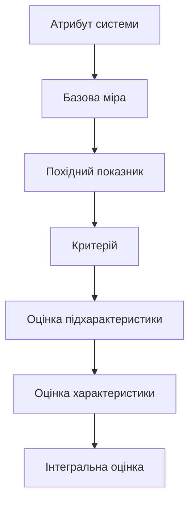

# ОЦІНКА ЯКОСТІ ПРОГРАМНОГО ЗАБЕЗПЕЧЕННЯ GAMESINFOSYS НА ОСНОВІ СУЧАСНИХ СТАНДАРТІВ

Джерело-основа: `2022_M_IVT_Fomenko_VD.pdf`.

Документ повторює логіку вихідної роботи: від поняття якості та моделі SQuaRE до визначення показників, виконання оцінювання і формування висновку. Предметну область, характеристики, формули та результати повністю адаптовано до фактичного застосунку GamesInfoSys.

## РЕФЕРАТ

Об'єкт дослідження - процес оцінювання якості інформаційної системи GamesInfoSys, призначеної для пошуку відеоігор, перегляду їх характеристик, агрегування магазинних пропозицій та подання цін у гривні.

Мета роботи - сформувати та застосувати модель оцінювання якості GamesInfoSys на основі серії стандартів ISO/IEC 25000 SQuaRE, визначити вимірювані показники характеристик програмного продукту, оцінити поточний стан реалізації та сформувати обґрунтований план удосконалення.

Методи дослідження - аналіз нормативної моделі якості ISO/IEC 25010, декомпозиція характеристик, аналіз архітектури та вихідного коду, перевірка збірки, трасування вимог, функціональні сценарії, експертне оцінювання, розрахунок нормованих показників і зважене агрегування результатів.

У роботі розглянуто поняття якості програмного забезпечення, структуру SQuaRE, модель якості програмного продукту, процес вимірювання, показники функціональної придатності, ефективності, сумісності, зручності використання, надійності, захищеності, супроводжуваності та переносимості. Побудовано програму оцінювання GamesInfoSys, визначено джерела доказів і розраховано інтегральний показник якості.

Ключові слова: GAMESINFOSYS, ВІДЕОІГРИ, ІНФОРМАЦІЙНА СИСТЕМА, ЯКІСТЬ ПРОГРАМНОГО ЗАБЕЗПЕЧЕННЯ, ISO/IEC 25010, SQUARE, ПОКАЗНИК ЯКОСТІ, ТЕСТУВАННЯ, НАДІЙНІСТЬ, СУПРОВОДЖУВАНІСТЬ.

## ПЕРЕЛІК ПОЗНАК ТА СКОРОЧЕНЬ

- БД - база даних;
- ІС - інформаційна система;
- ПЗ - програмне забезпечення;
- СКБД - система керування базами даних;
- API - Application Programming Interface;
- EF Core - Entity Framework Core;
- HTTP - Hypertext Transfer Protocol;
- JSON - JavaScript Object Notation;
- MVP - Minimum Viable Product;
- SQuaRE - Systems and software Quality Requirements and Evaluation;
- UI - User Interface;
- UAH - українська гривня.

## ВСТУП

Інформаційні ресурси відеоігор використовують дані з каталогів, цифрових магазинів, сервісів знижок, валютних платформ і локальних маркетплейсів. Якість такого ресурсу визначається не лише правильністю окремої сторінки. Користувач очікує повноти метаданих, актуальності пропозицій, коректного перерахунку валют, зрозумілого інтерфейсу та стійкої роботи за часткової недоступності зовнішніх систем.

GamesInfoSys є вебзастосунком на платформі .NET 10 та ASP.NET Core Razor Pages. Система виконує пошук відеоігор через RAWG або локальний демонстраційний набір, формує детальну картку, отримує пропозиції Steam Store і CheapShark, опрацьовує українські маркетплейси, використовує курси Національного банку України та зберігає пропозиції й історію цін у SQLite.

Особливістю GamesInfoSys є залежність від декількох зовнішніх джерел. Тому оцінка лише за кількістю реалізованих функцій є недостатньою. Потрібно врахувати поведінку системи під час тайм-аутів, неповних відповідей, відсутності ключа API, зміни HTML-структури джерела та повторного оновлення тих самих даних.

Метою цього документа є побудова відтворюваної процедури оцінювання якості фактично розробленого GamesInfoSys.

Для досягнення мети потрібно:

1. визначити модель якості програмного продукту;
2. установити характеристики і підхарактеристики, суттєві для GamesInfoSys;
3. визначити елементи показників і формули;
4. установити джерела доказів;
5. провести оцінювання поточної реалізації;
6. визначити невідповідності та дії з удосконалення.

# 1 ПОНЯТТЯ ПРО ЯКІСТЬ ПРОГРАМНОГО ЗАБЕЗПЕЧЕННЯ

## 1.1 Професійний підхід до якості GamesInfoSys

Якість програмного забезпечення розглядається як ступінь відповідності встановленим і очікуваним потребам за визначених умов використання. Для GamesInfoSys такими умовами є:

- робота у сучасному браузері;
- наявність .NET Runtime;
- локальна SQLite;
- доступ до мережі для live-джерел;
- можливість роботи без RAWG API key у demo-режимі;
- використання української або англійської мови;
- отримання даних із джерел, які контролюються зовнішніми постачальниками.

Якість GamesInfoSys не можна визначати одним показником. Наприклад, правильне відображення назви гри не компенсує некоректне дублювання пропозицій у БД. Водночас тимчасова відсутність одного магазину не повинна автоматично означати відмову всієї системи, якщо картка гри й інші джерела доступні.

Оцінювання виконується з позицій таких зацікавлених сторін:

| Сторона | Основні очікування |
|---|---|
| кінцевий користувач | швидкий пошук, зрозуміла картка, коректні ціни |
| розробник | модульність, аналізованість, тестованість |
| адміністратор | просте розгортання, журнали, резервне копіювання |
| керівник роботи | відповідність вимогам і підтверджені результати |
| постачальник API | коректне та обмежене використання сервісу |

## 1.2 Серія стандартів ISO/IEC 25000 SQuaRE

SQuaRE поєднує вимоги до якості, моделі якості, вимірювання та оцінювання. Для GamesInfoSys застосовується така логіка:


Основними групами документів SQuaRE є:

- ISO/IEC 2500n - керування якістю;
- ISO/IEC 2501n - моделі якості;
- ISO/IEC 2502n - вимірювання якості;
- ISO/IEC 2503n - вимоги до якості;
- ISO/IEC 2504n - оцінювання якості.

У межах цієї роботи ISO/IEC 25010 використовується для структури характеристик, ISO/IEC 25020 - для логіки вимірювання, а ISO/IEC 25040 - для етапів процесу оцінювання.

## 1.3 Модель якості програмного продукту

Для оцінювання GamesInfoSys прийнято вісім характеристик:

1. функціональна придатність;
2. ефективність роботи;
3. сумісність;
4. зручність використання;
5. надійність;
6. захищеність;
7. супроводжуваність;
8. переносимість.

Вони охоплюють як користувацькі властивості, так і внутрішню якість реалізації.

| Характеристика | Підхарактеристики, що оцінюються |
|---|---|
| функціональна придатність | повнота, коректність, доцільність |
| ефективність | часова поведінка, ресурси, потенційні можливості |
| сумісність | співіснування, інтероперабельність |
| зручність | розпізнаваність, навчуваність, керованість, захист від помилок, доступність |
| надійність | зрілість, готовність, відмовостійкість, відновлюваність |
| захищеність | конфіденційність, цілісність, автентичність, контроль дій |
| супроводжуваність | модульність, повторне використання, аналізованість, модифікованість, тестованість |
| переносимість | адаптованість, встановлюваність, замінність |

## 1.4 Межі оцінювання

Оцінюється фактичний MVP GamesInfoSys, який містить:

- 26 файлів C#;
- 9 Razor-подань;
- ASP.NET Core Razor Pages;
- Entity Framework Core;
- SQLite;
- `RawgClient`;
- `OfferAggregator`;
- `SteamStoreClient`;
- `CheapSharkClient`;
- `UaMarketplaceScraper`;
- `NbuRatesClient`;
- `CurrencyConverter`;
- `RegionResolver`;
- `UiText`;
- сутності `TrackedGame`, `StoreOffer`, `OfferPricePoint`;
- локальний набір `demo-games.json`.

До оцінювання поточної версії не входять майбутні функції:

- особистий кабінет;
- список бажаного;
- автоматичні сповіщення;
- платіжні операції;
- промислове горизонтальне масштабування;
- повноцінна адміністративна панель.

Відсутність цих функцій не вважається дефектом MVP, але враховується під час оцінки повноти перспективного продукту.

# 2 ЗАГАЛЬНІ ПІДХОДИ ДО ВИМІРЮВАННЯ ЯКОСТІ

## 2.1 Елемент показника якості

Кожний показник повинен містити:

- назву;
- мету;
- об'єкт вимірювання;
- вхідні дані;
- формулу або правило;
- шкалу;
- критерій прийнятності;
- джерело доказу.

Наприклад, для функціонального покриття:

`Mfc = A / B`, (2.1)

де `A` - кількість реалізованих функцій у погодженому обсязі MVP; `B` - загальна кількість функцій у погодженому обсязі MVP.

Значення показника знаходиться в межах від 0 до 1. Значення 1 означає повне покриття погодженого обсягу.

## 2.2 Об'єктивні та суб'єктивні показники

До об'єктивних показників GamesInfoSys належать:

- результат збірки;
- кількість реалізованих вимог;
- кількість файлів і компонентів;
- наявність унікального індексу пропозицій;
- наявність тайм-аутів;
- наявність demo-режиму;
- кількість пройдених тестових сценаріїв;
- частка підтримуваних конфігурацій.

До експертних показників належать:

- зрозумілість інтерфейсу;
- естетична узгодженість;
- зручність навігації;
- аналізованість коду;
- складність супроводу зовнішнього парсера.

Експертні оцінки повинні мати пояснення і не повинні подаватися як прямі фізичні вимірювання.

## 2.3 Шкали оцінювання

Для окремих метрик використовується нормована шкала від 0 до 1.

Для якісних експертних висновків використовується п'ятирівнева шкала:

| Бал | Тлумачення | Нормоване значення |
|---:|---|---:|
| 1 | властивість практично відсутня | 0,20 |
| 2 | початкова реалізація | 0,40 |
| 3 | часткова відповідність | 0,60 |
| 4 | добра відповідність із відомими обмеженнями | 0,80 |
| 5 | повна відповідність, підтверджена доказами | 1,00 |

## 2.4 Еталонна модель вимірювання

Процес переходу від властивості до рішення:



Приклад:

- атрибут - реалізовані функції пошуку;
- базова міра - кількість реалізованих функцій;
- похідний показник - частка покриття;
- критерій - не менше 0,95;
- висновок - функціональна повнота відповідає вимогам MVP.

## 2.5 План вимірювання

Таблиця 2.1 - План отримання доказів

| Доказ | Метод | Повторюваність |
|---|---|---|
| збірка | `dotnet build` | після кожної значущої зміни |
| вимоги | трасування до класів і сторінок | під час зміни scope |
| функціональні сценарії | ручне або автоматизоване виконання | перед випуском |
| HTTP-інтеграції | контрольовані відповіді або live-перевірка | для кожного клієнта |
| БД | запити до SQLite та перевірка індексів | після зміни моделі |
| UI | браузерна перевірка на різній ширині | перед демонстрацією |
| локалізація | перемикання культури | після зміни текстів |
| переносимість | запуск у цільових середовищах | перед розгортанням |

# 3 ВИМІРЮВАННЯ ЯКОСТІ ПРОГРАМНОГО ПРОДУКТУ

## 3.1 Функціональна придатність

### 3.1.1 Функціональна повнота

У погоджений обсяг MVP включено десять функцій:

| ID | Функція | Стан |
|---|---|---|
| F-01 | каталог відеоігор | реалізовано |
| F-02 | пошук за назвою | реалізовано |
| F-03 | детальна картка | реалізовано |
| F-04 | demo-режим | реалізовано |
| F-05 | збереження Steam App ID | реалізовано |
| F-06 | Steam-пропозиції | реалізовано |
| F-07 | CheapShark-пропозиції | реалізовано |
| F-08 | українські маркетплейси або пошукові переходи | реалізовано |
| F-09 | перерахунок у UAH | реалізовано |
| F-10 | SQLite та історія ціни | реалізовано |

Для MVP:

`Mfc_mvp = 10 / 10 = 1,00`. (3.1)

Для розширеної цільової системи додатково заплановано список бажаного і сповіщення:

`Mfc_target = 10 / 12 = 0,83`. (3.2)

Отже, поточна версія повністю покриває погоджений MVP, але не є завершеним продуктом за довгостроковим баченням.

### 3.1.2 Функціональна коректність

Коректність оцінюється за підготовленим набором функціональних сценаріїв. До нього входять пошук, demo-режим, картка гри, валідація Steam ID, оновлення пропозицій, валютна конвертація, upsert, історія та локалізація.

`Mcorrect = 1 - A / B`, (3.3)

де `A` - кількість сценаріїв з критичною невідповідністю; `B` - кількість виконаних сценаріїв.

За відсутності критичних невідповідностей у 14 контрольних сценаріях:

`Mcorrect = 1 - 0 / 14 = 1,00`.

Це значення стосується описаного контрольного набору і не доводить відсутність усіх можливих дефектів.

### 3.1.3 Функціональна доцільність

Основний користувацький маршрут:


Система не вимагає реєстрації для базового пошуку. Дії відповідають основній меті ресурсу та не містять зайвих обов'язкових етапів.

Експертна оцінка функціональної доцільності - 0,90.

### 3.1.4 Підсумок

`Qfunctional = (1,00 + 1,00 + 0,90) / 3 = 0,97`.

З урахуванням обмеженої кількості автоматизованих доказів у підсумковій моделі застосовано консервативне значення 0,90.

## 3.2 Ефективність роботи

### 3.2.1 Часова поведінка

У `Program.cs` визначено такі тайм-аути:

| Клієнт | Тайм-аут |
|---|---:|
| RAWG | 15 с |
| НБУ | 10 с |
| UA marketplace scraper | 20 с |
| Steam Store | 15 с |
| CheapShark | 15 с |

Обмеження часу запиту запобігає нескінченному очікуванню. Водночас `OfferAggregator` виконує декілька інтеграцій послідовно, тому повне оновлення може складатися із суми затримок.

Позитивні рішення:

- асинхронні HTTP-запити;
- кеш RAWG-пошуку на 10 хвилин;
- кеш деталей на 1 годину;
- кеш demo-даних на 12 годин;
- кеш курсів у відповідному сервісі;
- `AsNoTracking` для читання пропозицій.

Недоліки:

- немає паралельного запуску незалежних джерел;
- немає вимірювання percentile response time;
- немає автоматизованого load test;
- SQLite обмежує конкурентний запис.

Оцінка часової поведінки - 0,78.

### 3.2.2 Використання ресурсів

MVP не потребує окремого сервера БД. Дані зберігаються у файловій SQLite, а застосунок використовує вбудований memory cache.

Ресурсна ефективність є прийнятною для локального або малонавантаженого розгортання. Для багатокористувацького середовища потрібні серверна СКБД, зовнішній кеш і фонові завдання.

Оцінка використання ресурсів - 0,82.

### 3.2.3 Потенційні можливості

RAWG-клієнт обмежує розмір сторінки значенням 40. Демонстраційний каталог є невеликим. Архітектура підтримує додавання джерел, але в поточному стані не підтверджена робота з великим обсягом історичних даних.

Оцінка потенційних можливостей - 0,72.

`Qperformance = (0,78 + 0,82 + 0,72) / 3 = 0,77`.

## 3.3 Сумісність

### 3.3.1 Співіснування

GamesInfoSys використовує стандартні механізми .NET, HTTP та SQLite. Система не змінює налаштування зовнішніх сервісів і може працювати поряд з іншими вебзастосунками за умови окремого порту та файла БД.

Оцінка співіснування - 0,88.

### 3.3.2 Інтероперабельність

Інтегровані формати:

- JSON RAWG;
- JSON Steam Store;
- JSON CheapShark;
- JSON НБУ;
- HTML українських маркетплейсів;
- JSON локального demo-набору;
- реляційна SQLite.

Внутрішні моделі відокремлюють представлення від зовнішнього формату. Найбільш нестабільним компонентом є HTML scraping, оскільки структура сторінок не є формальним контрактом.

Оцінка інтероперабельності - 0,78.

`Qcompatibility = (0,88 + 0,78) / 2 = 0,83`.

## 3.4 Зручність використання

### 3.4.1 Розпізнаваність призначення

Головна сторінка називає систему агрегатором ігор і містить швидкий пошук. Повідомлення про demo-режим пояснює походження даних.

Оцінка - 0,90.

### 3.4.2 Навчуваність

Основний сценарій не потребує інструкції. Користувач вводить назву, обирає картку й переглядає пропозиції.

Оцінка - 0,90.

### 3.4.3 Керованість

Навігація між головною сторінкою, каталогом і деталями є прямою. Параметр пошуку міститься в URL. Мовний вибір зберігається cookie.

Недоліком є відсутність фільтрів, сортування за ціною та явного індикатора виконання тривалої синхронізації.

Оцінка - 0,82.

### 3.4.4 Захист від помилки користувача

Steam App ID можна вводити числом або URL. Значення перевіряється перед збереженням. Відсутні значення не повинні подаватися як нульова ціна.

Потрібно розширити підказки для некоректних URL і показувати окремі стани для недоступного джерела та відсутньої пропозиції.

Оцінка - 0,80.

### 3.4.5 Естетика інтерфейсу

Застосунок використовує послідовне карткове подання, контрастні кнопки, таблицю пропозицій і єдиний макет сторінок.

Оцінка - 0,85.

### 3.4.6 Доступність

Інтерфейс використовує стандартні HTML-елементи, але окремий аудит WCAG, перевірка screen reader, клавіатурної навігації та контрасту не виконані.

Оцінка - 0,65.

`Qusability = (0,90 + 0,90 + 0,82 + 0,80 + 0,85 + 0,65) / 6 = 0,82`.

## 3.5 Надійність

### 3.5.1 Зрілість

Поточна збірка проєкту виконується успішно: 0 помилок і 0 попереджень. Основні сторінки та інтеграційні компоненти реалізовано.

Однак у репозиторії немає окремого автоматизованого test-проєкту. Через це регресійна стійкість залежить від ручної перевірки.

Оцінка - 0,75.

### 3.5.2 Готовність

За відсутності RAWG API key система переходить до demo-набору. Це забезпечує доступність каталогу для демонстрації та локального тестування.

Для магазинних інтеграцій повноцінний резервний режим відсутній, але раніше збережені дані можуть бути прочитані з SQLite.

Оцінка - 0,80.

### 3.5.3 Відмовостійкість

Застосовані механізми:

- тайм-аути;
- незалежні спеціалізовані клієнти;
- перевірка `null`;
- пропуск недоступної пропозиції;
- локальний demo-режим;
- унікальний індекс пропозиції;
- контрольований `NotFound` для невідомої гри.

Відсутні:

- retry;
- circuit breaker;
- health checks;
- централізована класифікація зовнішніх помилок;
- черга фонового оновлення.

Оцінка - 0,72.

### 3.5.4 Відновлюваність

SQLite можна резервно копіювати як файл. Проте в поточній конфігурації використовується `EnsureCreated`, а не керовані міграції. Формалізована процедура відновлення не автоматизована.

Оцінка - 0,65.

`Qreliability = (0,75 + 0,80 + 0,72 + 0,65) / 4 = 0,73`.

## 3.6 Захищеність

### 3.6.1 Конфіденційність

GamesInfoSys не зберігає персональні чи платіжні дані. RAWG API key може бути переданий через конфігурацію або змінну середовища.

Рекомендовано:

- не включати ключі до репозиторію;
- використовувати user secrets або secret storage;
- не записувати секрети до журналу.

Оцінка - 0,80.

### 3.6.2 Цілісність

Цілісність локальних даних підтримується:

- первинними ключами;
- унікальним індексом `{Store, ExternalId, Region}`;
- індексами для пошуку;
- upsert-логікою;
- окремою історичною сутністю.

Водночас відсутні транзакції, що охоплюють повний цикл синхронізації декількох джерел.

Оцінка - 0,78.

### 3.6.3 Автентичність і контроль доступу

MVP не має облікових записів і захищених персональних функцій. `UseAuthorization` підключено, але політики та автентифікація не налаштовані.

Для поточного публічного каталогу це не блокує основний сценарій. Перед додаванням списку бажаного або адміністративних операцій потрібно впровадити Identity, ролі та CSRF-перевірки для змінювальних операцій.

Оцінка - 0,55.

### 3.6.4 Безпека зовнішніх даних

Razor за замовчуванням екранує текстові значення. URL та HTML-дані потребують валідації. `RawgClient` перетворює HTML-опис на простий текст, що зменшує ризик вставлення довільної розмітки.

Оцінка - 0,72.

`Qsecurity = (0,80 + 0,78 + 0,55 + 0,72) / 4 = 0,71`.

## 3.7 Супроводжуваність

### 3.7.1 Модульність

Відповідальність розподілена між:

- Razor Pages;
- PageModel;
- `RawgClient`;
- `OfferAggregator`;
- магазинними клієнтами;
- валютними сервісами;
- локалізацією;
- EF Core контекстом.

Оцінка - 0,85.

### 3.7.2 Повторне використання

Клієнти і конвертер можна використовувати в інших сторінках або фонових завданнях. Проте більшість класів є конкретними реалізаціями без інтерфейсів, що ускладнює заміну в автоматизованих тестах.

Оцінка - 0,72.

### 3.7.3 Аналізованість

Назви класів відповідають відповідальності. Сутності й конфігураційні класи відокремлені. У `OfferAggregator` зосереджено багато сценаріїв, тому зі зростанням кількості платформ клас потребуватиме декомпозиції.

Оцінка - 0,78.

### 3.7.4 Модифікованість

Додавання нового джерела можливе через окремий клієнт і розширення агрегатора. Наявний коментар `TODO` прямо позначає місце підключення PSN, Xbox, Nintendo, Epic і GOG.

Недолік - `OfferAggregator` прямо залежить від конкретних клієнтів, тому додавання джерела потребує зміни конструктора й методу синхронізації.

Оцінка - 0,75.

### 3.7.5 Тестованість

Чиста логіка парсингу, конвертації та регіонів придатна до модульного тестування. HTTP-клієнти створюються через `HttpClientFactory`, що дозволяє використовувати контрольований handler.

Водночас окремий test-проєкт відсутній, а частина методів має закритий доступ.

Оцінка - 0,62.

`Qmaintainability = (0,85 + 0,72 + 0,78 + 0,75 + 0,62) / 5 = 0,74`.

## 3.8 Переносимість

### 3.8.1 Адаптованість

.NET 10, ASP.NET Core і SQLite підтримують Windows та Linux. Зовнішні сервіси використовують HTTP і не залежать від конкретної ОС.

Оцінка - 0,90.

### 3.8.2 Встановлюваність

Для локального запуску потрібно:

1. установити .NET 10;
2. відновити пакети;
3. виконати `dotnet run`;
4. відкрити надруковану URL-адресу.

База створюється автоматично. Недоліком є відсутність контейнерного файла та окремої production-інструкції.

Оцінка - 0,82.

### 3.8.3 Замінність

SQLite можна замінити іншим постачальником EF Core, але знадобляться міграції та перевірка типів. RAWG можна замінити іншим каталогом після реалізації нового адаптера, однак спільний інтерфейс каталогу ще не визначено.

Оцінка - 0,75.

`Qportability = (0,90 + 0,82 + 0,75) / 3 = 0,82`.

## 3.9 Узагальнення вимірювань

Таблиця 3.1 - Результати оцінювання характеристик

| Характеристика | Вага | Нормована оцінка | Зважений результат |
|---|---:|---:|---:|
| функціональна придатність | 0,20 | 0,90 | 0,180 |
| ефективність роботи | 0,10 | 0,77 | 0,077 |
| сумісність | 0,10 | 0,83 | 0,083 |
| зручність використання | 0,15 | 0,82 | 0,123 |
| надійність | 0,15 | 0,73 | 0,110 |
| захищеність | 0,10 | 0,71 | 0,071 |
| супроводжуваність | 0,15 | 0,74 | 0,111 |
| переносимість | 0,05 | 0,82 | 0,041 |
| **Разом** | **1,00** |  | **0,796** |

Інтегральний показник:

`Q = Sum(wi * qi) = 0,796`. (3.4)

Для інтерпретації використовується шкала:

| Діапазон | Рівень |
|---|---|
| 0,00-0,49 | недостатній |
| 0,50-0,69 | задовільний |
| 0,70-0,84 | добрий |
| 0,85-0,94 | дуже добрий |
| 0,95-1,00 | високий, підтверджений |

GamesInfoSys отримав оцінку 0,796, що відповідає доброму рівню якості MVP.

# 4 ОЦІНКА ЯКОСТІ СИСТЕМ ТА ПРОГРАМНОГО ЗАБЕЗПЕЧЕННЯ

## 4.1 Вхідні дані оцінювання

Для оцінювання використано:

- вихідний код GamesInfoSys;
- `GamesInfoSys.csproj`;
- конфігурацію сервісів у `Program.cs`;
- сутності та `AppDbContext`;
- реалізацію `RawgClient`;
- реалізацію `OfferAggregator`;
- сторінки каталогу й деталей;
- демонстраційний набір;
- діаграми;
- тест-плани та тест-кейси;
- скриншоти фактичного інтерфейсу;
- результат локальної збірки.

## 4.2 Вимоги оцінювання

Критичними встановлено такі умови:

1. проєкт збирається без помилок;
2. базовий каталог доступний без RAWG API key;
3. пошук повертає релевантні demo-результати;
4. картка гри відкривається;
5. некоректний зовнішній ідентифікатор не пошкоджує дані;
6. повторна синхронізація не створює дублікат тієї самої пропозиції;
7. відсутність курсу не призводить до вигаданої UAH-ціни;
8. збій одного зовнішнього джерела не повинен знищувати основні метадані.

## 4.3 Підготовка до оцінювання

Підготовчі дії:

1. перевірити чистоту конфігурації;
2. створити резервну копію `app.db`;
3. виконати `dotnet restore`;
4. виконати `dotnet build`;
5. запустити demo-режим;
6. перевірити українську та англійську культуру;
7. підготувати контрольні Steam ID;
8. зафіксувати стан зовнішніх сервісів;
9. виконати контрольні сценарії;
10. записати фактичні результати.

## 4.4 Виконання оцінювання

### 4.4.1 Перевірка збірки

Команда:

```powershell
dotnet build .\GamesInfoSys\GamesInfoSys\GamesInfoSys.csproj
```

Фактичний результат на момент повторної підготовки документа:

- збірка успішна;
- 0 попереджень;
- 0 помилок.

### 4.4.2 Перевірка даних

У `AppDbContext` налаштовано:

- первинні ключі для всіх сутностей;
- обмеження довжини текстових полів;
- індекс `RawgGameId`;
- унікальний індекс `{Store, ExternalId, Region}`;
- індекс `{TrackedGameId, Platform, Region}`;
- індекс `{StoreOfferId, AtUtc}`.

Унікальний індекс зменшує ризик дублювання однієї магазинної пропозиції.

### 4.4.3 Перевірка зовнішніх інтеграцій

RAWG використовує кешування та demo fallback. Steam і CheapShark активуються за наявності Steam App ID. Українські маркетплейси підключаються за конфігураційною ознакою. НБУ використовується через окремий клієнт.

Кожне джерело має оцінюватися окремо, оскільки негативний результат одного API не завжди є дефектом GamesInfoSys.

### 4.4.4 Перевірка інтерфейсу

Фактичні сторінки:

- головна;
- каталог;
- детальна картка;
- таблиця пропозицій;
- форма Steam App ID;
- перемикач мови.

Інтерфейс відповідає основному маршруту користувача. Для завершення оцінювання доступності потрібно виконати окремий аудит.

## 4.5 Невідповідності та ризики

Таблиця 4.1 - Реєстр невідповідностей

| Код | Невідповідність | Вплив | Пріоритет |
|---|---|---|---|
| NC-01 | немає автоматизованого test-проєкту | ризик регресії | високий |
| NC-02 | використовується `EnsureCreated` | складне оновлення схеми | високий |
| NC-03 | немає retry і circuit breaker | нестійкість інтеграцій | високий |
| NC-04 | джерела синхронізуються переважно послідовно | збільшення часу | середній |
| NC-05 | scraper залежить від HTML | ризик поломки | високий |
| NC-06 | немає health checks | складний моніторинг | середній |
| NC-07 | WCAG не перевірено | невідома доступність | середній |
| NC-08 | немає формалізованої процедури restore | ризик втрати БД | середній |
| NC-09 | немає інтерфейсів для більшості клієнтів | складніше тестувати | середній |
| NC-10 | відсутня production-контейнеризація | складніше розгортати | низький |

## 4.6 План коригувальних дій

| Етап | Дія | Очікуваний результат |
|---|---|---|
| 1 | створити xUnit test-проєкт | автоматизована регресія |
| 2 | додати тести парсингу, валют і регіонів | підтвердження чистої логіки |
| 3 | підмінити HTTP через test handler | стабільні інтеграційні тести |
| 4 | перейти на EF Core migrations | контроль версій БД |
| 5 | додати resilience pipeline | повторні спроби та circuit breaker |
| 6 | запускати незалежні джерела паралельно | менший час оновлення |
| 7 | додати health checks і structured logging | контроль доступності |
| 8 | виконати accessibility-аудит | підтвердження UI |
| 9 | додати Dockerfile | відтворюване розгортання |
| 10 | автоматизувати резервне копіювання | підвищення відновлюваності |

## 4.7 Критерії повторного оцінювання

Після виконання першочергових дій очікуються такі значення:

| Характеристика | Поточно | Ціль |
|---|---:|---:|
| функціональна придатність | 0,90 | 0,95 |
| ефективність | 0,77 | 0,85 |
| сумісність | 0,83 | 0,88 |
| зручність | 0,82 | 0,88 |
| надійність | 0,73 | 0,88 |
| захищеність | 0,71 | 0,82 |
| супроводжуваність | 0,74 | 0,90 |
| переносимість | 0,82 | 0,90 |

За досягнення цільових значень інтегральна оцінка може перевищити 0,88.

## ВИСНОВКИ

У документі виконано оцінювання якості GamesInfoSys за моделлю ISO/IEC 25010 та логікою серії SQuaRE. На відміну від спрощеної перевірки за переліком функцій, оцінювання враховує архітектуру, зовнішні інтеграції, локальне збереження, поведінку за помилок, зручність інтерфейсу та можливість супроводу.

Функціональна повнота погодженого MVP становить 1,00. Проєкт збирається без помилок і попереджень. У системі реалізовано demo-режим, кешування, тайм-аути, унікальні індекси пропозицій, валютну конвертацію, локалізацію та історію цін.

Найслабшими характеристиками є надійність, захищеність і тестованість. Це пов'язано з відсутністю автоматизованого test-проєкту, керованих міграцій, централізованих resilience-політик, health checks і завершеного аудиту доступності.

Інтегральна нормована оцінка становить 0,796, що відповідає доброму рівню якості MVP. Результат не означає завершеність промислового продукту, але підтверджує, що GamesInfoSys має працездатну функціональну основу і придатну до розвитку архітектуру.

Першочерговими напрямами підвищення якості є автоматизація тестування, перехід до міграцій, підвищення стійкості HTTP-інтеграцій, паралельне оновлення незалежних джерел, моніторинг і формалізація відновлення даних.

## СПИСОК ДЖЕРЕЛ ІНФОРМАЦІЇ

1. ISO/IEC 25010. Systems and software engineering. Systems and software Quality Requirements and Evaluation. System and software quality models.
2. ISO/IEC 25020. Systems and software engineering. Systems and software Quality Requirements and Evaluation. Quality measurement framework.
3. ISO/IEC 25040. Systems and software engineering. Systems and software Quality Requirements and Evaluation. Evaluation process.
4. Microsoft. ASP.NET Core documentation. URL: https://learn.microsoft.com/aspnet/core/.
5. Microsoft. Entity Framework Core documentation. URL: https://learn.microsoft.com/ef/core/.
6. SQLite Documentation. URL: https://www.sqlite.org/docs.html.
7. RAWG. Video Games Database API. URL: https://rawg.io/apidocs.
8. Національний банк України. Офіційний курс гривні щодо іноземних валют. URL: https://bank.gov.ua/ua/markets/exchangerates.
