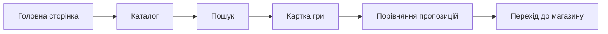

# ОЦІНКА ЯКОСТІ ПРОГРАМНОГО ЗАБЕЗПЕЧЕННЯ GAMESINFOSYS НА ОСНОВІ СУЧАСНИХ СТАНДАРТІВ

Джерело-основа: `2022_M_IVT_Fomenko_VD.pdf`.

## Реферат

Об'єкт дослідження - якість вебзастосунку GamesInfoSys, призначеного для пошуку відеоігор, перегляду метаданих і порівняння магазинних пропозицій.

Мета роботи - сформувати модель оцінювання якості GamesInfoSys відповідно до підходів ISO/IEC 25010 та визначити практичні показники для перевірки функціональної придатності, продуктивності, сумісності, зручності, надійності, захищеності, супроводжуваності й переносимості.

Методи - аналіз архітектури й вихідного коду, функціональне тестування, експертне оцінювання, вимірювання часу відповіді, перевірка обробки помилок зовнішніх API та трасування вимог.

Результат - визначено набір показників якості, початкові оцінки реалізованого MVP і план удосконалення.

Ключові слова: GAMESINFOSYS, ВІДЕОІГРИ, ЯКІСТЬ ПРОГРАМНОГО ЗАБЕЗПЕЧЕННЯ, ISO/IEC 25010, ТЕСТУВАННЯ, НАДІЙНІСТЬ, ЗРУЧНІСТЬ, СУПРОВОДЖУВАНІСТЬ.

## 1 Загальні відомості про систему

GamesInfoSys є вебзастосунком на платформі .NET 10 та ASP.NET Core Razor Pages. Система виконує такі основні функції:

- пошук ігор у зовнішньому каталозі RAWG або локальному демонстраційному наборі;
- відображення назви, опису, рейтингу, дати випуску, жанрів і платформ;
- збереження зовнішніх ідентифікаторів гри;
- отримання пропозицій Steam Store та CheapShark;
- формування посилань на українські маркетплейси;
- перерахунок іноземних валют у гривню за курсами НБУ;
- збереження поточних пропозицій та історії цін у SQLite;
- підтримка української та англійської локалізації.

Архітектура складається з рівня подання Razor Pages, моделей сторінок, прикладних сервісів, HTTP-клієнтів зовнішніх систем та рівня доступу до даних Entity Framework Core.

## 2 Модель якості

### 2.1 Функціональна придатність

Функціональна придатність визначається повнотою, коректністю і доречністю реалізованих функцій.

| Показник | Спосіб перевірки | Критерій |
|---|---|---|
| Повнота пошуку | виконання запитів за повною і частковою назвою | знайдені релевантні ігри |
| Коректність картки | зіставлення з даними джерела | ключові поля не спотворені |
| Агрегація пропозицій | перевірка Steam і CheapShark | пропозиції нормалізовані |
| Валютна конвертація | контрольний розрахунок | похибка в межах округлення |
| Збереження історії | повторне оновлення ціни | створено нову часову точку |

Поточна оцінка - 4 з 5. Основні сценарії реалізовано, однак не всі платформи мають прямі цінові інтеграції.

### 2.2 Ефективність роботи

Для вебсистеми оцінюються:

- час відкриття локальної сторінки;
- тривалість зовнішніх HTTP-запитів;
- кількість послідовних звернень до джерел;
- використання кешу валютних курсів;
- стійкість інтерфейсу під час очікування відповіді.

Критичні клієнти мають тайм-аути від 10 до 20 секунд. Це запобігає нескінченному очікуванню, але потребує доповнення політиками повторних спроб і обмеження частоти запитів.

Поточна оцінка - 4 з 5.

### 2.3 Сумісність

GamesInfoSys взаємодіє з RAWG, Steam Store, CheapShark, НБУ та зовнішніми вебресурсами. Обмін даними виконується через HTTP, JSON і HTML. Внутрішні моделі відокремлюють формати зовнішніх систем від подання.

Поточна оцінка - 4 з 5. Ризиком залишається зміна неофіційної HTML-структури маркетплейсів.

### 2.4 Зручність використання

Інтерфейс побудовано навколо короткого маршруту:

Позитивними властивостями є картковий каталог, зрозуміла таблиця пропозицій, мовний перемикач і повідомлення про demo-режим. Потрібно додати явні індикатори завантаження, повідомлення про часткову недоступність джерел і доступність для клавіатурної навігації.

Поточна оцінка - 4 з 5.

### 2.5 Надійність

Надійність підтримується такими рішеннями:

- локальний демонстраційний набір за відсутності RAWG API;
- тайм-аути HTTP-клієнтів;
- незалежне завантаження основних метаданих і пропозицій;
- SQLite-сховище вже отриманих даних;
- валідація Steam App ID і URL;
- відсутність критичної залежності сторінки від одного магазину.

Недоліки: немає централізованих retry-політик, health checks і фонового моніторингу джерел.

Поточна оцінка - 4 з 5.

### 2.6 Захищеність

MVP не містить персональних кабінетів і платіжних даних, тому поверхня ризику обмежена. Водночас необхідно враховувати:

- зберігання ключа RAWG лише у конфігурації користувача або змінній середовища;
- заборону журналювання секретів;
- перевірку зовнішніх URL;
- екранування даних у Razor;
- використання HTTPS і HSTS у виробничому середовищі;
- контроль вхідних параметрів сторінок.

Поточна оцінка - 3 з 5 через відсутність автентифікації, розмежування ролей і формалізованого аудиту безпеки.

### 2.7 Супроводжуваність

Код розподілено на PageModel, клієнти інтеграцій, агрегатор, конвертер валют, локалізацію і контекст даних. Проєкт містить 26 файлів C#, 9 Razor-подань і окремі сутності `TrackedGame`, `StoreOffer`, `OfferPricePoint`.

Збірка `dotnet build` завершується без помилок і попереджень. Для підвищення оцінки потрібні автоматизовані тести, інтерфейси для HTTP-клієнтів і керовані міграції бази даних.

Поточна оцінка - 4 з 5.

### 2.8 Переносимість

Застосунок використовує кросплатформну платформу .NET і файлову SQLite. Він може працювати у Windows, Linux або контейнерному середовищі за наявності .NET Runtime та мережевого доступу.

Поточна оцінка - 4 з 5.

## 3 Узагальнена оцінка

| Характеристика | Вага | Оцінка, 1-5 | Зважена оцінка |
|---|---:|---:|---:|
| Функціональна придатність | 0,20 | 4 | 0,80 |
| Ефективність | 0,10 | 4 | 0,40 |
| Сумісність | 0,10 | 4 | 0,40 |
| Зручність | 0,15 | 4 | 0,60 |
| Надійність | 0,15 | 4 | 0,60 |
| Захищеність | 0,10 | 3 | 0,30 |
| Супроводжуваність | 0,15 | 4 | 0,60 |
| Переносимість | 0,05 | 4 | 0,20 |
| **Разом** | **1,00** |  | **3,90** |

Узагальнена оцінка 3,90 з 5 характеризує GamesInfoSys як працездатний MVP із доброю функціональною придатністю та архітектурною основою для розвитку.

## 4 План підвищення якості

1. Додати модульні тести для парсингу Steam URL, валютної конвертації та вибору регіону.
2. Додати інтеграційні тести з підробленими HTTP-відповідями.
3. Перейти від `EnsureCreated` до міграцій Entity Framework Core.
4. Реалізувати повторні спроби, circuit breaker і журналювання зовнішніх інтеграцій.
5. Додати фонове оновлення цін і контроль частоти запитів.
6. Перевірити доступність інтерфейсу за WCAG.
7. Додати облікові записи лише після формування моделі загроз.

## Висновки

Модель ISO/IEC 25010 дозволяє оцінити GamesInfoSys не лише за фактом наявності функцій, а за якістю їх виконання. Поточна реалізація відповідає меті навчального MVP: збирає дані про відеоігри, агрегує цінові пропозиції, виконує валютну нормалізацію та зберігає історію. Найбільший резерв удосконалення пов'язаний з автоматизованим тестуванням, безпекою майбутніх персональних функцій, моніторингом і стійкістю зовнішніх інтеграцій.

