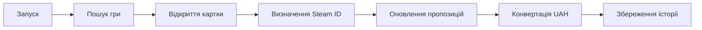

# GAMESINFOSYS TEST PLAN

Версія 1.0.  
Формат: на основі Rational Unified Process.  
Джерело-основа: `TestPlanTemplate_RUP.pdf`.

## Історія змін

| Дата | Версія | Опис | Автор |
|---|---|---|---|
| 12.06.2026 | 1.0 | початковий план для MVP | [ПІБ студента] |

## 1 Вступ

### 1.1 Призначення

Документ описує стратегію перевірки GamesInfoSys, ресурси, типи тестування, критерії завершення і результати.

### 1.2 Передумови

GamesInfoSys об'єднує каталог відеоігор, зовнішні магазинні пропозиції, валютні курси та локальне сховище. Система має працювати навіть без ключа RAWG завдяки демонстраційному набору.

### 1.3 Обсяг

Тестуються вебінтерфейс, прикладні сервіси, база даних, локалізація та інтеграції. Не тестуються платіжні операції, яких система не виконує.

### 1.4 Документація проєкту

| Артефакт | Наявність | Використання |
|---|---|---|
| опис вимог | так | джерело тестових умов |
| use case | так | сценарії системного тестування |
| IDEF0/DFD | так | перевірка потоків |
| модель даних | так | тести цілісності |
| вихідний код | так | модульні та рев'ю |
| прототип UI | фактичний UI | usability-перевірка |

## 2 Вимоги до тестування

- REQ-01: користувач може переглядати каталог;
- REQ-02: користувач може шукати гру;
- REQ-03: система показує детальну інформацію;
- REQ-04: система зберігає зовнішній ідентифікатор;
- REQ-05: система агрегує пропозиції;
- REQ-06: система показує UAH-еквівалент;
- REQ-07: система зберігає історію ціни;
- REQ-08: система працює в demo-режимі;
- REQ-09: інтерфейс підтримує UA/EN;
- REQ-10: збій окремого джерела не руйнує всю сторінку.

## 3 Стратегія тестування

### 3.1 Цілісність даних і бази

Перевіряється:

- створення `TrackedGame`;
- зв'язок гри з багатьма `StoreOffer`;
- зв'язок пропозиції з `OfferPricePoint`;
- оновлення наявної пропозиції без дубліката;
- збереження UTC-часу;
- коректне створення SQLite при першому запуску.

Критерій - дані після повторного відкриття відповідають останньому успішному оновленню.

### 3.2 Функціональне тестування

Для кожної вимоги виконується щонайменше один позитивний і один негативний сценарій.

### 3.3 Тестування бізнес-циклу

Повний цикл перевіряється як єдиний приймальний сценарій.

### 3.4 Тестування інтерфейсу

Перевіряються:

- читабельність на ширині 375, 768 і 1366 пікселів;
- логічний порядок заголовків;
- текст кнопок;
- таблиця пропозицій;
- повідомлення про помилки;
- перемикання мови;
- відсутність горизонтального прокручування основного контенту.

### 3.5 Профілювання продуктивності

Фіксується час:

- локального відкриття головної сторінки;
- пошуку в demo-наборі;
- читання картки з SQLite;
- повного live-оновлення.

Зовнішні запити оцінюються окремо від серверного рендерингу.

### 3.6 Навантажувальне тестування

Для MVP виконується базова перевірка серії послідовних запитів. Повномасштабний load test відкладається до серверного розгортання і переходу від SQLite до серверної СКБД.

### 3.7 Стресове і об'ємне тестування

Перевіряються:

- велика кількість пропозицій у таблиці;
- довгий опис гри;
- відсутні зображення;
- повільна відповідь джерела;
- некоректна JSON-відповідь;
- база з накопиченою історією.

### 3.8 Безпека і контроль доступу

У MVP відсутні ролі. Перевіряються безпечне екранування, валідація URL, відсутність секретів у UI та використання HTTPS у production.

### 3.9 Відновлення

Після недоступності зовнішнього сервісу основні сторінки повинні працювати з demo-даними або вже збереженою інформацією.

### 3.10 Конфігурації

| Конфігурація | Очікування |
|---|---|
| без RAWG API key | demo-каталог |
| з RAWG API key | live-каталог |
| без доступу НБУ | вихідна ціна без помилкового UAH |
| порожня SQLite | автоматичне створення |
| українська культура | українські UI-тексти |

### 3.11 Інсталяційне тестування

1. Встановити .NET 10 SDK або Runtime.
2. Відновити NuGet-пакети.
3. Виконати `dotnet build`.
4. Виконати `dotnet run`.
5. Перевірити створення `app.db`.
6. Відкрити надруковану локальну адресу.

## 4 Ресурси

### 4.1 Ролі

Одна людина може поєднувати ролі аналітика, розробника і тестувальника, але приймальну перевірку бажано виконувати окремому користувачеві.

### 4.2 Система

Потрібні ПК, .NET 10, браузер, доступ до інтернету для live-режиму та місце для SQLite.

## 5 Контрольні точки

| Етап | Результат |
|---|---|
| підготовка | стабільна збірка |
| дизайн тестів | тест-кейси і дані |
| smoke | базові сторінки працюють |
| повний цикл | виконані функціональні тести |
| регресія | повторна перевірка після виправлень |
| завершення | підсумковий звіт |

## 6 Результати

- тестова модель;
- тест-кейси;
- журнал;
- дефекти;
- матриця трасування;
- звіт про покриття;
- висновок про готовність.

