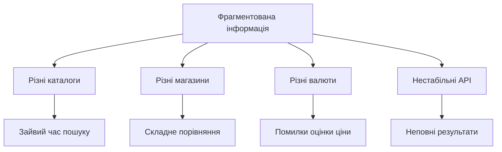
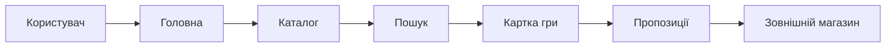

# ЗАВДАННЯ ДО ЛАБОРАТОРНИХ РОБІТ 1-4 ДЛЯ ПРОЄКТУ GAMESINFOSYS

Джерело-основа: `Завдання до лабораторних робіт 1-4.pdf`.

Дисципліна: Основи управління проєктами програмної інженерії.

## Лабораторна робота 1. Аналіз предметної області та вимог

### Мета

Проаналізувати проблеми інформаційних ресурсів відеоігор, сформувати дерево проблем і цілей, вимоги замовника та межі GamesInfoSys.

### Завдання

1. Описати предметну область.
2. Побудувати дерево проблем на 2-3 рівні.
3. Побудувати дерево цілей на 3-4 рівні.
4. Визначити функціональні та нефункціональні вимоги.
5. Побудувати SysML-подання вимог.
6. Побудувати use case.
7. Порівняти щонайменше три класи аналогів.

### Вихідні положення

Центральна проблема - користувач змушений окремо шукати метадані гри, ціни, регіональні пропозиції та валютний еквівалент.

### Результат

Звіт із деревами, вимогами, use case і таблицею аналогів.

## Лабораторна робота 2. План комунікацій

### Мета

Визначити стейкхолдерів GamesInfoSys та правила обміну інформацією.

### Завдання

1. Визначити ролі.
2. Оцінити вплив і підтримку.
3. Визначити очікування та ризики.
4. Скласти матрицю комунікацій.
5. Визначити формат погодження змін.

### Рекомендовані стейкхолдери

- здобувач-розробник;
- керівник роботи;
- нормоконтролер;
- потенційний користувач;
- представник інформаційного ресурсу;
- адміністратор розгортання;
- постачальники зовнішніх API.

## Лабораторна робота 3. Product Backlog і Sprint Backlog

### Мета

Сформувати повний список робіт, визначити пріоритети та оцінити трудомісткість.

### Завдання

1. Створити user stories.
2. Призначити пріоритет 1-100.
3. Оцінити story points.
4. Визначити критерії демонстрації.
5. Розподілити елементи між спринтами.
6. Сформувати Definition of Done.

### Приклади елементів

| ID | Елемент | Пріоритет | Story points |
|---|---|---:|---:|
| PB-01 | каталог і demo-режим | 100 | 8 |
| PB-02 | пошук гри | 100 | 5 |
| PB-03 | детальна картка | 95 | 8 |
| PB-04 | Steam-пропозиції | 90 | 13 |
| PB-05 | CheapShark | 75 | 8 |
| PB-06 | UAH-конвертація | 90 | 5 |
| PB-07 | SQLite та історія | 85 | 13 |
| PB-08 | локалізація | 70 | 5 |

## Лабораторна робота 4. Проєктування інтерфейсу

### Мета

Описати шлях користувача й підготувати прототип основних сторінок GamesInfoSys.

### Завдання

1. Побудувати user journey.
2. Визначити інформаційну архітектуру.
3. Розробити прототип головної сторінки.
4. Розробити прототип каталогу.
5. Розробити прототип картки гри.
6. Розробити таблицю пропозицій.
7. Передбачити мобільне подання.
8. Перевірити читабельність українського тексту.

## Загальні вимоги до звітів

Кожний звіт має містити:

- титульні відомості;
- тему і мету;
- вихідні дані;
- хід роботи;
- таблиці та діаграми;
- пояснення отриманих результатів;
- висновки;
- посилання на пов'язані матеріали GamesInfoSys.

