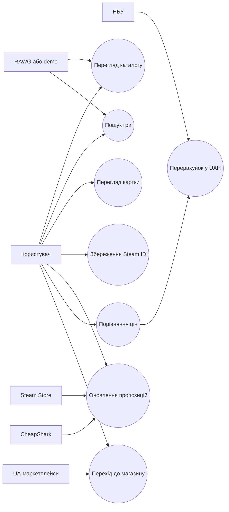

# ЛАБОРАТОРНА РОБОТА 2

# АНАЛІЗ ВИМОГ І USE CASE GAMESINFOSYS

Джерело-основа: `Лабораторна робота 2.pdf`.

## Мета

Визначити акторів і функції GamesInfoSys та подати взаємодію у вигляді діаграми варіантів використання.

## 1 Вимоги

| ID | Вимога | Тип | Пріоритет |
|---|---|---|---|
| FR-01 | система показує каталог | функціональна | Must |
| FR-02 | система шукає за назвою | функціональна | Must |
| FR-03 | система показує картку гри | функціональна | Must |
| FR-04 | користувач задає Steam App ID | функціональна | Should |
| FR-05 | система агрегує пропозиції | функціональна | Must |
| FR-06 | система перераховує ціну в UAH | функціональна | Must |
| FR-07 | система зберігає історію | функціональна | Should |
| FR-08 | система формує зовнішні посилання | функціональна | Should |
| NFR-01 | UI підтримує UA/EN | нефункціональна | Should |
| NFR-02 | система працює без RAWG key | нефункціональна | Must |
| NFR-03 | збій джерела не блокує сторінку | нефункціональна | Must |
| NFR-04 | UI адаптується до вузького екрана | нефункціональна | Should |

## 2 Use case diagram

## 3 Use case UC-02 "Пошук гри"

**Актор:** користувач.

**Передумова:** застосунок запущено.

**Основний сценарій:**

1. Користувач відкриває каталог.
2. Вводить частину назви.
3. Система перевіряє запит.
4. Система звертається до RAWG або demo-набору.
5. Система нормалізує відповідь.
6. Система показує картки результатів.
7. Користувач обирає гру.

**Альтернатива:** порожній запит показує початковий каталог.

**Помилка:** якщо live-джерело недоступне, система використовує demo або показує контрольоване повідомлення.

## 4 Use case UC-05 "Оновлення пропозицій"

**Передумова:** відкрито картку гри, визначено Steam App ID.

**Основний сценарій:**

1. Система створює або знаходить `TrackedGame`.
2. `OfferAggregator` викликає джерела.
3. Пропозиції приводяться до спільної моделі.
4. Ціни перераховуються в UAH.
5. `StoreOffer` створюється або оновлюється.
6. Додається `OfferPricePoint`.
7. Таблиця пропозицій відображається користувачеві.

## Висновки

У роботі визначено шість зовнішніх акторів і основні користувацькі сценарії. Діаграма відображає фактичні межі GamesInfoSys: система допомагає знайти та порівняти інформацію, але не виконує купівлю.

