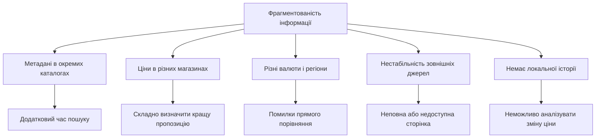
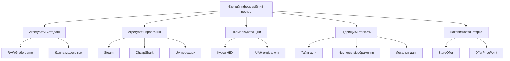

# ЛАБОРАТОРНА РОБОТА 1

# АНАЛІЗ ПРЕДМЕТНОЇ ОБЛАСТІ, ДЕРЕВО ПРОБЛЕМ І ДЕРЕВО ЦІЛЕЙ GAMESINFOSYS

Джерело-основа: `ЛР1_Гуляков_А_КН219а.pdf`.

Дисципліна: Основи управління проєктами програмної інженерії.

## Мета

Визначити проблеми, які розв'язує GamesInfoSys, сформувати дерево цілей і порівняти проєкт із класами аналогічних рішень.

## 1 Аналіз проблеми

Користувач, який хоче отримати повну інформацію про відеогру, зазвичай використовує декілька незалежних ресурсів. Один ресурс містить опис і рейтинг, другий - магазинну ціну, третій - історію знижок, четвертий - локальні пропозиції. Дані відрізняються за форматами, регіонами й валютами.

Центральна проблема - фрагментованість інформації про відеоігри та магазинні пропозиції.

## 2 Дерево цілей

Головна мета - скоротити час і складність пошуку інформації про відеоігри та порівняння пропозицій.

## 3 Завдання проєкту

1. Проаналізувати джерела інформації.
2. Сформувати внутрішні моделі.
3. Реалізувати пошук.
4. Реалізувати картку гри.
5. Інтегрувати джерела пропозицій.
6. Реалізувати валютну нормалізацію.
7. Спроєктувати SQLite-модель.
8. Реалізувати локалізацію.
9. Перевірити основні сценарії.
10. Підготувати документацію.

## 4 Аналіз аналогів

Для коректності порівнюються не бренди, а класи рішень.

| Критерій | Каталог ігор | Окремий магазин | Агрегатор знижок | GamesInfoSys |
|---|:---:|:---:|:---:|:---:|
| метадані гри | + | +/- | +/- | + |
| декілька джерел цін | - | - | + | + |
| UAH-еквівалент | - | +/- | +/- | + |
| український UI | +/- | +/- | +/- | + |
| локальна історія | - | - | +/- | + |
| demo без API | - | - | - | + |
| самостійне розгортання | - | - | - | + |
| повнота магазинів | - | один | висока | середня |

GamesInfoSys поступається спеціалізованим агрегаторам кількістю магазинів, але має перевагу у контрольованому локальному розгортанні, українському поданні, власній моделі даних і можливості розвитку.

## Висновки

Дерево проблем показало, що складність користувацького сценарію спричинена розподіленістю даних і несумісністю форматів. Дерево цілей визначило функціональні напрями GamesInfoSys. Порівняння підтвердило доцільність навчального проєкту як інтегрованої та розширюваної системи.

