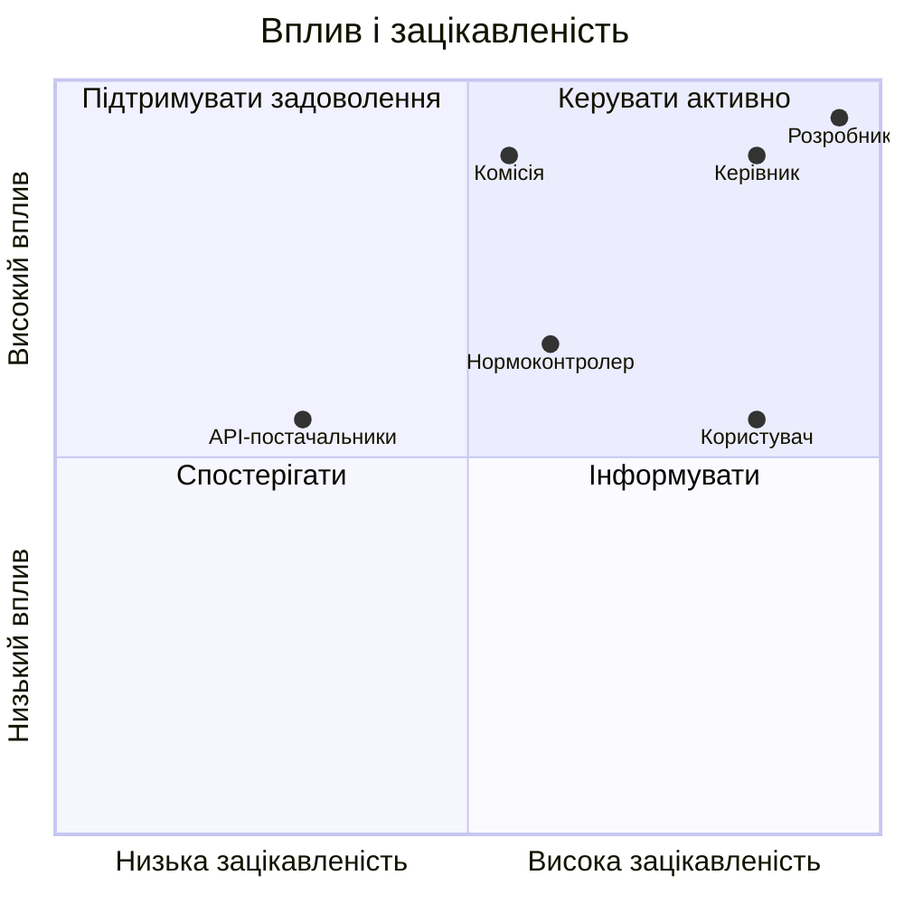

# ЛАБОРАТОРНА РОБОТА 2

# ПЛАН КОМУНІКАЦІЙ ПРОЄКТУ GAMESINFOSYS

Джерело-основа: `ЛР2_Кушнерьова_КН219а.docx`.

## Мета

Визначити стейкхолдерів GamesInfoSys, їхній вплив, очікування та спосіб комунікації.

## 1 Стейкхолдери

| Роль | Вплив | Підтримка | Основне очікування |
|---|---:|---:|---|
| Здобувач-розробник | високий | високий | завершити працездатний проєкт |
| Керівник роботи | високий | високий | наукова і технічна обґрунтованість |
| Нормоконтролер | середній | високий | відповідність оформлення |
| Екзаменаційна комісія | високий | нейтральний | підтверджені результати |
| Кінцевий користувач | середній | високий | швидкий пошук і зрозумілі ціни |
| Адміністратор | середній | середній | просте розгортання і супровід |
| Постачальники API | середній | нейтральний | дотримання правил доступу |

## 2 Матриця впливу

## 3 План комунікацій

| Стейкхолдер | Інформація | Формат | Періодичність | Відповідальний |
|---|---|---|---|---|
| керівник | прогрес, ризики, розділи | консультація, файли | щотижня | здобувач |
| нормоконтролер | оформлення | DOCX/PDF, чеклист | перед поданням | здобувач |
| користувач | прототип і сценарії | демонстрація | після ітерації | здобувач |
| адміністратор | конфігурація | README, інструкція | перед розгортанням | розробник |
| комісія | результати | презентація, доповідь | захист | здобувач |
| API-постачальник | технічні запити | HTTP, документація | за потреби | застосунок |

## 4 Порядок погодження змін

1. Зміна формулюється як короткий запит.
2. Визначається причина і вплив.
3. Перевіряються пов'язані вимоги, код і документація.
4. Керівник погоджує зміни, що впливають на зміст роботи.
5. Після реалізації оновлюються тести і діаграми.

## 5 Комунікаційні ризики

| Ризик | Наслідок | Запобігання |
|---|---|---|
| запізнілий зворотний зв'язок | перероблення розділів | проміжні версії |
| різне розуміння меж | зайві функції | зафіксований scope |
| неузгоджені назви | суперечності | словник термінів |
| зміни API без повідомлення | збій інтеграції | журнали і контрактні тести |
| усні домовленості | втрата рішень | короткі письмові підсумки |

## Висновки

Ключовими стейкхолдерами є розробник, керівник і користувач. Для них визначено різні інформаційні потреби. План зменшує ризик розбіжностей між фактичним застосунком, пояснювальною запискою та очікуваннями захисту.

