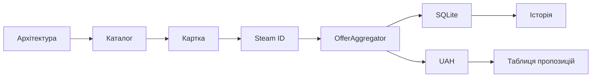

# ЛАБОРАТОРНА РОБОТА 3

# PRODUCT BACKLOG І SPRINT BACKLOG GAMESINFOSYS

Джерело-основа: `ЛР3_Гуляков_А_КН219а.pdf`.

## Мета

Сформувати перелік робіт, визначити важливість, оцінити складність і розподілити задачі між ітераціями.

## 1 Product Backlog

| ID | User story | Важливість | SP | Як продемонструвати |
|---|---|---:|---:|---|
| PB-01 | Як користувач, я хочу бачити каталог | 100 | 8 | відкрити `/Games` |
| PB-02 | Як користувач, я хочу шукати за назвою | 100 | 5 | знайти `Elden Ring` |
| PB-03 | Як користувач, я хочу бачити картку гри | 100 | 8 | відкрити деталі |
| PB-04 | Як система, я хочу demo-режим | 95 | 5 | запуск без API key |
| PB-05 | Як користувач, я хочу задати Steam ID | 90 | 5 | зберегти число або URL |
| PB-06 | Як користувач, я хочу Steam-ціну | 95 | 13 | оновити пропозицію |
| PB-07 | Як користувач, я хочу CheapShark-угоди | 75 | 8 | показати список |
| PB-08 | Як користувач, я хочу UAH | 95 | 5 | показати еквівалент |
| PB-09 | Як система, я хочу зберігати пропозиції | 90 | 8 | перевірити SQLite |
| PB-10 | Як система, я хочу історію ціни | 80 | 5 | повторне оновлення |
| PB-11 | Як користувач, я хочу український UI | 80 | 5 | перемкнути мову |
| PB-12 | Як користувач, я хочу UA-переходи | 65 | 3 | Rozetka, Prom, OLX |
| PB-13 | Як адміністратор, я хочу журнали | 60 | 8 | перегляд помилок |
| PB-14 | Як користувач, я хочу список бажаного | 45 | 13 | майбутня версія |
| PB-15 | Як користувач, я хочу сповіщення | 40 | 13 | майбутня версія |
| PB-16 | Як команда, ми хочемо автотести | 90 | 13 | `dotnet test` |

## 2 Пріоритезація

Метод MoSCoW:

- Must: PB-01, PB-02, PB-03, PB-04, PB-06, PB-08, PB-09;
- Should: PB-05, PB-07, PB-10, PB-11, PB-16;
- Could: PB-12, PB-13;
- Won't for MVP: PB-14, PB-15.

## 3 Sprint Backlog

### Sprint 1. Каталог і базова архітектура

| Задача | SP |
|---|---:|
| створити Razor Pages проєкт | 3 |
| додати demo-набір | 5 |
| реалізувати каталог | 8 |
| реалізувати пошук | 5 |
| створити картку | 8 |
| **Разом** | **29** |

### Sprint 2. Пропозиції та дані

| Задача | SP |
|---|---:|
| сутності SQLite | 8 |
| Steam App ID | 5 |
| Steam client | 13 |
| OfferAggregator | 8 |
| історія ціни | 5 |
| **Разом** | **39** |

### Sprint 3. Розширення і якість

| Задача | SP |
|---|---:|
| CheapShark | 8 |
| НБУ і UAH | 5 |
| UA-посилання | 3 |
| локалізація | 5 |
| автотести | 13 |
| документація | 8 |
| **Разом** | **42** |

## 4 Definition of Done

Елемент завершено, якщо:

- код збирається без помилок;
- сценарій доступний з UI;
- оброблено некоректні дані;
- немає дублювання в SQLite;
- оновлено документацію;
- виконано smoke/regression;
- результат можна продемонструвати.

## 5 Залежності

## Висновки

Backlog відображає фактичний склад GamesInfoSys і відокремлює MVP від перспективних функцій. Найбільш складними елементами є зовнішні інтеграції, агрегація та автоматизовані тести.

