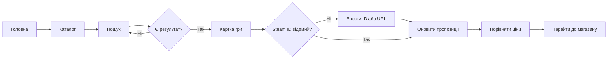
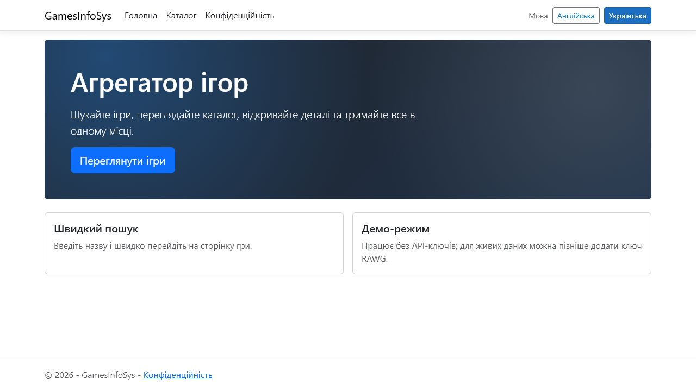
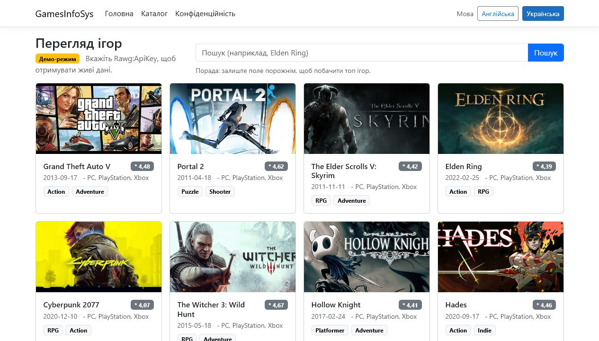
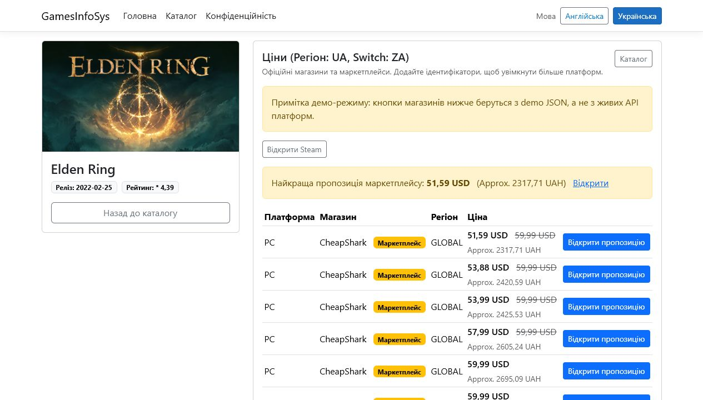

# ЛАБОРАТОРНА РОБОТА 4

# ПРОЄКТУВАННЯ ІНТЕРФЕЙСУ GAMESINFOSYS

Джерело-основа: `ЛР4_Кушнерьова_КН219а.docx`.

## Мета

Описати шлях користувача, інформаційну архітектуру і прототип основних сторінок GamesInfoSys.

## 1 Шлях користувача

Користувач відкриває головну сторінку, переходить до каталогу, вводить назву гри, обирає результат і відкриває картку. У картці він переглядає опис, платформи та магазинні пропозиції. За потреби користувач вводить Steam App ID, оновлює ціни і переходить до зовнішнього магазину.

## 2 Інформаційна архітектура

### Головна сторінка

- назва системи;
- коротка ціннісна пропозиція;
- поле швидкого пошуку;
- кнопка каталогу;
- повідомлення про demo-режим.

### Каталог

- форма пошуку;
- список карток;
- обкладинка;
- назва;
- рейтинг;
- дата випуску;
- кнопка деталей.

### Картка гри

- заголовок і фонове зображення;
- опис;
- жанри та платформи;
- Steam App ID;
- таблиця пропозицій;
- UAH-еквівалент;
- зовнішні переходи.

## 3 Вимоги до UI

| ID | Вимога |
|---|---|
| UI-01 | користувач розуміє призначення на першому екрані |
| UI-02 | пошук доступний без зайвих переходів |
| UI-03 | картки мають однакову структуру |
| UI-04 | відсутні дані не показуються як нуль |
| UI-05 | зовнішні посилання візуально відрізняються |
| UI-06 | таблиця читається на вузькому екрані |
| UI-07 | українські символи відображаються в UTF-8 |
| UI-08 | помилка не видаляє вже завантажений контент |

## 4 Прототип таблиці пропозицій

| Магазин | Регіон | Поточна ціна | Орієнтовно UAH | Дія |
|---|---|---:|---:|---|
| Steam | UA | 59,99 USD | приблизно 2 480 грн | відкрити |
| CheapShark | US | 49,99 USD | приблизно 2 067 грн | відкрити |

Слово "приблизно" є обов'язковим, оскільки магазин може застосовувати власний курс або податки.

## 5 Перевірка прототипу

| Питання | Результат |
|---|---|
| Чи зрозуміло, де шукати? | так |
| Чи можна повернутися до каталогу? | так |
| Чи видно джерело ціни? | так |
| Чи відрізняється UAH від вихідної валюти? | так |
| Чи пояснений demo-режим? | так |
| Чи потрібен окремий кабінет у MVP? | ні |

## Висновки

Інтерфейс реалізує короткий послідовний сценарій без обов'язкової реєстрації. Фактичні скриншоти відповідають спроєктованій інформаційній архітектурі. Подальше вдосконалення має включати індикатори завантаження, графіки історії та перевірку доступності.

