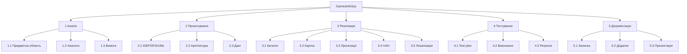
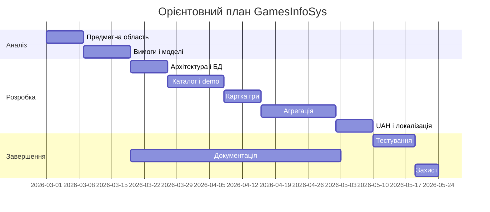

# ЛАБОРАТОРНА РОБОТА 5

# РЕСУРСИ, WBS І ПЛАНУВАННЯ ВИТРАТ GAMESINFOSYS

Джерело-основа: `ЛР5_Кушнерьова_КН219а.docx`.

## Мета

Визначити ролі, ресурси, структуру робіт, тривалість і модель витрат проєкту GamesInfoSys.

## 1 Учасники і ролі

| Роль | Основні обов'язки | Завантаження |
|---|---|---:|
| Здобувач / аналітик | предметна область, вимоги, діаграми | 20 % |
| Здобувач / розробник | архітектура, код, інтеграції | 45 % |
| Здобувач / тестувальник | тест-план, сценарії, виправлення | 15 % |
| Здобувач / технічний автор | пояснювальна записка | 20 % |
| Керівник | консультації і перевірка | часткова |

Одна особа поєднує декілька функцій, тому календарний план має враховувати неможливість повного паралельного виконання.

## 2 WBS

## 3 Календарний план

| Код | Робота | Днів | Попередник |
|---|---|---:|---|
| A | аналіз предметної області | 8 | - |
| B | вимоги і моделі | 10 | A |
| C | архітектура і БД | 8 | B |
| D | каталог і demo | 12 | C |
| E | картка гри | 8 | D |
| F | агрегація пропозицій | 16 | E |
| G | UAH і локалізація | 8 | F |
| H | тестування | 9 | G |
| I | документація | 12 | B |
| J | підготовка захисту | 5 | H, I |

## 4 Ресурси

- ПК розробника;
- .NET 10 SDK;
- IDE або редактор;
- Git;
- SQLite;
- браузер;
- мережевий доступ;
- RAWG API key для live-режиму;
- дискове місце для резервної копії;
- інструмент побудови діаграм.

## 5 Оцінка трудових витрат

Для навчальної моделі прийнято:

- 90 людино-днів розробника по 900 грн;
- 12 еквівалентних днів консультацій керівника по 1200 грн.

`Csalary = 90 * 900 + 12 * 1200 = 95 400 грн`.

Додаткова оплата 10 %:

`Cadditional = 9 540 грн`.

Соціальні нарахування 22 %:

`Csocial = 0,22 * (95 400 + 9 540) = 23 086,80 грн`.

Інші умовні витрати:

| Стаття | Сума, грн |
|---|---:|
| машинний час | 3 600 |
| матеріали і допоміжні засоби | 8 000 |
| накладні витрати | 57 240 |
| **Разом із працею** | **196 866,80** |

Числа є модельними вихідними даними лабораторної роботи і мають бути замінені актуальними значеннями за вимогами економічного розділу.

## 6 Аналіз

Найбільша частина трудомісткості припадає на інтеграції, оскільки кожне джерело має власний формат, правила регіону і поведінку помилок. Другим за обсягом блоком є документація, яка включає моделі, опис коду, тестування та оформлення.

## Висновки

WBS показує повний склад проєкту, а календарний план - залежності між етапами. Розрахунок підтверджує, що основним ресурсом є праця розробника. Для зниження витрат доцільно повторно використовувати спільні моделі, HTTP-клієнти, локалізацію та автоматизовані тести.

