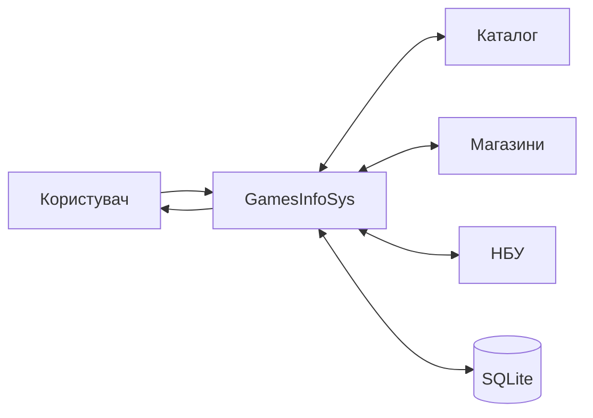

# МЕТОДИЧНА СТРУКТУРА ДИПЛОМНОЇ РОБОТИ 126 ДЛЯ GAMESINFOSYS

Джерело-основа: `МВ_ДРБ_126_ПЗІС (3).docx`.

Спеціальність: 126 Інформаційні системи та технології.

## Акцент роботи

Для спеціальності 126 GamesInfoSys доцільно подавати як інформаційну систему, що забезпечує збір, перетворення, накопичення і подання даних про відеоігри.

Ключовими є:

- інформаційні потоки;
- інтеграція зовнішніх джерел;
- структура даних;
- технології оброблення;
- користувацькі процеси;
- розгортання і супровід.

## Вступ

Сформулювати проблему фрагментації інформації, мету створення єдиного ресурсу та практичну цінність системи.

## Розділ 1. Дослідження предметної області

### 1.1 Інформаційні потреби

Користувачеві потрібні:

- ідентифікація гри;
- опис;
- платформи;
- рейтинг;
- дата випуску;
- магазинні ціни;
- регіон;
- валюта;
- зовнішнє посилання;
- історія.

### 1.2 Джерела даних

| Джерело | Дані | Формат |
|---|---|---|
| RAWG | метадані | JSON API |
| demo | резервні метадані | JSON |
| Steam | регіональна пропозиція | HTTP/JSON |
| CheapShark | угоди | JSON API |
| НБУ | валютні курси | JSON |
| UA-маркетплейси | результати пошуку | URL/HTML |

### 1.3 Аналоги

Порівняти каталоги, магазини й агрегатори.

### 1.4 Постановка задачі

Визначити вхідні дані, вихідні дані, обмеження, ролі й критерії.

## Розділ 2. Моделювання інформаційної системи

Обов'язково подати:

- IDEF0;
- IDEF3;
- DFD;
- use case;
- activity;
- sequence;
- data model.

DFD має показати:

## Розділ 3. Проєктні рішення

### 3.1 Інформаційна архітектура

Пояснити, як зовнішні дані переходять у внутрішні моделі.

### 3.2 Програмна архітектура

Вебінтерфейс -> PageModel -> сервіси -> зовнішні системи/SQLite.

### 3.3 Модель даних

Описати ключі, зв'язки, обмеження і правила оновлення.

### 3.4 Технологічний стек

Обґрунтувати .NET, Razor Pages, EF Core та SQLite.

### 3.5 Інтерфейс

Визначити інформаційні блоки, навігацію і локалізацію.

## Розділ 4. Реалізація і тестування

Потрібно показати:

- структуру каталогів проєкту;
- конфігурацію сервісів;
- алгоритм пошуку;
- алгоритм upsert пропозицій;
- конвертацію;
- обробку помилок;
- скриншоти;
- тест-кейси;
- результати.

## Розділ 5. Впровадження і супровід

Описати:

- локальний запуск;
- production-конфігурацію;
- секрети;
- резервне копіювання;
- міграції;
- моніторинг;
- оновлення інтеграцій;
- масштабування.

## ТЕО і висновки

Економічний розділ повинен бути пов'язаний з інформаційною системою, а висновки - з вимогами та реалізованими інформаційними процесами.

