# ДОДАТОК А

# ГРАФІЧНІ МАТЕРІАЛИ ДО ІНФОРМАЦІЙНОЇ СИСТЕМИ GAMESINFOSYS

Додаток сформовано за принципом графічного додатка з дипломної роботи Д. О. Чуба: функціональні, процесні, інформаційні та UML-моделі винесено в окремий блок. Усі діаграми адаптовано до фактичної архітектури GamesInfoSys.

## А.1 Функціональні моделі IDEF0

Джерело моделі: `diagrams/06_idef0.md`.

# IDEF0-ДІАГРАМИ ІНФОРМАЦІЙНОЇ СИСТЕМИ `GamesInfoSys`

Діаграми побудовано за структурою рисунків 2.1–2.3 з оригінального DOCX. Збережено ICOM-логіку: входи розташовано зліва, виходи — справа, керування — зверху, механізми — знизу. Після експорту в DOCX потрібно перевірити, щоб стрілки входили саме у відповідні сторони функціональних блоків.

## Рисунок 2.1 – Контекстна діаграма «Управління інформаційним ресурсом відеоігор»

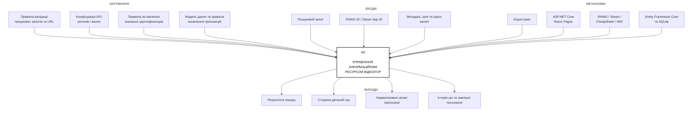

На контекстній діаграмі вся система подана як одна функція `A0`. Вона перетворює запити, ідентифікатори та зовнішні дані на результати пошуку, сторінки деталей і збережені пропозиції. Виконання функції регулюється конфігурацією й правилами обробки, а забезпечується програмними компонентами, зовнішніми сервісами та базою даних.

## Рисунок 2.2 – Декомпозиція контекстної діаграми IDEF0

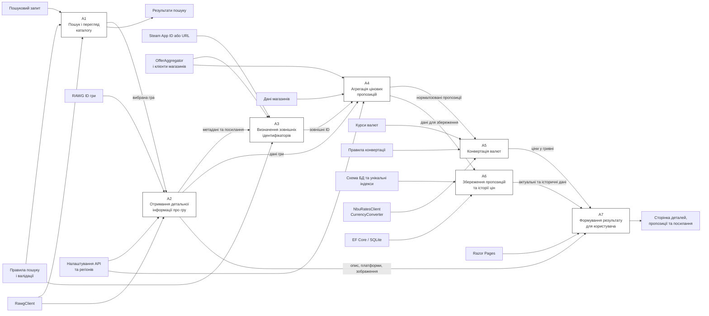

Декомпозиція зберігає граничні стрілки контекстної діаграми та розподіляє загальну функцію між сімома підпроцесами. Основний інформаційний потік проходить від пошуку до формування сторінки, а процеси `A4–A6` відповідають за отримання, перетворення й накопичення цінових даних.

## Рисунок 2.3 – Декомпозиція процесу «Агрегація цінових пропозицій»

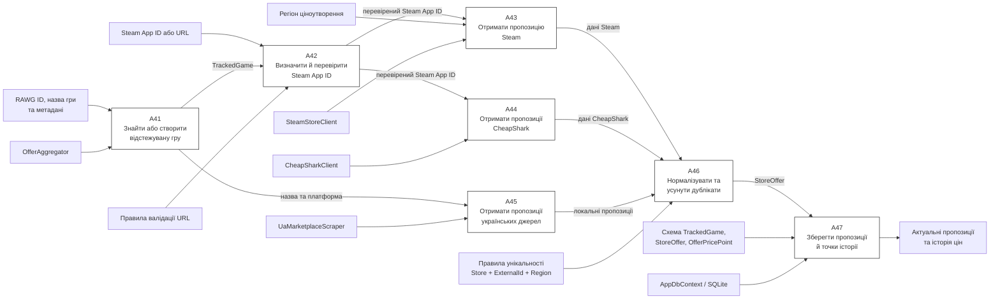

Процеси отримання пропозицій із Steam, CheapShark та українських джерел можуть виконуватися незалежно, але їхні результати надходять до спільного етапу нормалізації. Після цього дані зберігаються в єдиній моделі, що забезпечує однакове відображення незалежно від джерела.

## Відповідність програмному коду

- `A1–A2` — `RawgClient.SearchGamesAsync`, `RawgClient.GetGameAsync`, `RawgClient.GetScreenshotsAsync`.
- `A3` — `DetailsModel.TryParseSteamAppId`, `OfferAggregator.TryInferSteamAppId`.
- `A4` — `OfferAggregator.SyncOffersForRawgGameAsync`.
- `A5` — `CurrencyConverter.ToUahAsync`, `NbuRatesClient`.
- `A6` — `AppDbContext`, `TrackedGame`, `StoreOffer`, `OfferPricePoint`.
- `A7` — `Pages/Games/Details.cshtml.cs` і `Pages/Games/Details.cshtml`.

## А.2 Процесні моделі IDEF3

Джерело моделі: `diagrams/08_idef3.md`.

# IDEF3-ДІАГРАМИ ОСНОВНИХ СЦЕНАРІЇВ `GamesInfoSys`

Діаграми 2.4–2.9 замінюють шість IDEF3-прикладів з оригінального DOCX. Блоки `UOB` описують одиниці роботи, а вузли `J` показують розгалуження або об’єднання потоків.

## Рисунок 2.4 – IDEF3-діаграма процесу «Пошук і вибір відеогри»

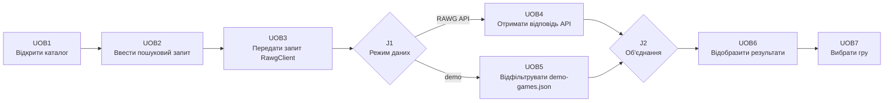

## Рисунок 2.5 – IDEF3-діаграма процесу «Отримання детальної інформації»

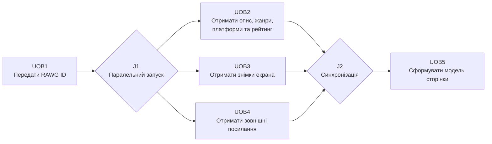

## Рисунок 2.6 – IDEF3-діаграма процесу «Визначення Steam App ID»

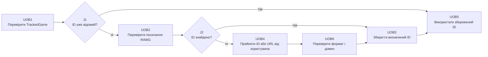

## Рисунок 2.7 – IDEF3-діаграма процесу «Отримання цінових пропозицій»

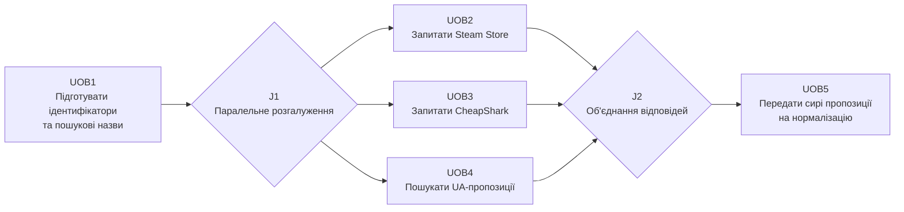

## Рисунок 2.8 – IDEF3-діаграма процесу «Конвертація вартості у гривню»

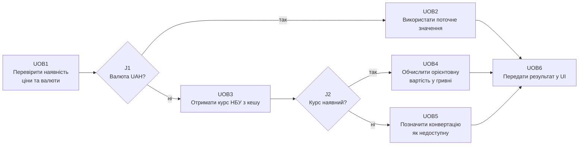

## Рисунок 2.9 – IDEF3-діаграма процесу «Збереження та відображення пропозицій»

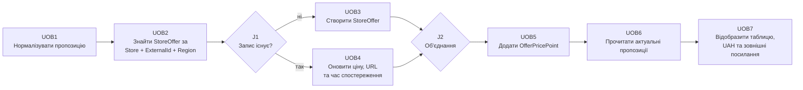

## Рекомендації до експорту

- використовувати білий фон, чорні контури та однаковий розмір блоків;
- розміщувати сценарій зліва направо, як у зразках оригінального DOCX;
- не зменшувати текст нижче читабельного розміру після вставлення на сторінку А4;
- під кожним експортованим зображенням додати відповідний підпис `Рисунок 2.4 – ...`;
- за потреби розмістити широкі діаграми на альбомній сторінці з коректними полями шаблону.

## А.3 Діаграми потоків даних DFD

Джерело моделі: `diagrams/07_dfd.md`.

# DFD-ДІАГРАМИ ІНФОРМАЦІЙНОЇ СИСТЕМИ `GamesInfoSys`

Комплект відповідає рисункам 2.10–2.12 оригінального DOCX: контекст системи, рівень підсистеми та деталізація одного процесу. На відміну від IDEF0, стрілки тут позначають саме дані, а не керування або механізми.

## Рисунок 2.10 – Контекстна діаграма DFD рівня системи

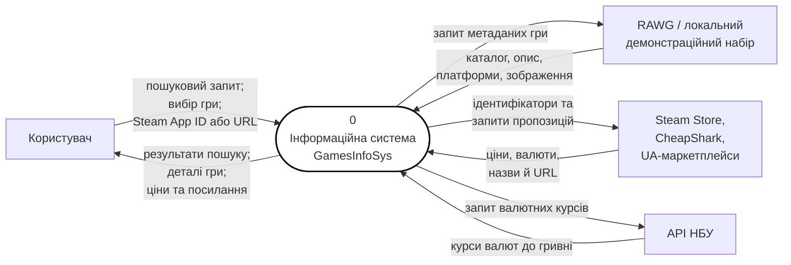

Зовнішньою сутністю, що ініціює основні сценарії, є користувач. Інші зовнішні сутності є постачальниками даних. База даних на контекстному рівні не показується як зовнішня сутність, оскільки є внутрішньою частиною `GamesInfoSys`.

## Рисунок 2.11 – Діаграма потоків даних рівня підсистеми

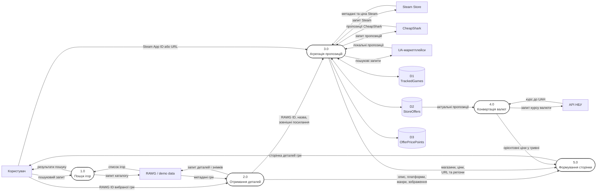

На цьому рівні видно, що дані гри не записуються безпосередньо до `StoreOffers`. Спочатку процес `3.0` створює або знаходить запис у `TrackedGames`, після чого пов’язує з ним нормалізовані пропозиції та історичні точки.

## Рисунок 2.12 – Діаграма DFD процесу «Агрегація цінових пропозицій»

```mermaid
flowchart LR
    IN1["RAWG ID, назва та<br/>метадані гри"]
    IN2["Steam App ID або URL"]
    P31(["3.1<br/>Отримати запис<br/>відстежуваної гри"])
    P32(["3.2<br/>Визначити Steam App ID"])
    P33(["3.3<br/>Отримати зовнішні<br/>пропозиції"])
    P34(["3.4<br/>Нормалізувати й<br/>зіставити дані"])
    P35(["3.5<br/>Оновити поточні<br/>пропозиції"])
    P36(["3.6<br/>Додати точки<br/>історії цін"])
    EXT1["Steam / CheapShark /<br/>UA-маркетплейси"]
    D1[("D1<br/>TrackedGames")]
    D2[("D2<br/>StoreOffers")]
    D3[("D3<br/>OfferPricePoints")]

    IN1 --> P31
    P31 -- "пошук за RAWG ID" --> D1
    D1 -- "наявна гра" --> P31
    P31 -- "нова або наявна<br/>TrackedGame" --> D1
    P31 -- "дані відстежуваної гри" --> P32
    IN2 --> P32
    P32 -- "оновлений Steam App ID" --> D1
    P32 -- "ідентифікатори й назва" --> P33
    P33 -- "запити цін і товарів" --> EXT1
    EXT1 -- "неоднорідні відповіді" --> P33
    P33 -- "сирі пропозиції" --> P34
    P34 -- "нормалізовані StoreOffer" --> P35
    P35 -- "пошук дубліката" --> D2
    D2 -- "наявна пропозиція" --> P35
    P35 -- "нова або оновлена пропозиція" --> D2
    P35 -- "ціна, валюта,<br/>StoreOffer ID" --> P36
    P36 -- "нова часова точка" --> D3
    D2 -- "актуальний список пропозицій" --> OUT["Пропозиції для сторінки деталей"]
    D3 -- "історичні значення" --> OUT

    style P31 fill:#fff,stroke:#111
    style P32 fill:#fff,stroke:#111
    style P33 fill:#fff,stroke:#111
    style P34 fill:#fff,stroke:#111
    style P35 fill:#fff,stroke:#111
    style P36 fill:#fff,stroke:#111
```

Балансування DFD дотримано: дані, що входять до процесу `3.0` на рисунку 2.11, присутні на детальній діаграмі як `RAWG ID`, назва, метадані та Steam App ID. Виходом є список актуальних пропозицій і збережена історія.

## Словник потоків даних

| Потік | Склад даних |
|---|---|
| Пошуковий запит | текст назви або її частина |
| Метадані гри | RAWG ID, назва, опис, дата випуску, рейтинг, жанри, платформи, URL, зображення |
| Зовнішній ідентифікатор | Steam App ID або інший ID магазину |
| Пропозиція | магазин, платформа, регіон, зовнішній ID, назва товару, URL, валюта, поточна та початкова ціна |
| Валютний курс | код валюти та коефіцієнт перерахунку до гривні |
| Точка історії | StoreOffer ID, момент часу UTC, валюта, ціна та початкова ціна |

## А.4 UML-діаграма варіантів використання

Джерело моделі: `diagrams/01_use_case.md`.

# Use case diagram for `GamesInfoSys`

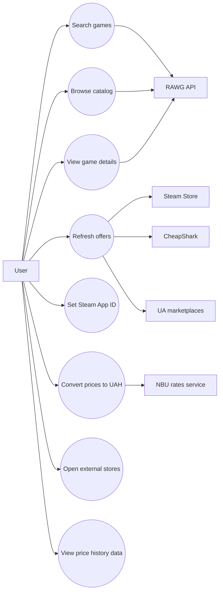

## Notes from code

- Search and catalog browsing are handled by `RawgClient.SearchGamesAsync(...)`.
- Game details are loaded by `RawgClient.GetGameAsync(...)`.
- Offer refresh is coordinated by `OfferAggregator.SyncOffersForRawgGameAsync(...)`.
- Manual Steam mapping is handled by `DetailsModel.OnPostSetSteamAsync(...)`.
- UAH conversion is handled by `CurrencyConverter.ToUahAsync(...)`.

## А.5 Компонентна архітектура

Джерело моделі: `diagrams/02_component_architecture.md`.

# Component architecture for `GamesInfoSys`

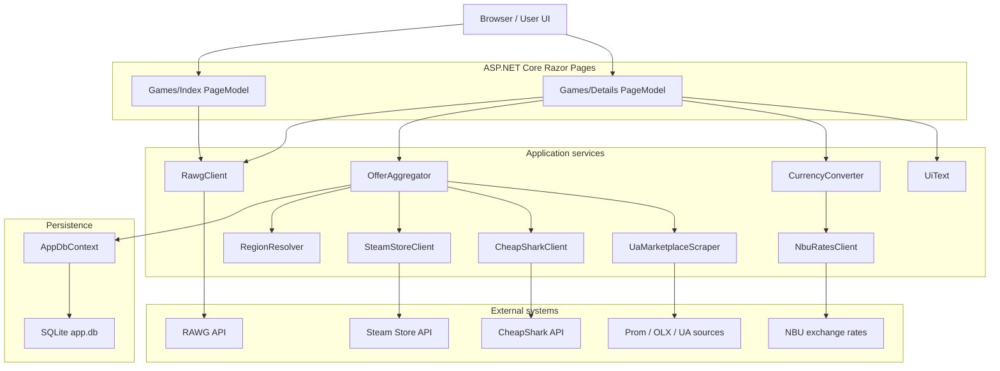

## Notes from code

- Service registration and wiring are defined in `GamesInfoSys/GamesInfoSys/Program.cs`.
- The main page models are `Pages/Games/Index.cshtml.cs` and `Pages/Games/Details.cshtml.cs`.
- The persistence layer is `AppDbContext` over SQLite `app.db`.

## А.6 Діаграма послідовності

Джерело моделі: `diagrams/03_sequence_search_and_details.md`.

# Sequence diagram for search and details flow

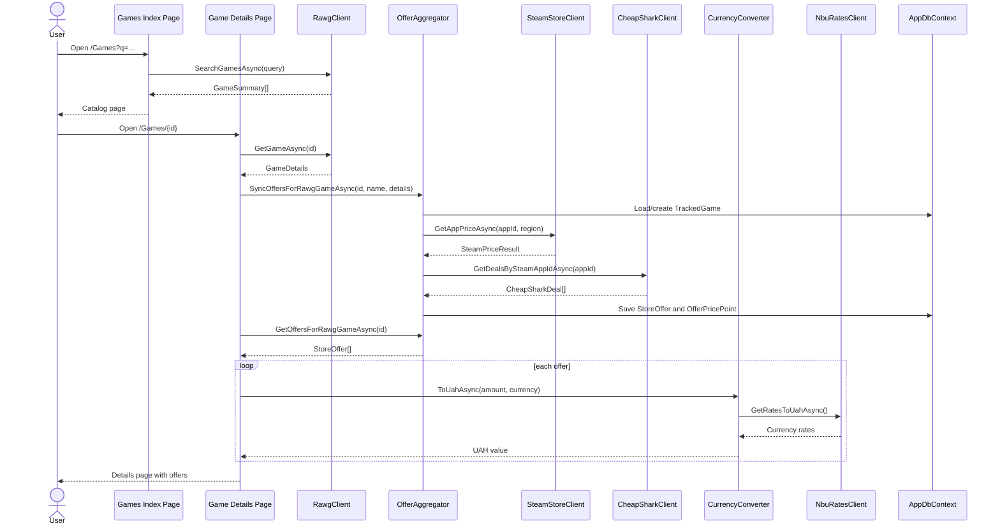

## Notes from code

- Search flow: `GamesInfoSys/GamesInfoSys/Pages/Games/Index.cshtml.cs`
- Details flow: `GamesInfoSys/GamesInfoSys/Pages/Games/Details.cshtml.cs`
- Offer synchronization: `GamesInfoSys/GamesInfoSys/Services/OfferAggregator.cs`

## А.7 Модель даних

Джерело моделі: `diagrams/04_data_model.md`.

# Data model diagram for persistent entities

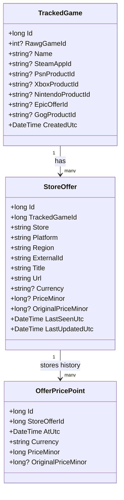

## Notes from code

- Entities are defined in:
  - `GamesInfoSys/GamesInfoSys/Data/Entities/TrackedGame.cs`
  - `GamesInfoSys/GamesInfoSys/Data/Entities/StoreOffer.cs`
  - `GamesInfoSys/GamesInfoSys/Data/Entities/OfferPricePoint.cs`
- EF Core configuration is defined in `GamesInfoSys/GamesInfoSys/Data/AppDbContext.cs`.

## А.8 Діаграма діяльності

Джерело моделі: `diagrams/05_offer_sync_activity.md`.

# Activity diagram for offer synchronization

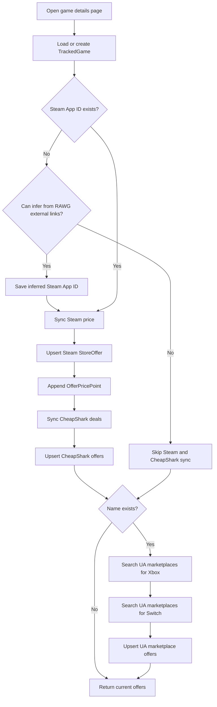

## Notes from code

- Main method: `OfferAggregator.SyncOffersForRawgGameAsync(...)`
- Steam sync: `SyncSteamAsync(...)`
- CheapShark sync: `SyncCheapSharkAsync(...)`
- UA marketplace sync: `SyncUaMarketplacesAsync(...)`

