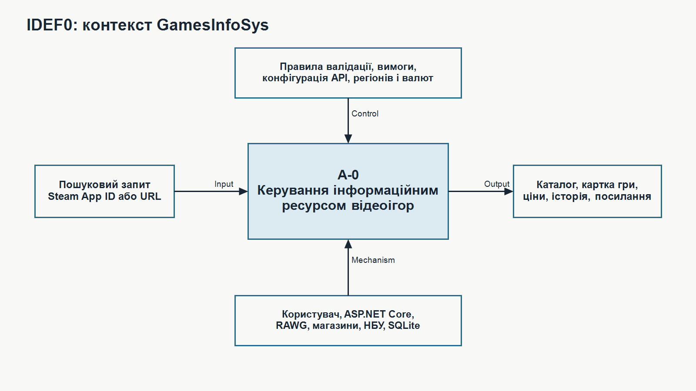
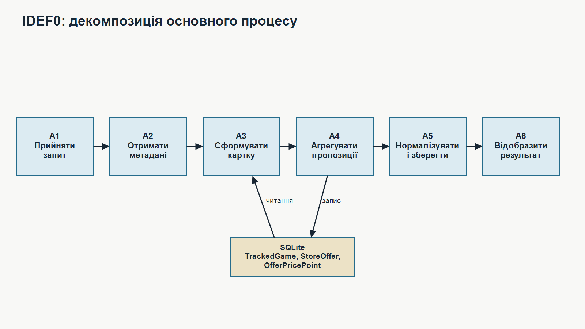
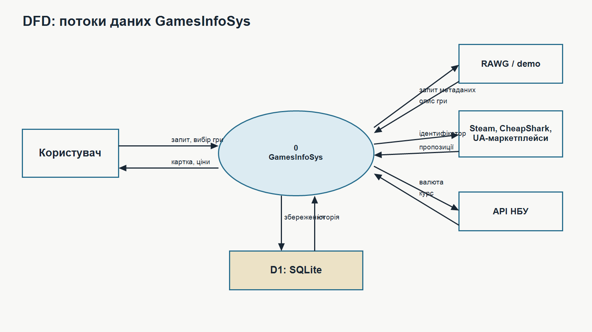
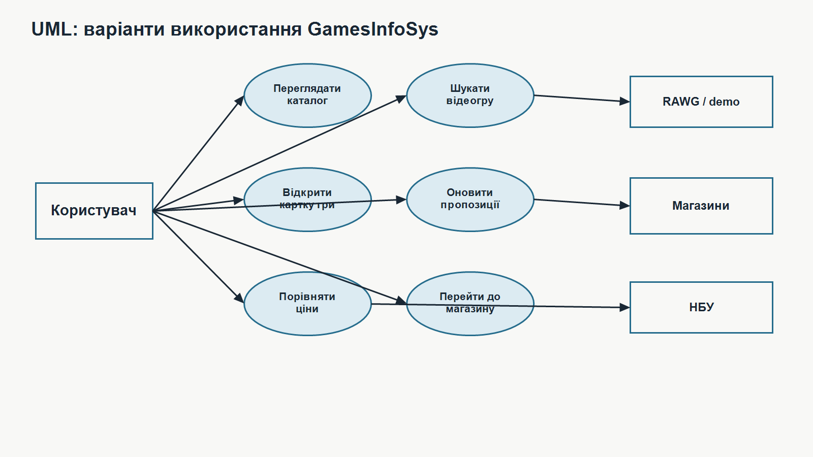
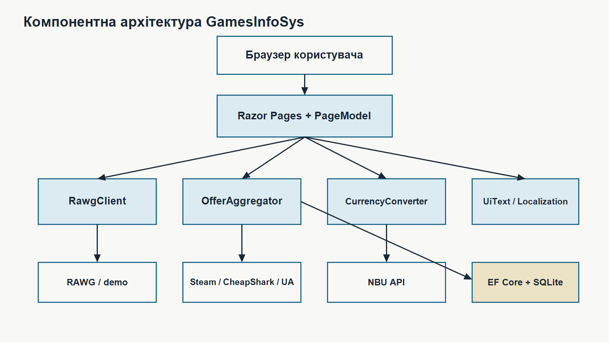
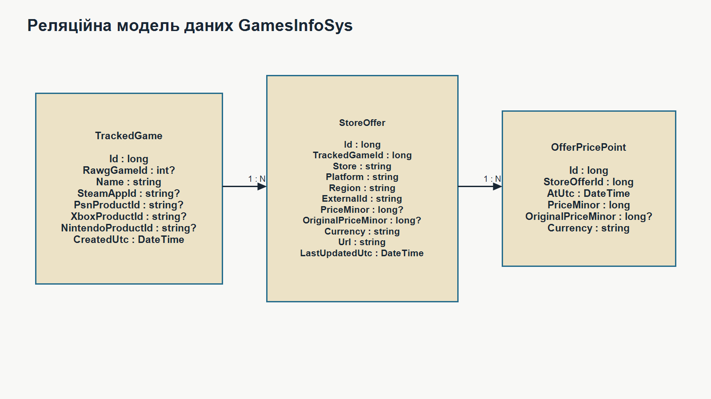

# РЕФЕРАТ

Пояснювальна записка до дипломної роботи присвячена проєктуванню та розробці інформаційної системи для інформаційного ресурсу відеоігор.

Ключові слова: ІНФОРМАЦІЙНА СИСТЕМА, ВЕБЗАСТОСУНОК, ВІДЕОІГРИ, RAWG, STEAM, SQLITE, RAZOR PAGES, АГРЕГАЦІЯ ЦІН, КОНВЕРТАЦІЯ ВАЛЮТ.

Об’єктом дослідження є інформаційна система для інформаційного ресурсу відеоігор.

Предметом дослідження є проєктування та розробка програмного забезпечення інформаційної системи для інформаційного ресурсу відеоігор.

Метою роботи є створення зручної, функціональної та адаптивної веборієнтованої системи, яка забезпечить централізований доступ до інформації про відеоігри, спростить пошук актуальних цін і пропозицій, а також автоматизує основні процеси збирання, відображення та оновлення ігрових даних.

У роботі було проаналізовано предметну область, визначено ключові функціональні вимоги до системи, розроблено UML-діаграми, побудовано моделі бізнес-процесів, а також створено архітектуру вебзастосунку.

Під час реалізації було обрано технології ASP.NET Core Razor Pages, C#, HTML, CSS, Bootstrap та JavaScript, а для збереження даних використано базу SQLite. Система охоплює функціональність для пошуку ігор, перегляду детальної інформації, відстеження цінових пропозицій, збереження історії цін і швидкого переходу до зовнішніх сервісів та торговельних майданчиків.

Тестування системи здійснювалось інтерактивно під час розробки шляхом ручної перевірки роботи ключових функціональних блоків. Виявлені помилки були усунені, що забезпечило стабільну роботу програми.

У дипломній роботі також подано обґрунтування вибору архітектурного підходу та оцінено доцільність реалізації проєкту з техніко-економічної точки зору.

# ABSTRACT

The thesis is devoted to the design and development of an information system for a video game information resource.

Keywords: INFORMATION SYSTEM, WEB APPLICATION, VIDEO GAMES, RAWG, STEAM, SQLITE, RAZOR PAGES, PRICE AGGREGATION, CURRENCY CONVERSION.

The object of research is an information system for a video game information resource.

The subject of the study is the design and development of software for searching, browsing, and aggregating video game data.

The purpose of the project is to create a convenient, functional, and adaptive web-based system that centralizes video game information, simplifies price discovery, and automates the aggregation and presentation of game-related data.

The work includes domain analysis, definition of functional requirements, development of UML diagrams and business process models, and implementation of the architecture of a web application for browsing games and offers.

The chosen technologies were ASP.NET Core Razor Pages, C#, HTML, CSS, Bootstrap, JavaScript, and SQLite. The system integrates RAWG, Steam, CheapShark, and NBU exchange rates, and supports search, game details, offer tracking, and price conversion to UAH.

Testing was performed manually during development to verify search scenarios, page rendering, price synchronization, and data correctness. All identified issues were fixed, resulting in a stable software solution.

The thesis also includes architectural rationale and a feasibility study supporting the practical implementation of the project.

# ЗМІСТ

# ПЕРЕЛІК ПОЗНАК ТА СКОРОЧЕНЬ

- ІС - інформаційна система
- ПЗ - програмне забезпечення
- API - Application Programming Interface
- HTML - мова розмітки гіпертексту
- CSS - каскадні таблиці стилів
- UML - Unified Modeling Language
- DFD - діаграма потоків даних
- IDEF0, IDEF3 - методології функціонального моделювання процесів
- UI - користувацький інтерфейс
- UX - користувацький досвід
- RAWG - зовнішній сервіс метаданих про відеоігри
- NBU - Національний банк України
- UAH - українська гривня
- SQLite - вбудована реляційна база даних
- Razor Pages - сторінкоорієнтований підхід ASP.NET Core для створення вебзастосунків

# ВСТУП

Сучасна відеоігрова індустрія характеризується значною кількістю цифрових платформ, магазинів, інформаційних каталогів і торговельних майданчиків. Відомості про одну гру можуть бути розподілені між декількома джерелами: метадані й рейтинги подаються в каталогах, ціни — у цифрових магазинах, знижки — в агрегаторах, а локальні пропозиції — на українських маркетплейсах. Користувачеві доводиться самостійно зіставляти назви, платформи, регіони, валюти та зовнішні ідентифікатори.

Актуальність роботи зумовлена потребою централізувати ці дані в одному інформаційному ресурсі. Така система повинна не лише виконувати пошук, а й отримувати відомості з різних джерел, приводити їх до спільної структури, зберігати актуальні пропозиції та подавати орієнтовну вартість у гривні. Особливе значення для українського користувача мають локалізація, підтримка регіональних цін і швидкий доступ до українських торговельних майданчиків.

У роботі розробляється вебзастосунок `GamesInfoSys` на платформі ASP.NET Core Razor Pages. Він підтримує пошук відеоігор, перегляд детальної інформації, інтеграцію з RAWG, Steam Store, CheapShark і API Національного банку України, збереження пропозицій та історії цін у SQLite. За відсутності ключа RAWG система працює з локальним демонстраційним набором даних.

Метою роботи є проєктування та розроблення інформаційної системи для пошуку, агрегування, збереження й відображення інформації про відеоігри та доступні цінові пропозиції.

Об’єктом дослідження є процеси інформаційного забезпечення користувачів ресурсу відеоігор.

Предметом дослідження є моделі, методи й програмні засоби отримання метаданих, агрегації пропозицій, конвертації валют і накопичення історії цін.

Для досягнення поставленої мети необхідно розв'язати такі задачі:

1. проаналізувати предметну область інформаційних ресурсів відеоігор, визначити проблеми пошуку та зіставлення розподілених даних, а також дослідити функціональні можливості наявних аналогів;
2. сформувати функціональні та нефункціональні вимоги до GamesInfoSys і побудувати функціональні, процесні та інформаційні моделі системи у нотаціях IDEF0, IDEF3, DFD та UML;
3. спроєктувати архітектуру програмного забезпечення, структуру основних компонентів, алгоритми пошуку й агрегування пропозицій та реляційну модель даних;
4. реалізувати вебзастосунок GamesInfoSys, що забезпечує каталог, пошук, детальну картку гри, інтеграцію із зовнішніми джерелами, валютну конвертацію, локалізацію та збереження історії цін;
5. виконати функціональне, інтеграційне та інтерфейсне тестування розробленої системи, оцінити її якість і визначити обмеження поточної реалізації;
6. обґрунтувати організаційні та технічні заходи супроводу, безпечного розгортання, резервного копіювання і подальшого масштабування GamesInfoSys;
7. виконати техніко-економічне обґрунтування доцільності розробки та практичного використання інформаційної системи.

Практичне значення роботи полягає у створенні працездатного MVP, який скорочує кількість ручних переходів між джерелами, уніфікує представлення пропозицій і створює основу для аналітики зміни цін.

# 1 АНАЛІЗ ПРЕДМЕТНОЇ ОБЛАСТІ ІНФОРМАЦІЙНОЇ СИСТЕМИ ДЛЯ ІНФОРМАЦІЙНОГО РЕСУРСУ ВІДЕОІГОР

## 1.1 Опис предметної області «Інформаційний ресурс відеоігор»

Відеоігрова індустрія є однією з найдинамічніших складових сучасної цифрової економіки. Кількість ігор, платформ розповсюдження, регіональних магазинів, знижок і додаткових інформаційних матеріалів постійно зростає. Через це користувачеві дедалі складніше швидко знайти достовірну інформацію про конкретну гру, порівняти доступні пропозиції та перейти до потрібного магазину. Відомості про назву, дату випуску, жанри, платформи, рейтинг, системи цифрового розповсюдження та поточні ціни часто розміщуються на різних вебресурсах і мають неоднакову структуру.

Інформаційний ресурс відеоігор повинен об’єднувати довідкові та комерційні дані в єдиному інтерфейсі. Його основним призначенням є надання користувачеві засобів пошуку, перегляду й аналізу інформації про ігри без необхідності послідовно відкривати декілька окремих сайтів. У межах такої системи метадані про гру доповнюються інформацією про зовнішні магазини, регіони продажу, валюту, звичайну та акційну ціну, а також посиланнями на огляди або демонстраційні матеріали.

Особливістю предметної області є залежність результату від зовнішніх джерел. Каталог ігор може бути отриманий через спеціалізований API, ціни — через API цифрових магазинів або агрегаторів, валютні курси — через банківські сервіси, а пропозиції українських торговельних майданчиків — через пошук або аналіз їхніх сторінок. Дані відрізняються за форматом, повнотою, валютою та частотою оновлення. Отже, програмна система повинна не лише відобразити отриману інформацію, а й нормалізувати її, зіставити з обраною грою та зберегти у власній моделі даних.

Розроблений застосунок `GamesInfoSys` реалізує веборієнтований інформаційний ресурс, у якому центральним об’єктом є відеогра. Користувач вводить назву або частину назви гри, отримує перелік відповідних результатів і переходить до сторінки детального перегляду. На сторінці відображаються опис, дата випуску, рейтинг, платформи, жанри, знімки екрана, зовнішні посилання та доступні торговельні пропозиції. Для пропозицій, ціна яких подана не в гривні, система обчислює орієнтовне значення в гривнях за курсами Національного банку України.

Окремим завданням є підтримка історії цін. Дані, отримані із зовнішніх джерел, не повинні втрачатися після завершення HTTP-запиту. Для цього в системі створюється запис відстежуваної гри, зберігаються актуальні пропозиції магазинів і формуються часові точки зміни вартості. Такий підхід створює основу для подальшого побудування графіків, визначення мінімальної ціни та аналізу динаміки пропозицій.

У предметній області можна виділити таких учасників і програмні компоненти:

- користувач інформаційного ресурсу, який здійснює пошук і перегляд даних;
- вебзастосунок `GamesInfoSys`, який координує виконання сценаріїв;
- сервіс RAWG або локальний демонстраційний набір даних, що надає метадані про ігри;
- Steam Store та CheapShark, які надають відомості про цифрові пропозиції;
- українські маркетплейси, на яких можуть бути доступні фізичні або цифрові версії;
- API НБУ, що використовується для валютного перерахунку;
- локальна база даних SQLite, у якій зберігаються відстежувані ігри, пропозиції та історія цін.

Таким чином, предметна область охоплює процеси пошуку ігор, отримання метаданих, зіставлення гри із зовнішніми ідентифікаторами, агрегації пропозицій, конвертації валют, збереження історії та формування результату для користувача. Автоматизація цих процесів зменшує кількість ручних дій, підвищує цілісність даних і забезпечує зручніший доступ до інформації.

## 1.2 Огляд існуючих інформаційних систем у сфері відеоігор

Для визначення вимог до майбутньої системи доцільно розглянути основні класи наявних рішень. До них належать енциклопедичні каталоги ігор, цифрові магазини, агрегатори знижок та локальні торговельні майданчики. Кожний клас вирішує лише частину задачі.

Енциклопедичні ресурси надають структуровані метадані: назву, опис, дату випуску, жанр, розробника, видавця, платформи, рейтинг і медіаматеріали. Їхньою перевагою є значний обсяг каталогу та уніфікована структура. Недоліком є те, що цінова інформація або відсутня, або не враховує локальні регіони й українські джерела.

Цифрові магазини містять точні відомості про товар у межах власної платформи. Користувач може переглянути поточну ціну, знижку та сторінку придбання. Водночас магазин не зацікавлений у повному порівнянні з конкурентами, тому відомості обмежені однією екосистемою. Крім того, одна гра може мати різні ідентифікатори в Steam, PlayStation Store, Xbox, Nintendo eShop, Epic Games Store і GOG.

Агрегатори цін дозволяють порівнювати цифрові пропозиції та переходити до магазинів. Їхньою перевагою є орієнтація на пошук найвигіднішої ціни. Однак частина таких сервісів не забезпечує україномовний інтерфейс, не відображає українські маркетплейси або використовує регіони, які не відповідають умовам придбання українського користувача.

Локальні маркетплейси містять пропозиції фізичних копій, дисків, ключів або консолей. Вони важливі для українського ринку, проте результати пошуку можуть містити нерелевантні товари, різні видання однієї гри та оголошення користувачів. Для їх інтеграції потрібна додаткова фільтрація й позначення джерела.

Порівняння класів систем доцільно оформити у таблиці 1.1.

**Таблиця 1.1 – Порівняльний огляд класів існуючих систем**

| Критерій | Каталог ігор | Цифровий магазин | Агрегатор цін | Український маркетплейс | GamesInfoSys |
|---|---:|---:|---:|---:|---:|
| Пошук за назвою | + | + | + | + | + |
| Повні метадані гри | + | частково | частково | – | + |
| Порівняння кількох джерел | – | – | + | – | + |
| Орієнтовна ціна у гривні | частково | частково | частково | + | + |
| Збереження історії пропозицій | – | – | частково | – | + |
| Українські зовнішні джерела | – | – | частково | + | + |
| Демонстраційний автономний режим | – | – | – | – | + |

Проведене порівняння показує, що жодний окремий клас систем не поєднує повний каталог, агреговані пропозиції, локальний валютний контекст, українські зовнішні джерела та власне збереження історії. Саме це визначає доцільність розроблення спеціалізованого рішення.

Запропонована система не повинна повністю замінювати зовнішні сервіси. Її роль полягає в координації та уніфікації даних: отримати інформацію, привести її до спільної моделі, відобразити в одному інтерфейсі та надати прямі посилання на першоджерело. Такий підхід зменшує дублювання функцій і водночас створює користувацьку цінність.

## 1.3 Огляд засобів і технологій створення інформаційної системи

Для реалізації інформаційного ресурсу потрібні засоби серверного вебпрограмування, роботи з HTTP, збереження структурованих даних та побудови адаптивного інтерфейсу. У застосунку використано платформу .NET і ASP.NET Core Razor Pages.

Razor Pages організовує функціональність навколо окремих сторінок і відповідних моделей сторінок. Така структура є доречною для системи з чітко визначеними сценаріями: головна сторінка, каталог ігор, деталі гри, службові сторінки. Обробник `OnGetAsync` формує дані для початкового відображення, а `OnPostSetSteamAsync` опрацьовує введення Steam App ID або посилання.

Мова C# використовується для реалізації моделей, сторінкової логіки, сервісів інтеграції та правил обробки даних. Асинхронні операції дають змогу виконувати зовнішні HTTP-запити без блокування потоку. Для кожного зовнішнього джерела створено окремий клієнт або сервіс, завдяки чому відповідальність компонентів не змішується.

Entity Framework Core забезпечує доступ до локальної бази даних SQLite. Використання ORM спрощує визначення сутностей, зв’язків та індексів. База містить таблиці відстежуваних ігор, пропозицій магазинів і точок історії цін. SQLite не потребує окремого сервера, тому є зручною для демонстраційного й локального розгортання.

Для побудови інтерфейсу застосовуються HTML, CSS, компоненти Razor і Bootstrap. Сервер формує сторінку з уже підготовленими даними, а браузер відповідає за відображення й адаптацію до розміру екрана. Локалізація реалізована для української та англійської культур із можливістю перемикання мови.

Для зовнішніх інтеграцій використано `HttpClient`. RAWG надає каталог та детальні метадані, Steam Store — відомості про продукт і ціну, CheapShark — пропозиції та перенаправлення до магазинів, НБУ — валютні курси. Окремий сервіс `UaMarketplaceScraper` формує або отримує пропозиції українських джерел.

Система також підтримує демонстраційний режим. Якщо ключ RAWG API не задано, дані завантажуються з локального файлу `demo-games.json`. Це дозволяє запускати застосунок, перевіряти каталог і сторінки деталей без обов’язкової реєстрації в зовнішньому сервісі.

## 1.4 Визначення моделі процесу розробки інформаційної системи

Під час вибору моделі життєвого циклу враховано залежність проєкту від зовнішніх сервісів, необхідність поступового уточнення структури даних і можливість окремо перевіряти кожну інтеграцію. Тому для розроблення `GamesInfoSys` доцільною є ітеративно-інкрементна модель.

На першій ітерації формується базова структура ASP.NET Core застосунку, головна сторінка та навігація. На другій реалізується каталог ігор у демонстраційному режимі. На третій додається інтеграція з RAWG і сторінка детального перегляду. Наступна ітерація охоплює модель бази даних і збереження пропозицій. Після цього підключаються Steam, CheapShark, українські джерела та конвертація валют.

Кожний інкремент має завершуватися працездатним результатом. Наприклад, навіть без налаштованого RAWG API система повинна показати демонстраційний каталог; за відсутності ціни в одному джерелі сторінка гри повинна залишатися доступною; помилка валютного сервісу не повинна блокувати відображення основних метаданих.

Ітеративний підхід дозволяє уточнювати правила зіставлення зовнішніх ідентифікаторів. Спочатку Steam App ID може вводитися користувачем, а надалі система намагається визначити його автоматично з посилань RAWG. Аналогічно історія цін спочатку зберігається у вигляді часових точок, а графічний аналіз може бути доданий наступним інкрементом.

## 1.5 Постановка задачі

Метою роботи є проєктування та розроблення інформаційної системи для пошуку, агрегування, збереження та відображення інформації про відеоігри й доступні торговельні пропозиції.

Об’єктом дослідження є процеси інформаційного забезпечення користувачів ресурсу відеоігор.

Предметом дослідження є моделі, методи та програмні засоби отримання метаданих, агрегації цінових пропозицій, валютного перерахунку й збереження історії цін.

Для досягнення поставленої мети необхідно розв’язати такі задачі:

1. Проаналізувати предметну область інформаційних ресурсів відеоігор і наявні програмні аналоги.
2. Сформувати вимоги до GamesInfoSys та розробити моделі IDEF0, IDEF3, DFD і UML для основних процесів.
3. Спроєктувати архітектуру ASP.NET Core Razor Pages, алгоритми роботи сервісів і модель даних.
4. Реалізувати пошук, детальний перегляд, агрегацію пропозицій, валютний перерахунок та інтеграції із зовнішніми джерелами.
5. Провести функціональне тестування основних користувацьких сценаріїв і оцінити якість реалізації.
6. Обґрунтувати порядок супроводу, розгортання, конфігурування та подальшого масштабування системи.
7. Виконати техніко-економічне обґрунтування доцільності розроблення GamesInfoSys.

Результатом виконання задач має стати працездатний вебзастосунок `GamesInfoSys`, який централізує інформацію про відеоігри, зменшує кількість ручних переходів між сайтами та створює основу для подальшого аналізу динаміки цін.

# 2 МОДЕЛЮВАННЯ ІНФОРМАЦІЙНОЇ СИСТЕМИ ДЛЯ ІНФОРМАЦІЙНОГО РЕСУРСУ ВІДЕОІГОР

## 2.1 Моделювання бізнес-процесів інформаційної системи

Коли користувач відкриває вебзастосунок `GamesInfoSys`, він потрапляє на головну сторінку з коротким описом ресурсу та переходом до каталогу. Подальша взаємодія не потребує обов’язкової реєстрації: користувач відкриває каталог, вводить назву або частину назви відеогри й надсилає пошуковий запит. Модель сторінки передає запит сервісу `RawgClient`, який залежно від конфігурації використовує RAWG API або локальний демонстраційний набір даних.

У відповідь система формує перелік ігор. Кожна позиція містить ідентифікатор, назву, зображення, дату випуску, рейтинг та інші короткі характеристики, доступні в джерелі. Користувач обирає потрібну гру й переходить до сторінки детального перегляду. Якщо гру не знайдено, система повертає коректний стан відсутності даних замість формування помилкової сторінки.

Під час відкриття сторінки деталей виконується декілька пов’язаних процесів. Спочатку завантажуються метадані гри: опис, платформи, жанри, рейтинг, офіційний сайт, зовнішні магазини й зображення. Після цього система запускає синхронізацію торговельних пропозицій. Для гри створюється або знаходиться запис `TrackedGame`, пов’язаний з ідентифікатором RAWG.

Для отримання ціни Steam потрібний Steam App ID. Система намагається визначити його автоматично за зовнішніми посиланнями в метаданих гри. Якщо автоматичне зіставлення неможливе, користувач може ввести числовий ідентифікатор або повне посилання на сторінку `store.steampowered.com/app/...`. Введене значення перевіряється, зберігається та використовується під час повторної синхронізації.

Сервіс `OfferAggregator` координує роботу джерел. Він викликає `SteamStoreClient`, отримує пропозиції через `CheapSharkClient`, а також виконує пошук на українських маркетплейсах для окремих платформ. Дані різних джерел перетворюються до спільної сутності `StoreOffer`, яка містить назву магазину, платформу, регіон, зовнішній ідентифікатор, посилання, валюту, поточну й початкову ціну та час оновлення.

Під час збереження система перевіряє, чи існує відповідна пропозиція. Унікальність визначається комбінацією магазину, зовнішнього ідентифікатора та регіону. Для нової пропозиції створюється запис, а для наявної оновлюються ціна, назва, адреса та час останнього спостереження. Якщо ціна відома, додатково створюється `OfferPricePoint`, що фіксує її значення в конкретний момент часу.

Після отримання пропозицій система виконує валютний перерахунок. Для кожної ціни, поданої не в гривні, сервіс `CurrencyConverter` звертається до `NbuRatesClient` і обчислює орієнтовне значення в гривнях. Курси кешуються, що зменшує кількість повторних HTTP-запитів. Якщо валюта або ціна відсутні, система не створює штучного значення, а показує користувачеві доступну інформацію без конвертації.

Завершальним етапом є формування сторінки деталей. Користувач отримує метадані, знімки екрана, зовнішні посилання, перелік пропозицій, орієнтовні значення в гривні та швидкі переходи до оглядів, геймплею й українських маркетплейсів. Таким чином, один користувацький запит запускає послідовність взаємопов’язаних процесів отримання, нормалізації, збереження й представлення даних.

Аналіз предметної області дозволив виділити такі основні бізнес-процеси:

1. Управління інформаційним ресурсом відеоігор:
   1.1. Пошук і перегляд каталогу ігор.
   1.2. Отримання детальної інформації про гру.
   1.3. Визначення зовнішніх ідентифікаторів.
   1.4. Агрегація цінових пропозицій.
   1.5. Конвертація валют.
   1.6. Збереження пропозицій та історії цін.
   1.7. Формування зовнішніх посилань і результату для користувача.
2. Агрегація цінових пропозицій:
   2.1. Вибір або створення відстежуваної гри.
   2.2. Визначення Steam App ID.
   2.3. Отримання пропозицій Steam.
   2.4. Отримання пропозицій CheapShark.
   2.5. Отримання пропозицій українських маркетплейсів.
   2.6. Нормалізація та збереження пропозицій.
   2.7. Формування точок історії цін.

Для опису системи в нотації IDEF0 визначено такі ICOM-компоненти:

1. Входи: пошуковий запит; ідентифікатор гри RAWG; Steam App ID або посилання; метадані гри; відповіді магазинів; валютні курси.
2. Виходи: результати пошуку; сторінка деталей; нормалізований список пропозицій; значення цін у гривні; збережена історія; зовнішні посилання.
3. Керування: правила валідації; налаштування регіонів; конфігурація API; правила зіставлення ідентифікаторів; модель даних; правила конвертації валют; обмеження часу HTTP-запитів.
4. Механізми: користувач; ASP.NET Core Razor Pages; `RawgClient`; `OfferAggregator`; клієнти зовнішніх сервісів; Entity Framework Core; SQLite; кеш пам’яті.

Контекстну діаграму IDEF0 наведено на рисунку 2.1, її декомпозицію — на рисунку 2.2, а деталізацію процесу агрегації пропозицій — на рисунку 2.3. Код діаграм міститься у файлі `diagrams/06_idef0.md`.

Рисунок 2.1 – Контекстна діаграма «Управління інформаційним ресурсом відеоігор»

Рисунок 2.2 – Декомпозиція контекстної діаграми IDEF0

Рисунок 2.3 – Декомпозиція процесу «Агрегація цінових пропозицій»

Нотація IDEF3 використовується для подання часової та причинно-наслідкової послідовності робіт. На відміну від IDEF0, де акцент зроблено на входах, виходах, керуванні й механізмах функції, IDEF3 показує, що саме відбувається раніше, які дії виконуються паралельно та за яких умов процес продовжується.

Для `GamesInfoSys` доцільно деталізувати такі сценарії:

- пошук і вибір гри;
- завантаження детальної інформації;
- визначення Steam App ID;
- паралельне отримання пропозицій із зовнішніх джерел;
- конвертація валют;
- збереження та відображення результатів.

IDEF3-діаграми наведено у файлі `diagrams/08_idef3.md` як рисунки 2.4–2.9. Вони повторюють структуру комплекту діаграм з оригінального DOCX, але містять процеси реального застосунку.

Діаграма потоків даних DFD відображає, які дані надходять від користувача й зовнішніх сервісів, які процеси їх перетворюють і в яких сховищах вони зберігаються. На контекстному рівні система розглядається як єдиний процес. На рівні підсистеми виділяються пошук, отримання деталей, агрегація пропозицій, конвертація та формування результату. На детальному рівні розкривається процес синхронізації пропозицій.

Контекстну DFD наведено на рисунку 2.10, DFD рівня підсистеми — на рисунку 2.11, а деталізацію процесу агрегації — на рисунку 2.12. Код і пояснення містяться у файлі `diagrams/07_dfd.md`.

Рисунок 2.10 – Контекстна діаграма DFD рівня системи

Рисунок 2.11 – Діаграма потоків даних рівня підсистеми

Рисунок 2.12 – Діаграма DFD процесу «Агрегація цінових пропозицій»

Побудовані моделі показують, що `GamesInfoSys` є не статичним каталогом, а інтеграційною інформаційною системою. Вона приймає запит користувача, координує декілька зовнішніх джерел, перетворює неоднорідні відповіді на спільну модель, зберігає результати та формує єдине представлення.

## 2.2 Визначення функціональних і нефункціональних вимог

Функціональні вимоги визначають дії, які повинна виконувати система, а нефункціональні — характеристики якості, обмеження та умови її роботи.

### 2.2.1 Функціональні вимоги

1. **Пошук відеоігор.** Система повинна приймати текстовий запит, передавати його джерелу метаданих і відображати список знайдених ігор. Порожній запит може використовуватися для формування початкової добірки.

2. **Демонстраційний режим.** За відсутності ключа RAWG API система повинна використовувати локальний набір `demo-games.json`, щоб основні сценарії залишалися доступними.

3. **Перегляд детальної інформації.** Для обраної гри система повинна відображати назву, опис, дату випуску, рейтинг, жанри, платформи, офіційний сайт, зовнішні магазини та знімки екрана, якщо відповідні дані доступні.

4. **Ведення відстежуваних ігор.** Під час синхронізації система повинна знаходити або створювати сутність `TrackedGame`, пов’язану з RAWG ID.

5. **Визначення Steam App ID.** Система повинна намагатися автоматично отримати Steam App ID із зовнішніх посилань. Користувач повинен мати можливість ввести числовий ID або URL вручну.

6. **Валідація введення.** Значення Steam App ID повинно перевірятися. URL має належати домену Steam і містити коректний числовий ідентифікатор застосунку.

7. **Отримання пропозицій Steam.** За наявності Steam App ID система повинна отримати дані про продукт і ціну для налаштованого регіону.

8. **Отримання пропозицій CheapShark.** Система повинна запитувати доступні пропозиції, пов’язані зі Steam App ID, і формувати посилання перенаправлення до магазину.

9. **Отримання українських пропозицій.** Система повинна виконувати пошук релевантних пропозицій українських маркетплейсів для підтримуваних платформ.

10. **Нормалізація даних.** Пропозиції різних джерел повинні приводитися до єдиної структури з назвою магазину, платформою, регіоном, валютою, ціною та URL.

11. **Усунення дублювання.** Система не повинна створювати дублікати пропозицій з однаковим магазином, зовнішнім ідентифікатором і регіоном.

12. **Збереження поточної ціни.** Актуальна інформація повинна записуватися в таблицю `StoreOffers`.

13. **Збереження історії.** Для відомої ціни повинна створюватися часова точка `OfferPricePoint`.

14. **Конвертація валют.** Система повинна обчислювати орієнтовну вартість у гривні за курсами НБУ.

15. **Визначення найкращої пропозиції.** Серед доступних не-Steam пропозицій система може вибирати позицію з мінімальною відомою ціною для додаткового виділення.

16. **Формування зовнішніх посилань.** Сторінка повинна містити переходи до офіційних магазинів, українських маркетплейсів, пошуку оглядів і геймплею.

17. **Локалізація.** Користувач повинен мати можливість перемикати українську та англійську мови інтерфейсу.

18. **Обробка відсутніх даних.** Відсутність ціни, валюти, зображення або відповіді окремого сервісу не повинна призводити до аварійного завершення всієї сторінки.

### 2.2.2 Нефункціональні вимоги

1. **Зручність використання.** Основні сценарії повинні виконуватися за мінімальну кількість переходів: пошук, вибір гри, перегляд результату.
2. **Продуктивність.** Зовнішні запити виконуються асинхронно, а валютні курси й демонстраційні дані кешуються.
3. **Надійність.** Для HTTP-клієнтів задаються обмеження часу очікування; відмова одного джерела не повинна блокувати основні метадані.
4. **Підтримуваність.** Кожне зовнішнє джерело реалізується окремим сервісом, а координація зосереджується в `OfferAggregator`.
5. **Цілісність даних.** У базі використовуються первинні ключі, унікальні й пошукові індекси.
6. **Переносимість.** Застосунок запускається на платформі .NET, а SQLite не потребує окремого сервера бази даних.
7. **Масштабованість.** Архітектура повинна дозволяти підключення нових магазинів і заміну локального сховища на серверну СКБД.
8. **Локалізація.** Текст інтерфейсу не повинен бути жорстко прив’язаний до однієї мови.
9. **Безпека.** Вхідні URL перевіряються, HTTPS перенаправлення й HSTS застосовуються у виробничому середовищі, конфіденційні API-ключі мають задаватися через конфігурацію або змінні середовища.

## 2.3 Розробка UML-діаграм основних варіантів використання

Діаграма варіантів використання подає систему з точки зору зовнішнього користувача. Основним актором є користувач інформаційного ресурсу. Допоміжними зовнішніми акторами виступають RAWG, Steam Store, CheapShark, API НБУ й українські джерела пропозицій.

До основних варіантів використання належать:

- знайти відеогру;
- переглянути каталог;
- відкрити сторінку деталей;
- переглянути знімки екрана й зовнішні посилання;
- оновити цінові пропозиції;
- вказати Steam App ID;
- переглянути ціну у вихідній валюті та гривні;
- перейти до магазину або маркетплейсу;
- змінити мову інтерфейсу.

Контекстна UML-діаграма міститься у файлі `diagrams/01_use_case.md` і повинна бути оформлена як рисунок 2.13.

Рисунок 2.13 – Контекстна діаграма варіантів використання системи

Деталізуємо варіант використання «Перегляд детальної інформації та пропозицій».

1. **Короткий опис.** Користувач обирає гру з результатів пошуку й отримує об’єднану інформацію про неї та доступні пропозиції.
2. **Передумови.** Вебзастосунок запущено; користувач має доступ до сторінки каталогу; джерело метаданих доступне або ввімкнено демонстраційний режим.
3. **Головний потік подій.**
   1. Користувач вводить пошуковий запит.
   2. Система відображає список ігор.
   3. Користувач вибирає гру.
   4. Система отримує детальні метадані.
   5. Система знаходить або створює відстежувану гру.
   6. Система визначає Steam App ID, якщо це можливо.
   7. Система отримує та зберігає пропозиції.
   8. Система конвертує відомі ціни у гривню.
   9. Система відображає сторінку деталей.
4. **Підлеглі потоки.**
   - завантаження знімків екрана;
   - формування зовнішніх посилань;
   - визначення найкращої пропозиції;
   - збереження точки історії ціни.
5. **Альтернативні потоки.**
   - якщо RAWG API не налаштовано, використовуються демонстраційні дані;
   - якщо Steam App ID не визначено, користувач вводить його вручну;
   - якщо ціна відсутня, пропозиція показується без числового значення;
   - якщо гру не знайдено, система повертає стан `NotFound`;
   - якщо введене Steam-посилання некоректне, відображається повідомлення валідації.
6. **Постумови.** Користувач отримує доступну інформацію; отримані пропозиції збережено або оновлено; для відомих цін створено історичні точки.
7. **Спеціальні вимоги.** Інтерфейс повинен залишатися читабельним на різних пристроях, а зовнішні помилки не повинні знищувати вже отримані дані.

Рисунок 2.14 – Діаграма варіантів використання «Перегляд детальної інформації та пропозицій»

Розроблені UML-моделі узгоджуються з IDEF0 і DFD: варіанти використання описують користувацьку мету, IDEF0 — функціональну структуру, IDEF3 — послідовність робіт, а DFD — рух і збереження даних.

## 2.8 Графічне подання ключових моделей

Контекстну модель системи наведено на рисунку 2.1.



Рисунок 2.1 - Контекстна діаграма IDEF0 GamesInfoSys

Декомпозицію основного процесу наведено на рисунку 2.2.



Рисунок 2.2 - Декомпозиція основного процесу GamesInfoSys

Потоки інформації між користувачем, зовнішніми сервісами й локальним сховищем показано на рисунку 2.3.



Рисунок 2.3 - Контекстна діаграма потоків даних GamesInfoSys

Основні варіанти використання наведено на рисунку 2.4.



Рисунок 2.4 - Діаграма варіантів використання GamesInfoSys

# 3 РОЗРОБКА ПРОГРАМНОГО ЗАБЕЗПЕЧЕННЯ ІНФОРМАЦІЙНОЇ СИСТЕМИ ДЛЯ ІНФОРМАЦІЙНОГО РЕСУРСУ ВІДЕОІГОР

## 3.1 Проєктування архітектури інформаційної системи

Архітектура програмної системи визначає розподіл відповідальності між її компонентами, порядок обміну даними та можливості подальшого розвитку. Для `GamesInfoSys` обрано вебархітектуру на основі ASP.NET Core Razor Pages. Вона поєднує серверне формування сторінок, сторінкові моделі, окремий сервісний рівень і реляційне локальне сховище.

На відміну від спрощеної клієнтської системи, що зберігає дані лише у браузері, розроблений застосунок має повноцінну серверну частину. Сервер обробляє HTTP-запити користувача, звертається до зовнішніх API, виконує нормалізацію пропозицій, конвертацію валют і роботу з базою SQLite. Такий підхід дозволяє приховати технічні деталі зовнішніх інтеграцій від клієнта та централізувати правила обробки.

Архітектуру системи доцільно подати у вигляді таких рівнів:

1. **Рівень представлення.** До нього належать Razor-сторінки, спільний макет, HTML-розмітка, CSS, Bootstrap і локалізовані текстові ресурси. Рівень відповідає за введення пошукового запиту, вибір гри, введення Steam App ID, відображення метаданих і таблиці пропозицій.
2. **Сторінковий рівень.** Моделі `IndexModel` і `DetailsModel` приймають параметри HTTP-запиту, викликають необхідні сервіси та формують дані для представлення. Вони не реалізують низькорівневу логіку HTTP-інтеграцій або SQL-операцій.
3. **Сервісний рівень.** Містить `RawgClient`, `OfferAggregator`, `SteamStoreClient`, `CheapSharkClient`, `UaMarketplaceScraper`, `NbuRatesClient`, `CurrencyConverter`, `RegionResolver` і `UiText`. Кожний сервіс має окрему відповідальність.
4. **Рівень доступу до даних.** Представлений `AppDbContext` і сутностями Entity Framework Core. Він забезпечує створення, читання й оновлення відстежуваних ігор, пропозицій і точок історії.
5. **Зовнішній інтеграційний рівень.** Включає RAWG, Steam Store, CheapShark, API НБУ та українські торговельні джерела.

Під час запуску застосунку в контейнері залежностей реєструються Razor Pages, локалізація, кеш пам’яті, контекст бази даних і типізовані HTTP-клієнти. Для кожного клієнта встановлено базову адресу та обмеження часу очікування. Після побудови конвеєра застосунку база даних створюється методом `EnsureCreated`, якщо її ще не існує.

Обробка запиту каталогу починається в `Pages/Games/Index.cshtml.cs`. Властивість `Query` зв’язується з параметром `q`, а метод `OnGetAsync` передає його до `RawgClient.SearchGamesAsync`. Такий розподіл дозволяє залишити сторінкову модель компактною.

Обробка сторінки деталей є складнішою. Метод `OnGetAsync` послідовно отримує метадані, запускає синхронізацію пропозицій, читає збережені записи, визначає найкращу доступну пропозицію, обчислює значення у гривні та завантажує знімки екрана. Якщо гра не знайдена, повертається `NotFound`.

POST-сценарій використовується для ручного встановлення Steam App ID. Вхідне значення перевіряється як числовий ідентифікатор або URL Steam. Після успішної валідації значення зберігається, пропозиції повторно синхронізуються, а користувач перенаправляється на GET-сторінку. Використання перенаправлення після POST запобігає повторному надсиланню форми під час оновлення браузера.

Компонентну архітектуру наведено у файлі `diagrams/02_component_architecture.md`, а послідовність виконання запиту — у файлі `diagrams/03_sequence_search_and_details.md`.

Рисунок 3.1 – Компонентна архітектура інформаційної системи

Рисунок 3.2 – Діаграма послідовності пошуку та перегляду гри

## 3.2 Структура програмних компонентів

`RawgClient` інкапсулює роботу з каталогом ігор. Він підтримує два режими: live-режим із ключем API та демонстраційний режим із локальним JSON-файлом. Методи клієнта повертають внутрішні моделі `GameSummary`, `GameDetails` і `GameScreenshot`, завдяки чому сторінки не залежать від точного формату зовнішньої JSON-відповіді.

`OfferAggregator` є центральним сервісом цінової підсистеми. Він не відповідає за відображення сторінки, а виконує координацію джерел і бази даних. Основні операції сервісу:

- знайти або створити `TrackedGame`;
- оновити назву гри;
- визначити Steam App ID з метаданих;
- синхронізувати Steam;
- отримати пропозиції CheapShark;
- виконати пошук українських пропозицій;
- оновити або створити `StoreOffer`;
- додати `OfferPricePoint`;
- повернути впорядкований перелік пропозицій.

`SteamStoreClient` отримує метадані й ціну продукту Steam. Регіон визначається через `RegionResolver` та конфігурацію `PricingOptions`. За замовчуванням використовується український регіон, а для окремих платформ можуть задаватися власні значення.

`CheapSharkClient` отримує перелік пропозицій за Steam App ID. Оскільки кінцева URL-адреса магазину може формуватися через перенаправлення агрегатора, клієнт створює спеціальне посилання на угоду.

`UaMarketplaceScraper` відповідає за локальні джерела. Для HTTP-клієнта встановлено описовий User-Agent та заголовок прийнятних мов. Отримані позиції повинні розглядатися як зовнішні пропозиції, що можуть потребувати додаткової перевірки користувачем.

`NbuRatesClient` отримує курси валют, а `CurrencyConverter` використовує їх для перерахунку. Винесення цієї логіки в окремий сервіс дає змогу змінити джерело курсу без модифікації сторінкових моделей.

`UiText` централізує текстові підписи інтерфейсу. Культура визначається через механізм локалізації ASP.NET Core. Користувач може змінити мову, після чого вибір зберігається в cookie.

## 3.3 Проєктування моделі даних

Для збереження даних використано реляційну модель з трьома основними сутностями.

Сутність `TrackedGame` представляє гру, для якої система виконує відстеження пропозицій. Поле `RawgGameId` пов’язує локальний запис із каталогом RAWG. Поле `SteamAppId` зберігає ідентифікатор Steam. Також передбачено поля для інших платформ, що створює основу для майбутнього розширення.

Сутність `StoreOffer` представляє актуальний стан однієї пропозиції. Вона пов’язана з `TrackedGame` через `TrackedGameId`. До атрибутів належать магазин, платформа, регіон, зовнішній ідентифікатор, назва, URL, валюта, поточна та початкова ціна, час останнього спостереження й оновлення.

Ціна зберігається в мінімальних одиницях валюти як ціле число. Наприклад, 199,99 одиниці валюти подаються як 19999. Це зменшує ризик помилок двійкової арифметики під час збереження грошових значень.

Сутність `OfferPricePoint` містить історичне значення ціни. Кожний запис пов’язаний з конкретною пропозицією й містить момент часу UTC, валюту, поточну та початкову ціну. Накопичення таких записів дозволяє надалі побудувати часовий ряд.

Для підвищення цілісності створено унікальний індекс за полями `Store`, `ExternalId`, `Region`. Він запобігає появі декількох локальних записів однієї й тієї самої пропозиції. Додаткові індекси прискорюють пошук гри за RAWG ID, вибір пропозицій за грою, платформою та регіоном, а також сортування історичних точок за часом.

Модель даних наведено у файлі `diagrams/04_data_model.md`.

Рисунок 3.3 – Логічна модель даних інформаційної системи

## 3.4 Вибір інструментальних засобів

Основною платформою є .NET 10 та ASP.NET Core. Вибір обґрунтований підтримкою асинхронного програмування, вбудованим контейнером залежностей, конфігурацією, локалізацією, журналюванням і зручною інтеграцією з Entity Framework Core.

Razor Pages обрано через сторінково орієнтований характер застосунку. Для невеликої інформаційної системи цей підхід дозволяє уникнути надлишкової кількості контролерів і водночас зберегти чітке розділення між розміткою та серверною логікою.

Entity Framework Core використано як об’єктно-реляційний засіб доступу до даних, а SQLite — як компактну СКБД. Перевагою SQLite є зберігання бази в одному файлі `app.db`, просте локальне розгортання й достатня продуктивність для MVP. У разі зростання навантаження контекст можна переналаштувати на серверну реляційну СКБД.

Bootstrap і власні CSS-стилі забезпечують адаптивність інтерфейсу. HTML формується Razor-компонентами, а стандартна клієнтська валідація використовується для форм.

Файл `appsettings.json` містить параметри RAWG, ціноутворення, валютного сервісу та скрапінгу. Конфіденційні значення, зокрема API-ключі, доцільно задавати через змінні середовища.

## 3.5 Розгортання та конфігурація

Для локального запуску необхідно перейти до каталогу проєкту й виконати `dotnet run`. Після запуску застосунок повідомляє локальну HTTP або HTTPS-адресу. База SQLite створюється автоматично.

За замовчуванням застосунок працює в демонстраційному режимі. Для live-режиму потрібно встановити `Rawg:ApiKey` у конфігурації або змінну середовища `RAWG__APIKEY`.

Основні параметри ціноутворення:

- `Pricing:DefaultRegion` — регіон за замовчуванням;
- `Pricing:PreferredCurrency` — бажана валюта відображення;
- `Pricing:PlatformRegions` — регіональні перевизначення для платформ;
- `Currency:NbuBaseUrl` — адреса сервісу курсів НБУ.

У виробничому середовищі застосунок використовує обробник помилок, HSTS і перенаправлення на HTTPS. Для промислового розгортання також потрібно налаштувати журналювання, резервне копіювання бази, секрети, обмеження частоти запитів і політику повторних спроб зовнішніх HTTP-викликів.

Спроєктована архітектура відповідає реалізованому програмному коду та дозволяє розширювати систему новими джерелами без зміни сторінкового рівня.

Архітектуру реалізованої системи наведено на рисунку 3.1.



Рисунок 3.1 - Компонентна архітектура GamesInfoSys

Реляційну модель даних наведено на рисунку 3.2.



Рисунок 3.2 - Реляційна модель даних GamesInfoSys

# 4 ПРОГРАМНА РЕАЛІЗАЦІЯ, ТЕСТУВАННЯ ТА СУПРОВІД РОЗРОБЛЕНОЇ ПРОГРАМНОЇ СИСТЕМИ

## 4.1 Опис основних форм візуального інтерфейсу

Користувацький інтерфейс `GamesInfoSys` організовано навколо послідовного сценарію «знайти гру — відкрити деталі — переглянути пропозиції». Така структура зменшує кількість зайвих переходів і відповідає призначенню інформаційного ресурсу.

Головна сторінка містить назву системи, короткий опис і перехід до каталогу. Спільний макет забезпечує навігацію, перемикання мови та однакове оформлення службових елементів. Сторінка повинна одразу пояснювати користувачеві, що система об’єднує метадані й цінові пропозиції.

Сторінка каталогу містить форму пошуку та список ігор. Пошуковий запит передається через параметр `q`, тому результат можна повторно відкрити за сформованою адресою. Картка гри повинна містити достатньо інформації для ідентифікації, але не дублювати повну сторінку деталей.

Сторінка деталей є основною інформаційною формою. У верхній частині відображаються назва, фонове зображення, рейтинг, дата випуску й платформи. Далі подаються опис, жанри, офіційний сайт, посилання на зовнішні магазини та знімки екрана.

Окремий блок призначено для Steam App ID. Якщо ідентифікатор не вдалося визначити автоматично, користувач може ввести число або URL. У разі помилки форма показує повідомлення валідації та не втрачає вже завантажені дані.

Таблиця пропозицій містить магазин, платформу, регіон, назву товару, поточну ціну, початкову ціну, валюту, орієнтовне значення у гривні та посилання. Для відсутніх значень використовується нейтральне позначення, а не нульова ціна.

Блок зовнішніх дій містить швидкі переходи до українських маркетплейсів і відеоматеріалів. Посилання формуються на основі назви гри, тому користувач може продовжити дослідження навіть тоді, коли автоматично отримана пропозиція відсутня.

Під час підготовки остаточної дипломної роботи до цього підрозділу потрібно додати знімки:

1. головної сторінки;
2. каталогу з результатами пошуку;
3. сторінки деталей;
4. форми Steam App ID;
5. таблиці пропозицій;
6. відображення ціни у гривні;
7. мобільного вигляду.

Кожний знімок повинен мати посилання в тексті, підпис `Рисунок 4.x – ...` і пояснення, яку функцію він демонструє.

## 4.2 Методика тестування

Тестування проводиться для перевірки відповідності реалізованої системи функціональним і нефункціональним вимогам. Для `GamesInfoSys` доцільно поєднати модульне, інтеграційне, системне та ручне інтерфейсне тестування.

Модульне тестування має охоплювати функції, які не потребують реального мережевого з’єднання: розбір Steam URL, перетворення ціни з мінімальних одиниць, вибір регіону, фільтрацію демонстраційних даних і правила визначення найкращої пропозиції.

Інтеграційне тестування перевіряє взаємодію з SQLite та зовнішніми HTTP-клієнтами. Для стабільності бажано використовувати тестові HTTP-відповіді, а не залежати від фактичного стану сторонніх сервісів. Перевіряється створення `TrackedGame`, оновлення `StoreOffer`, запобігання дублюванню та формування `OfferPricePoint`.

Системне тестування виконується через браузер. Воно охоплює повний сценарій від введення назви до переходу за пропозицією. Окремо перевіряються демонстраційний і live-режими.

**Таблиця 4.1 – Контрольні приклади функціонального тестування**

| № | Вхідні умови та дія | Очікуваний результат |
|---:|---|---|
| 1 | Відкрити каталог без ключа RAWG | Відображається демонстраційний набір |
| 2 | Ввести частину назви відомої гри | Список містить релевантні позиції |
| 3 | Відкрити коректний RAWG ID | Відображається сторінка деталей |
| 4 | Відкрити неіснуючий ID | Повертається стан `NotFound` |
| 5 | Ввести числовий Steam App ID | ID зберігається, виконується синхронізація |
| 6 | Ввести повний Steam URL | Ідентифікатор виділяється з URL |
| 7 | Ввести URL стороннього домену | Відображається помилка валідації |
| 8 | Повторно оновити ту саму пропозицію | Дублікат `StoreOffer` не створюється |
| 9 | Отримати ціну в іноземній валюті | Показується орієнтовне значення в UAH |
| 10 | Зовнішнє джерело не повернуло ціну | Сторінка працює, ціна позначена як відсутня |
| 11 | Змінити мову інтерфейсу | Тексти перемикаються, вибір зберігається |
| 12 | Відкрити сторінку на вузькому екрані | Основні елементи залишаються читабельними |

## 4.3 Результати перевірки основних сценаріїв

Під час перевірки пошуку необхідно оцінити не лише факт появи списку, а й коректність передавання запиту, відсутність аварійного завершення для порожнього рядка та можливість переходу до деталей.

Для сторінки деталей перевіряється незалежність блоків. Якщо знімки екрана недоступні, опис і пропозиції повинні залишатися видимими. Якщо синхронізація магазину завершилася помилкою, основні метадані гри не повинні втрачатися.

Під час тестування Steam App ID потрібно охопити число, коректний URL, URL без сегмента `app`, неправильний домен, порожнє значення й рядок із зайвими пробілами. Після успішного POST-запиту має відбутися перенаправлення на GET-сторінку.

Для бази даних перевіряється зв’язок між трьома сутностями. Видалення або дублювання пропозиції не повинно порушувати історію. Час зберігається в UTC, що спрощує подальшу роботу з різними часовими зонами.

Валютний перерахунок перевіряється для UAH і принаймні однієї іноземної валюти. Якщо вихідна валюта вже UAH, значення не повинно повторно конвертуватися. Якщо курс недоступний, інтерфейс не повинен показувати некоректне число.

Результати тестування доцільно доповнити фактичними знімками екрана, журналом запуску й фрагментами таблиць SQLite. Не слід обмежувати підрозділ набором ілюстрацій: після кожного прикладу потрібно пояснити вхідні умови, отриманий результат і висновок.

## 4.4 Супровід програмної системи

Супровід `GamesInfoSys` охоплює контроль зовнішніх інтеграцій, оновлення залежностей, резервне копіювання бази й аналіз журналів. Найбільш мінливою частиною є зовнішні джерела, оскільки формат API або HTML-сторінок може змінюватися незалежно від застосунку.

Для кожного HTTP-клієнта потрібно вести журнал помилок із назвою джерела, URL, кодом відповіді та тривалістю запиту. Конфіденційні ключі не повинні записуватися до журналу.

Файл `app.db` потрібно періодично копіювати. Перед зміною структури сутностей у промисловій версії доцільно перейти від `EnsureCreated` до керованих міграцій Entity Framework Core.

Оновлення пакетів необхідно виконувати після перевірки сумісності. Особливу увагу слід приділяти версіям .NET, Entity Framework Core та постачальника SQLite.

## 4.5 Напрями вдосконалення

Першим напрямом є повноцінне використання накопиченої історії: графіки зміни цін, мінімум за період, відсоток знижки, порівняння магазинів і сповіщення про досягнення заданого порога.

Другим напрямом є розширення платформ. У сутності `TrackedGame` уже передбачено поля для PlayStation, Xbox, Nintendo, Epic і GOG. Наступні версії можуть підключити відповідні джерела й уніфікувати регіональні правила.

Третім напрямом є персоналізація: облікові записи, список бажаного, обрані платформи, бажана валюта та історія переглядів.

Четвертим напрямом є підвищення надійності через повторні спроби, автоматичне обмеження частоти запитів, фонове оновлення, черги та моніторинг доступності джерел.

П’ятим напрямом є перехід до серверної СКБД і контейнерного розгортання. Це дасть змогу обслуговувати декількох користувачів, виконувати резервне копіювання й масштабувати окремі компоненти.

Проведений аналіз підтверджує, що реалізована версія виконує роль MVP і водночас має архітектурну основу для подальшого розвитку.

## 4.6 Результати реалізації користувацького інтерфейсу

Головну сторінку розробленої системи показано на рисунку 4.1.


Рисунок 4.1 - Головна сторінка GamesInfoSys

Каталог відеоігор наведено на рисунку 4.2.


Рисунок 4.2 - Каталог відеоігор

Верхню частину картки гри з таблицею пропозицій показано на рисунку 4.3.


Рисунок 4.3 - Картка гри та магазинні пропозиції

Повний вигляд детальної сторінки наведено на рисунку 4.4.


Рисунок 4.4 - Повна детальна сторінка GamesInfoSys

# 5 ТЕХНІКО-ЕКОНОМІЧНЕ ОБҐРУНТУВАННЯ ПРОЄКТУ

## 5.1 Обґрунтування доцільності розробки програмного забезпечення

Доцільність `GamesInfoSys` визначається потребою скоротити час пошуку й порівняння інформації про відеоігри. Без спеціалізованої системи користувач окремо відкриває каталог, сторінки магазинів, агрегатор знижок, валютний сервіс і локальні маркетплейси. Розроблений застосунок об’єднує ці дії в одному сценарії.

Практична цінність полягає не лише у відображенні даних, а й у їх нормалізації та накопиченні. Збереження пропозицій і часових точок створює інформаційний актив, який може використовуватися для аналітики, рекомендацій і сповіщень.

Технічна доцільність підтверджується використанням поширеної платформи .NET, модульної сервісної архітектури й компактної бази SQLite. Для запуску MVP не потрібний окремий сервер бази даних, а демонстраційний режим зменшує залежність від зовнішнього API.

Економічна доцільність полягає у можливості повторного використання компонентів, поступового підключення джерел і зниження витрат на ручний збір інформації. Система може застосовуватися як самостійний інформаційний ресурс або як модуль більшого порталу.

## 5.2 Оцінка конкурентоспроможності програмного забезпечення

Для порівняння використовується умовний типовий агрегатор цін на відеоігри. Оцінювання здійснюється за критеріями функціональної повноти, локалізації, підтримки українських джерел, збереження історії, простоти розгортання, розширюваності та зручності інтерфейсу.

**Таблиця 5.1 – Порівняльна оцінка програмного забезпечення**

| Показник | Вага | GamesInfoSys, бал | Аналог, бал |
|---|---:|---:|---:|
| Пошук і метадані | 0,15 | 5 | 5 |
| Агрегація пропозицій | 0,20 | 4 | 5 |
| Українська локалізація | 0,15 | 5 | 3 |
| Українські джерела | 0,15 | 4 | 2 |
| Збереження історії | 0,15 | 4 | 4 |
| Простота локального запуску | 0,10 | 5 | 2 |
| Розширюваність | 0,10 | 4 | 4 |

Узагальнений показник якості визначається як сума добутків ваги критерію на його оцінку:

`J = Σ(wᵢ × bᵢ)`. (5.1)

За наведеними даними:

`J₁ = 0,15×5 + 0,20×4 + 0,15×5 + 0,15×4 + 0,15×4 + 0,10×5 + 0,10×4 = 4,40`;

`J₂ = 0,15×5 + 0,20×5 + 0,15×3 + 0,15×2 + 0,15×4 + 0,10×2 + 0,10×4 = 3,70`.

Коефіцієнт технічного рівня:

`Aₖ = J₁ / J₂ = 4,40 / 3,70 ≈ 1,19`. (5.2)

Значення більше одиниці свідчить про конкурентну перевагу за сукупністю обраних критеріїв. Оцінка є експертною й у фінальному DOCX повинна бути узгоджена з фактичними таблицями економічного розділу.

## 5.3 Планування комплексу робіт і оцінка трудомісткості

Розроблення проєкту охоплює аналіз предметної області, моделювання, проєктування архітектури, реалізацію інтерфейсу, зовнішніх інтеграцій, бази даних, тестування та оформлення документації.

**Таблиця 5.2 – Комплекс робіт проєкту**

| Код | Робота | Тривалість, робочі дні | Виконавець |
|---|---|---:|---|
| A | Аналіз предметної області та вимог | 8 | програміст, керівник |
| B | Побудова IDEF0, IDEF3, DFD та UML | 7 | програміст |
| C | Проєктування архітектури й моделі даних | 8 | програміст |
| D | Реалізація каталогу й RAWG/demo режиму | 12 | програміст |
| E | Реалізація агрегації пропозицій | 16 | програміст |
| F | Реалізація SQLite та історії цін | 10 | програміст |
| G | Реалізація локалізації й інтерфейсу | 8 | програміст |
| H | Тестування та виправлення дефектів | 9 | програміст |
| I | Підготовка пояснювальної записки | 12 | програміст, керівник |

Загальна оцінка становить 90 людино-днів. Частина робіт може виконуватися паралельно, тому календарна тривалість є меншою за сумарну трудомісткість.

На основі таблиці 5.2 у фінальній роботі потрібно побудувати календарний графік і діаграму Ганта.

Рисунок 5.1 – Графічне відображення календарного плану проєкту

## 5.4 Розрахунок проєктних витрат на розробку

Проєктні витрати включають основну й додаткову заробітну плату, соціальні нарахування, машинний час, матеріали, обладнання та накладні витрати.

Основна заробітна плата визначається за формулою:

`Cзп = Σ(Dᵢ × Rᵢ)`, (5.3)

де `Dᵢ` — кількість людино-днів виконавця, `Rᵢ` — денна ставка.

Для прикладу приймемо 90 людино-днів програміста зі ставкою 900 грн і 12 людино-днів керівника зі ставкою 1200 грн:

`Cзп = 90×900 + 12×1200 = 95 400 грн`.

Додаткова заробітна плата приймається на рівні 10 %:

`Cдод = 0,10 × 95 400 = 9 540 грн`.

Соціальні нарахування за ставкою 22 %:

`Cсоц = 0,22 × (95 400 + 9 540) = 23 086,80 грн`.

Машинний час за 720 годин і умовної вартості 5 грн/год:

`Cмаш = 720 × 5 = 3 600 грн`.

Якщо витрати на матеріали й допоміжні засоби становлять 8 000 грн, а накладні витрати — 60 % основної заробітної плати, то:

`Cнакл = 0,60 × 95 400 = 57 240 грн`.

Загальні витрати:

`Kр = 95 400 + 9 540 + 23 086,80 + 3 600 + 8 000 + 57 240 = 196 866,80 грн`. (5.4)

Усі ставки та нормативи у фінальній версії необхідно перевірити за актуальними методичними рекомендаціями кафедри.

## 5.5 Розрахунок витрат на впровадження

Для локального або навчального впровадження окремий сервер не є обов’язковим. Мінімальний варіант передбачає наявний комп’ютер, середовище .NET Runtime, інтернет-з’єднання та резервне сховище.

Для публічного розгортання враховуються:

- підготовка віртуального сервера або хмарного середовища;
- налаштування домену й TLS-сертифіката;
- перенесення бази даних;
- конфігурація секретів і журналювання;
- початкове адміністрування й перевірка інтеграцій.

Умовні одноразові витрати на розгортання приймемо на рівні 35 000 грн, а витрати на початкове налаштування й навчання адміністратора — 12 000 грн. Тоді:

`Kвп = 35 000 + 12 000 = 47 000 грн`. (5.5)

Сумарні витрати на розробку та впровадження:

`K₁ = Kр + Kвп = 196 866,80 + 47 000 = 243 866,80 грн`. (5.6)

## 5.6 Оцінка витрат на придбання та впровадження аналога

Для умовного комерційного аналога враховуються річна підписка, налаштування, інтеграція, навчання й залежність від зовнішнього постачальника. Якщо річна вартість підписки становить 70 000 грн, налаштування — 25 000 грн, інтеграція українських джерел — 90 000 грн, а навчання — 15 000 грн, то:

`K₂ = 70 000 + 25 000 + 90 000 + 15 000 = 200 000 грн`. (5.7)

Пряме порівняння одноразової розробки з однорічною підпискою є неповним, тому потрібно враховувати горизонт експлуатації. За три роки без урахування інфляції підписка становитиме щонайменше 210 000 грн, тоді як власна система потребуватиме переважно супроводу й хостингу.

## 5.7 Розрахунок поточних експлуатаційних витрат

До поточних витрат `GamesInfoSys` належать хостинг, резервне копіювання, моніторинг, технічний супровід і коригування інтеграцій. Умовна річна оцінка:

- хостинг і домен — 18 000 грн;
- резервне копіювання та моніторинг — 6 000 грн;
- супровід 8 годин на місяць за ставкою 600 грн — 57 600 грн;
- непередбачені витрати — 8 000 грн.

`Cексп1 = 18 000 + 6 000 + 57 600 + 8 000 = 89 600 грн/рік`. (5.8)

Для аналога до річної підписки додаються роботи з інтеграції та адміністрування. Умовно:

`Cексп2 = 70 000 + 36 000 + 15 000 = 121 000 грн/рік`. (5.9)

Річна економія експлуатаційних витрат:

`Eр = Cексп2 – Cексп1 = 121 000 – 89 600 = 31 400 грн/рік`. (5.10)

## 5.8 Розрахунок економічного ефекту

Економічний ефект визначається не лише прямою економією, а й скороченням часу користувачів та адміністратора ресурсу. Якщо система економить у середньому 10 хвилин на одному інформаційному пошуку, а за місяць виконується 600 пошуків, річна економія часу становить:

`T = 10/60 × 600 × 12 = 1 200 год/рік`.

Навіть за умовної вартості часу 100 грн/год непрямий ефект становитиме 120 000 грн на рік. Разом із прямою економією:

`Eзаг = 120 000 + 31 400 = 151 400 грн/рік`. (5.11)

Орієнтовний строк окупності:

`Tок = K₁ / Eзаг = 243 866,80 / 151 400 ≈ 1,61 року`. (5.12)

Наведені розрахунки демонструють потенційну доцільність власної розробки. Перед включенням до остаточної пояснювальної записки числові значення потрібно звірити з офіційною методикою економічного розділу, актуальними ставками й фактичним сценарієм впровадження.

# ВИСНОВКИ

У дипломній роботі досягнуто поставленої мети - спроєктовано та реалізовано інформаційну систему `GamesInfoSys` для пошуку, агрегування, збереження й відображення інформації про відеоігри та цінові пропозиції. Відповідно до сформульованих у вступі задач отримано такі результати:

1. Проаналізовано предметну область інформаційних ресурсів відеоігор. Визначено проблему розподілення відомостей між каталогами, цифровими магазинами, агрегаторами знижок, валютними сервісами та локальними маркетплейсами. Порівняння класів наявних рішень підтвердило доцільність створення системи, яка поєднує метадані, регіональні пропозиції, гривневий еквівалент і локальну історію цін.

2. Сформовано функціональні й нефункціональні вимоги та розроблено комплект моделей IDEF0, IDEF3, DFD і UML. IDEF0 відображає функціональну структуру та ICOM-зв'язки; IDEF3 описує послідовність основних сценаріїв; DFD показує рух даних між користувачем, зовнішніми сервісами, процесами й локальним сховищем; UML-моделі деталізують варіанти використання, компоненти, послідовності, діяльність і структуру даних.

3. Спроєктовано багаторівневу архітектуру програмного забезпечення та реляційну модель даних. Сторінковий рівень Razor Pages відокремлено від прикладних сервісів, HTTP-клієнтів і доступу до SQLite. Визначено алгоритми пошуку, зіставлення зовнішніх ідентифікаторів, агрегування пропозицій, валютної нормалізації, оновлення поточних значень і накопичення історії.

4. Реалізовано вебзастосунок GamesInfoSys на платформі .NET 10 та ASP.NET Core Razor Pages. `RawgClient` забезпечує каталог і детальні метадані, `OfferAggregator` координує Steam Store, CheapShark та українські джерела, `CurrencyConverter` виконує перерахунок за курсами НБУ, а Entity Framework Core і SQLite зберігають `TrackedGame`, `StoreOffer` та `OfferPricePoint`. Реалізовано demo-режим, пошук, картку гри, Steam App ID, зовнішні посилання та українську й англійську локалізацію.

5. Розроблено тест-план, тест-кейси та матрицю трасування вимог. Перевірено збірку, каталог, пошук, картку гри, валідацію Steam URL, обробку відсутніх даних, запобігання дублюванню пропозицій, валютний перерахунок, локалізацію й адаптивність. Оцінювання за характеристиками ISO/IEC 25010 показало добрий рівень якості MVP і визначило потребу в автоматизованій регресії, resilience-політиках та аудиті доступності.

6. Визначено заходи супроводу й розвитку системи: структуроване журналювання, резервне копіювання SQLite, перехід до міграцій Entity Framework Core, контроль доступності зовнішніх джерел, повторні спроби, фонове оновлення, контейнеризацію та перехід до серверної СКБД для багатокористувацького розгортання.

7. Виконано техніко-економічне обґрунтування проєкту. Оцінено трудомісткість, витрати на розробку, впровадження й експлуатацію, конкурентоспроможність та потенційний ефект від скорочення часу пошуку. Розрахунки підтвердили потенційну економічну доцільність власної розробки за умови актуалізації вихідних ставок для фактичного сценарію впровадження.

Отже, створено працездатний MVP інформаційного ресурсу відеоігор, який централізує розподілені дані та зменшує кількість ручних операцій користувача. Подальший розвиток може включати графіки історії цін, персональні списки, сповіщення про зниження вартості, додаткові платформи й магазини, автоматизовані тести та промислове серверне розгортання.

# ПЕРЕЛІК ІНФОРМАЦІЙНИХ ДЖЕРЕЛ

1. Методичні вказівки щодо структури та змісту пояснювальних записок дипломних робіт бакалавра за спеціальністю 126.
2. Bootstrap - офіційна документація.
3. JavaScript Reference - MDN Web Docs.
4. Visual Paradigm - матеріали з UML.
5. Visual Studio Code - офіційний сайт.
6. GitHub - платформа для зберігання коду.
7. RAWG - офіційна документація API.
8. CheapShark - офіційна документація API.
9. Steam Store API - приклад endpoint для отримання даних про застосунок.
10. НБУ - відкриті дані щодо курсів валют.

# ДОДАТОК А

# ГРАФІЧНІ МАТЕРІАЛИ GAMESINFOSYS

У додатку повторно наведено ключові моделі у збільшеному форматі для використання під час перевірки й захисту роботи.

## Рисунок А.1 - Контекстна діаграма IDEF0


## Рисунок А.2 - Декомпозиція IDEF0


## Рисунок А.3 - Контекстна DFD


## Рисунок А.4 - Діаграма варіантів використання


## Рисунок А.5 - Компонентна архітектура


## Рисунок А.6 - Реляційна модель даних


# ДОДАТОК Б

# ЛІСТИНГ КЛЮЧОВИХ КОМПОНЕНТІВ GAMESINFOSYS

У додатку наведено фактичний код основних компонентів. Автоматично створені файли, сторонні бібліотеки та великий демонстраційний набір JSON не включено.

## Б.1 Конфігурація застосунку

Файл: `GamesInfoSys/GamesInfoSys/Program.cs`

```csharp
using Microsoft.EntityFrameworkCore;
using Microsoft.AspNetCore.Localization;
using Microsoft.Extensions.Http.Resilience;
using System.Globalization;

var builder = WebApplication.CreateBuilder(args);

// Add services to the container.
builder.Services.AddRazorPages();
builder.Services.AddLocalization();
builder.Services.AddMemoryCache();
builder.Services.AddSingleton<GamesInfoSys.Services.UiText>();

builder.Services.Configure<GamesInfoSys.Services.RawgOptions>(builder.Configuration.GetSection("Rawg"));
builder.Services.AddHttpClient<GamesInfoSys.Services.RawgClient>((sp, client) =>
{
    var options = sp.GetRequiredService<Microsoft.Extensions.Options.IOptions<GamesInfoSys.Services.RawgOptions>>().Value;
    client.BaseAddress = new Uri(options.BaseUrl);
    client.Timeout = TimeSpan.FromSeconds(15);
})
.AddStandardResilienceHandler(options =>
{
    options.CircuitBreaker.SamplingDuration = TimeSpan.FromSeconds(30);
    options.CircuitBreaker.FailureRatio = 0.2;
    options.CircuitBreaker.MinimumThroughput = 5;
    options.CircuitBreaker.BreakDuration = TimeSpan.FromSeconds(20);
});

builder.Services.Configure<GamesInfoSys.Services.PricingOptions>(builder.Configuration.GetSection("Pricing"));
builder.Services.AddSingleton<GamesInfoSys.Services.RegionResolver>();

builder.Services.AddDbContext<GamesInfoSys.Data.AppDbContext>(o =>
{
    o.UseSqlite("Data Source=app.db");
});

builder.Services.Configure<GamesInfoSys.Services.CurrencyOptions>(builder.Configuration.GetSection("Currency"));
builder.Services.AddHttpClient<GamesInfoSys.Services.NbuRatesClient>((sp, client) =>
{
    var options = sp.GetRequiredService<Microsoft.Extensions.Options.IOptions<GamesInfoSys.Services.CurrencyOptions>>().Value;
    client.BaseAddress = new Uri(options.NbuBaseUrl);
    client.Timeout = TimeSpan.FromSeconds(10);
})
.AddStandardResilienceHandler();
builder.Services.AddScoped<GamesInfoSys.Services.IExchangeRateProvider>(sp => sp.GetRequiredService<GamesInfoSys.Services.NbuRatesClient>());
builder.Services.AddScoped<GamesInfoSys.Services.CurrencyConverter>();

builder.Services.Configure<GamesInfoSys.Services.ScrapingOptions>(builder.Configuration.GetSection("Scraping"));
builder.Services.AddHttpClient<GamesInfoSys.Services.UaMarketplaceScraper>(client =>
{
    client.Timeout = TimeSpan.FromSeconds(20);
    client.DefaultRequestHeaders.UserAgent.ParseAdd("GamesInfoSys/1.0 (UA price tracker; scraping MVP)");
    client.DefaultRequestHeaders.AcceptLanguage.ParseAdd("uk-UA,uk;q=0.9,en;q=0.6");
})
.AddStandardResilienceHandler(options =>
{
    options.TotalRequestTimeout.Timeout = TimeSpan.FromSeconds(25);
});

builder.Services.AddHttpClient<GamesInfoSys.Services.SteamStoreClient>(client =>
{
    client.BaseAddress = new Uri("https://store.steampowered.com/");
    client.Timeout = TimeSpan.FromSeconds(15);
})
.AddStandardResilienceHandler();
builder.Services.AddHttpClient<GamesInfoSys.Services.CheapSharkClient>(client =>
{
    client.BaseAddress = new Uri("https://www.cheapshark.com/");
    client.Timeout = TimeSpan.FromSeconds(15);
    // CheapShark requires a descriptive User-Agent to avoid accidental blocking.
    client.DefaultRequestHeaders.UserAgent.ParseAdd("GamesInfoSys/1.0 (no-key; marketplace redirects)");
})
.AddStandardResilienceHandler();
builder.Services.AddScoped<GamesInfoSys.Services.OfferAggregator>();

var app = builder.Build();

var supportedCultures = new[]
{
    new CultureInfo("en"),
    new CultureInfo("uk")
};

var localizationOptions = new RequestLocalizationOptions
{
    DefaultRequestCulture = new RequestCulture("en"),
    SupportedCultures = supportedCultures,
    SupportedUICultures = supportedCultures
};

localizationOptions.RequestCultureProviders.Insert(0, new QueryStringRequestCultureProvider());

// Configure the HTTP request pipeline.
if (!app.Environment.IsDevelopment())
{
    app.UseExceptionHandler("/Error");
    // The default HSTS value is 30 days. You may want to change this for production scenarios, see https://aka.ms/aspnetcore-hsts.
    app.UseHsts();
}

app.UseHttpsRedirection();
app.UseRequestLocalization(localizationOptions);
app.UseStaticFiles();

app.UseRouting();

app.UseAuthorization();

app.MapGet("/set-language", (HttpContext httpContext, string culture, string? returnUrl) =>
{
    var normalizedCulture = supportedCultures.Any(x => string.Equals(x.Name, culture, StringComparison.OrdinalIgnoreCase))
        ? culture
        : "en";

    httpContext.Response.Cookies.Append(
        CookieRequestCultureProvider.DefaultCookieName,
        CookieRequestCultureProvider.MakeCookieValue(new RequestCulture(normalizedCulture)),
        new CookieOptions
        {
            Expires = DateTimeOffset.UtcNow.AddYears(1),
            IsEssential = true,
            Path = "/"
        });

    return Results.LocalRedirect(string.IsNullOrWhiteSpace(returnUrl) ? "/" : returnUrl);
});

app.MapRazorPages();

using (var scope = app.Services.CreateScope())
{
    var db = scope.ServiceProvider.GetRequiredService<GamesInfoSys.Data.AppDbContext>();
    await GamesInfoSys.Data.MigrationBootstrapper.InitializeAsync(db);
}

app.Run();
```

## Б.2 Контекст бази даних

Файл: `GamesInfoSys/GamesInfoSys/Data/AppDbContext.cs`

```csharp
using GamesInfoSys.Data.Entities;
using Microsoft.EntityFrameworkCore;

namespace GamesInfoSys.Data;

public sealed class AppDbContext : DbContext
{
    public AppDbContext(DbContextOptions<AppDbContext> options) : base(options)
    {
    }

    public DbSet<TrackedGame> TrackedGames => Set<TrackedGame>();
    public DbSet<StoreOffer> StoreOffers => Set<StoreOffer>();
    public DbSet<OfferPricePoint> OfferPricePoints => Set<OfferPricePoint>();

    protected override void OnModelCreating(ModelBuilder modelBuilder)
    {
        modelBuilder.Entity<TrackedGame>(b =>
        {
            b.HasKey(x => x.Id);
            b.Property(x => x.Name).HasMaxLength(256);
            b.HasIndex(x => x.RawgGameId);
        });

        modelBuilder.Entity<StoreOffer>(b =>
        {
            b.HasKey(x => x.Id);
            b.Property(x => x.Store).HasMaxLength(64);
            b.Property(x => x.Platform).HasMaxLength(32);
            b.Property(x => x.Region).HasMaxLength(8);
            b.Property(x => x.Currency).HasMaxLength(8);
            b.Property(x => x.Title).HasMaxLength(256);
            b.Property(x => x.Url).HasMaxLength(1024);
            b.HasIndex(x => new { x.Store, x.ExternalId, x.Region }).IsUnique();
            b.HasIndex(x => new { x.TrackedGameId, x.Platform, x.Region });
        });

        modelBuilder.Entity<OfferPricePoint>(b =>
        {
            b.HasKey(x => x.Id);
            b.Property(x => x.Currency).HasMaxLength(8);
            b.HasIndex(x => new { x.StoreOfferId, x.AtUtc });
        });
    }
}
```

## Б.3 Сутність TrackedGame

Файл: `GamesInfoSys/GamesInfoSys/Data/Entities/TrackedGame.cs`

```csharp
namespace GamesInfoSys.Data.Entities;

public sealed class TrackedGame
{
    public long Id { get; set; }
    public int? RawgGameId { get; set; }
    public string? Name { get; set; }

    public string? SteamAppId { get; set; }
    public string? PsnProductId { get; set; }
    public string? XboxProductId { get; set; }
    public string? NintendoProductId { get; set; }
    public string? EpicOfferId { get; set; }
    public string? GogProductId { get; set; }

    public DateTime CreatedUtc { get; set; } = DateTime.UtcNow;
}
```

## Б.4 Сутність StoreOffer

Файл: `GamesInfoSys/GamesInfoSys/Data/Entities/StoreOffer.cs`

```csharp
namespace GamesInfoSys.Data.Entities;

public sealed class StoreOffer
{
    public long Id { get; set; }

    public long TrackedGameId { get; set; }
    public TrackedGame? TrackedGame { get; set; }

    public string Store { get; set; } = "";
    public string Platform { get; set; } = "";
    public string Region { get; set; } = "";

    public string ExternalId { get; set; } = "";
    public string Title { get; set; } = "";
    public string Url { get; set; } = "";

    public string? Currency { get; set; }
    public long? PriceMinor { get; set; }
    public long? OriginalPriceMinor { get; set; }

    public DateTime LastSeenUtc { get; set; } = DateTime.UtcNow;
    public DateTime LastUpdatedUtc { get; set; } = DateTime.UtcNow;
}
```

## Б.5 Сутність OfferPricePoint

Файл: `GamesInfoSys/GamesInfoSys/Data/Entities/OfferPricePoint.cs`

```csharp
namespace GamesInfoSys.Data.Entities;

public sealed class OfferPricePoint
{
    public long Id { get; set; }

    public long StoreOfferId { get; set; }
    public StoreOffer? StoreOffer { get; set; }

    public DateTime AtUtc { get; set; } = DateTime.UtcNow;
    public string Currency { get; set; } = "";
    public long PriceMinor { get; set; }
    public long? OriginalPriceMinor { get; set; }
}
```

## Б.6 Модель сторінки каталогу

Файл: `GamesInfoSys/GamesInfoSys/Pages/Games/Index.cshtml.cs`

```csharp
using GamesInfoSys.Models;
using GamesInfoSys.Services;
using Microsoft.AspNetCore.Mvc;
using Microsoft.AspNetCore.Mvc.RazorPages;

namespace GamesInfoSys.Pages.Games;

public sealed class IndexModel : PageModel
{
    private readonly RawgClient _rawg;

    public IndexModel(RawgClient rawg)
    {
        _rawg = rawg;
    }

    [BindProperty(SupportsGet = true, Name = "q")]
    public string? Query { get; set; }

    public bool IsDemoMode => _rawg.IsDemoMode;

    public IReadOnlyList<GameSummary> Games { get; private set; } = [];

    public async Task OnGetAsync()
    {
        Games = await _rawg.SearchGamesAsync(Query);
    }
}
```

## Б.7 Модель детальної сторінки

Файл: `GamesInfoSys/GamesInfoSys/Pages/Games/Details.cshtml.cs`

```csharp
using GamesInfoSys.Models;
using GamesInfoSys.Services;
using Microsoft.AspNetCore.Mvc;
using Microsoft.AspNetCore.Mvc.RazorPages;

namespace GamesInfoSys.Pages.Games;

public sealed class DetailsModel : PageModel
{
    private readonly RawgClient _rawg;
    private readonly OfferAggregator _offers;
    private readonly CurrencyConverter _fx;
    private readonly UiText _text;

    public DetailsModel(RawgClient rawg, OfferAggregator offers, CurrencyConverter fx, UiText text)
    {
        _rawg = rawg;
        _offers = offers;
        _fx = fx;
        _text = text;
    }

    public bool IsDemoMode => _rawg.IsDemoMode;

    public GameDetails? Game { get; private set; }
    public IReadOnlyList<GameScreenshot> Screenshots { get; private set; } = [];
    public IReadOnlyList<Data.Entities.StoreOffer> Offers { get; private set; } = [];
    public Dictionary<long, decimal?> OfferUahMajor { get; private set; } = new();
    public string GameNameForSearch => Game?.Name ?? "";
    public Data.Entities.StoreOffer? BestMarketplaceOffer { get; private set; }

    [BindProperty(SupportsGet = false)]
    public string? SteamAppIdOrUrl { get; set; }

    public async Task<IActionResult> OnGetAsync(int id)
    {
        Game = await _rawg.GetGameAsync(id);
        if (Game is null)
            return NotFound();

        await _offers.SyncOffersForRawgGameAsync(id, Game.Name, Game);
        Offers = await _offers.GetOffersForRawgGameAsync(id);
        BestMarketplaceOffer = Offers
            .Where(o => o.Store != "Steam" && o.PriceMinor is not null)
            .OrderBy(o => o.PriceMinor)
            .FirstOrDefault();
        OfferUahMajor = await ComputeUahAsync(Offers);

        Screenshots = await _rawg.GetScreenshotsAsync(id);
        return Page();
    }

    public async Task<IActionResult> OnPostSetSteamAsync(int id)
    {
        Game = await _rawg.GetGameAsync(id);
        if (Game is null)
            return NotFound();

        var parsed = SteamAppIdParser.TryParse(SteamAppIdOrUrl);
        if (string.IsNullOrWhiteSpace(parsed))
        {
            ModelState.AddModelError(nameof(SteamAppIdOrUrl), _text["SteamValidation"]);
            Offers = await _offers.GetOffersForRawgGameAsync(id);
            return Page();
        }

        await _offers.SetSteamAppIdAsync(id, parsed);
        await _offers.SyncOffersForRawgGameAsync(id, Game.Name);

        return RedirectToPage("/Games/Details", new { id });
    }

    private async Task<Dictionary<long, decimal?>> ComputeUahAsync(IReadOnlyList<Data.Entities.StoreOffer> offers)
    {
        var dict = new Dictionary<long, decimal?>();
        foreach (var o in offers)
        {
            if (o.PriceMinor is null || string.IsNullOrWhiteSpace(o.Currency))
            {
                dict[o.Id] = null;
                continue;
            }

            var major = o.PriceMinor.Value / 100m;
            dict[o.Id] = await _fx.ToUahAsync(major, o.Currency);
        }
        return dict;
    }
}
```

## Б.8 Агрегатор пропозицій

Файл: `GamesInfoSys/GamesInfoSys/Services/OfferAggregator.cs`

```csharp
using GamesInfoSys.Data;
using GamesInfoSys.Data.Entities;
using GamesInfoSys.Models;
using Microsoft.EntityFrameworkCore;

namespace GamesInfoSys.Services;

public sealed class OfferAggregator
{
    private readonly AppDbContext _db;
    private readonly RegionResolver _regions;
    private readonly SteamStoreClient _steam;
    private readonly CheapSharkClient _cheapShark;
    private readonly UaMarketplaceScraper _uaScraper;

    public OfferAggregator(
        AppDbContext db,
        RegionResolver regions,
        SteamStoreClient steam,
        CheapSharkClient cheapShark,
        UaMarketplaceScraper uaScraper)
    {
        _db = db;
        _regions = regions;
        _steam = steam;
        _cheapShark = cheapShark;
        _uaScraper = uaScraper;
    }

    public async Task<IReadOnlyList<StoreOffer>> GetOffersForRawgGameAsync(int rawgGameId)
    {
        var trackedId = await _db.TrackedGames
            .Where(g => g.RawgGameId == rawgGameId)
            .Select(g => (long?)g.Id)
            .FirstOrDefaultAsync();

        if (trackedId is null)
            return [];

        return await _db.StoreOffers
            .AsNoTracking()
            .Where(o => o.TrackedGameId == trackedId.Value)
            .OrderBy(o => o.Platform)
            .ThenBy(o => o.Store)
            .ToListAsync();
    }

    public async Task SyncOffersForRawgGameAsync(int rawgGameId, string? rawgName)
    {
        await SyncOffersForRawgGameAsync(rawgGameId, rawgName, null);
    }

    public async Task SyncOffersForRawgGameAsync(int rawgGameId, string? rawgName, GameDetails? details)
    {
        var tracked = await _db.TrackedGames.FirstOrDefaultAsync(g => g.RawgGameId == rawgGameId);
        if (tracked is null)
        {
            tracked = new TrackedGame
            {
                RawgGameId = rawgGameId,
                Name = rawgName
            };
            _db.TrackedGames.Add(tracked);
            await _db.SaveChangesAsync();
        }
        else if (!string.IsNullOrWhiteSpace(rawgName) && tracked.Name != rawgName)
        {
            tracked.Name = rawgName;
            await _db.SaveChangesAsync();
        }

        if (string.IsNullOrWhiteSpace(tracked.SteamAppId) && details is not null)
        {
            var inferred = TryInferSteamAppId(details);
            if (!string.IsNullOrWhiteSpace(inferred))
            {
                tracked.SteamAppId = inferred;
                await _db.SaveChangesAsync();
            }
        }

        if (!string.IsNullOrWhiteSpace(tracked.SteamAppId))
        {
            await SyncSteamAsync(tracked);
            await SyncCheapSharkAsync(tracked);
        }

        if (!string.IsNullOrWhiteSpace(tracked.Name))
        {
            await SyncUaMarketplacesAsync(tracked, platform: "Xbox", query: $"{tracked.Name} xbox");
            await SyncUaMarketplacesAsync(tracked, platform: "Switch", query: $"{tracked.Name} nintendo switch");
        }

        // TODO: add platform ingestors here (PSN/Xbox/Nintendo/Epic/GOG/etc).
    }

    public async Task SetSteamAppIdAsync(int rawgGameId, string steamAppId)
    {
        var tracked = await _db.TrackedGames.FirstOrDefaultAsync(g => g.RawgGameId == rawgGameId);
        if (tracked is null)
        {
            tracked = new TrackedGame
            {
                RawgGameId = rawgGameId,
                SteamAppId = steamAppId
            };
            _db.TrackedGames.Add(tracked);
        }
        else
        {
            tracked.SteamAppId = steamAppId;
        }

        await _db.SaveChangesAsync();
    }

    private async Task SyncSteamAsync(TrackedGame game)
    {
        var region = _regions.ForPlatform(GamePlatform.Pc);
        var result = await _steam.GetAppPriceAsync(game.SteamAppId!, region);
        if (result is null)
            return;

        var now = DateTime.UtcNow;

        var existing = await _db.StoreOffers.FirstOrDefaultAsync(o =>
            o.Store == "Steam" &&
            o.ExternalId == game.SteamAppId &&
            o.Region == region);

        if (existing is null)
        {
            existing = new StoreOffer
            {
                TrackedGameId = game.Id,
                Store = "Steam",
                Platform = "PC",
                Region = region,
                ExternalId = game.SteamAppId!,
                Title = result.Name,
                Url = $"https://store.steampowered.com/app/{game.SteamAppId}/",
                Currency = result.Currency,
                PriceMinor = result.FinalMinor,
                OriginalPriceMinor = result.InitialMinor,
                LastSeenUtc = now,
                LastUpdatedUtc = now
            };
            _db.StoreOffers.Add(existing);
            await _db.SaveChangesAsync();
        }
        else
        {
            existing.Title = result.Name;
            existing.Url = $"https://store.steampowered.com/app/{game.SteamAppId}/";
            existing.Currency = result.Currency;
            existing.PriceMinor = result.FinalMinor;
            existing.OriginalPriceMinor = result.InitialMinor;
            existing.LastSeenUtc = now;
            existing.LastUpdatedUtc = now;
            await _db.SaveChangesAsync();
        }

        if (!string.IsNullOrWhiteSpace(result.Currency) && result.FinalMinor > 0)
        {
            _db.OfferPricePoints.Add(new OfferPricePoint
            {
                StoreOfferId = existing.Id,
                AtUtc = now,
                Currency = result.Currency,
                PriceMinor = result.FinalMinor,
                OriginalPriceMinor = result.InitialMinor
            });
            await _db.SaveChangesAsync();
        }
    }

    private async Task SyncCheapSharkAsync(TrackedGame game)
    {
        var deals = await _cheapShark.GetDealsBySteamAppIdAsync(game.SteamAppId!, pageSize: 20, onSaleOnly: false);
        if (deals.Count == 0)
            return;

        var now = DateTime.UtcNow;
        var region = "GLOBAL";

        foreach (var d in deals)
        {
            var externalId = d.DealId;
            var existing = await _db.StoreOffers.FirstOrDefaultAsync(o =>
                o.Store == "CheapShark" &&
                o.ExternalId == externalId &&
                o.Region == region);

            var priceMinor = d.SalePriceUsd is null ? (long?)null : (long)Math.Round(d.SalePriceUsd.Value * 100m, MidpointRounding.AwayFromZero);
            var originalMinor = d.NormalPriceUsd is null ? (long?)null : (long)Math.Round(d.NormalPriceUsd.Value * 100m, MidpointRounding.AwayFromZero);

            var title = string.IsNullOrWhiteSpace(d.Title) ? (game.Name ?? "Deal") : d.Title;
            var url = CheapSharkClient.RedirectUrl(d.DealId);

            if (existing is null)
            {
                existing = new StoreOffer
                {
                    TrackedGameId = game.Id,
                    Store = "CheapShark",
                    Platform = "PC",
                    Region = region,
                    ExternalId = externalId,
                    Title = title,
                    Url = url,
                    Currency = "USD",
                    PriceMinor = priceMinor,
                    OriginalPriceMinor = originalMinor,
                    LastSeenUtc = now,
                    LastUpdatedUtc = now
                };
                _db.StoreOffers.Add(existing);
            }
            else
            {
                existing.Title = title;
                existing.Url = url;
                existing.Currency = "USD";
                existing.PriceMinor = priceMinor;
                existing.OriginalPriceMinor = originalMinor;
                existing.LastSeenUtc = now;
                existing.LastUpdatedUtc = now;
            }
        }

        await _db.SaveChangesAsync();
    }

    private async Task SyncUaMarketplacesAsync(TrackedGame game, string platform, string query)
    {
        if (!_uaScraper.Enabled)
            return;

        var offers = new List<UaMarketOffer>();
        offers.AddRange(await _uaScraper.SearchAsync("prom", platform, query));
        offers.AddRange(await _uaScraper.SearchAsync("olx", platform, query));

        var now = DateTime.UtcNow;
        foreach (var o in offers)
        {
            var externalId = $"{o.Store}:{o.Url}".ToLowerInvariant();
            var existing = await _db.StoreOffers.FirstOrDefaultAsync(x =>
                x.Store == o.Store &&
                x.ExternalId == externalId &&
                x.Region == "UA");

            if (existing is null)
            {
                existing = new StoreOffer
                {
                    TrackedGameId = game.Id,
                    Store = o.Store,
                    Platform = platform,
                    Region = "UA",
                    ExternalId = externalId,
                    Title = o.Title,
                    Url = o.Url,
                    Currency = o.Currency,
                    PriceMinor = o.PriceMinor,
                    OriginalPriceMinor = null,
                    LastSeenUtc = now,
                    LastUpdatedUtc = now
                };
                _db.StoreOffers.Add(existing);
            }
            else
            {
                existing.Title = o.Title;
                existing.Url = o.Url;
                existing.Currency = o.Currency;
                existing.PriceMinor = o.PriceMinor;
                existing.LastSeenUtc = now;
                existing.LastUpdatedUtc = now;
            }
        }

        await _db.SaveChangesAsync();
    }

    private static string? TryInferSteamAppId(GameDetails details)
    {
        // RAWG often provides store links like https://store.steampowered.com/app/1245620/...
        foreach (var link in details.ExternalStores)
        {
            if (!link.Url.Contains("store.steampowered.com", StringComparison.OrdinalIgnoreCase))
                continue;

            var uriOk = Uri.TryCreate(link.Url, UriKind.Absolute, out var uri);
            if (!uriOk || uri is null)
                continue;

            var segments = uri.AbsolutePath.Trim('/').Split('/', StringSplitOptions.RemoveEmptyEntries);
            // Expect: app/{appid}/...
            for (var i = 0; i < segments.Length - 1; i++)
            {
                if (!segments[i].Equals("app", StringComparison.OrdinalIgnoreCase))
                    continue;
                var id = segments[i + 1];
                if (int.TryParse(id, out _))
                    return id;
            }
        }

        return null;
    }
}
```

## Б.9 Конвертація валют

Файл: `GamesInfoSys/GamesInfoSys/Services/CurrencyConverter.cs`

```csharp
namespace GamesInfoSys.Services;

public sealed class CurrencyConverter
{
    private readonly IExchangeRateProvider _rates;

    public CurrencyConverter(IExchangeRateProvider rates)
    {
        _rates = rates;
    }

    public async Task<decimal?> ToUahAsync(decimal amount, string fromCurrency)
    {
        if (amount <= 0)
            return null;
        if (string.IsNullOrWhiteSpace(fromCurrency))
            return null;

        fromCurrency = fromCurrency.Trim().ToUpperInvariant();
        if (fromCurrency == "UAH")
            return amount;

        var rates = await _rates.GetRatesToUahAsync();
        if (!rates.TryGetValue(fromCurrency, out var rateToUah) || rateToUah <= 0)
            return null;

        return amount * rateToUah;
    }
}
```

# ДОДАТОК В

# ДОДАТОК В

# ПРОТОКОЛ ТЕСТУВАННЯ ІНФОРМАЦІЙНОЇ СИСТЕМИ GAMESINFOSYS

## В.1 Мета тестування

Метою тестування є перевірка відповідності розробленого застосунку функціональним і нефункціональним вимогам, стабільності взаємодії із зовнішніми джерелами, коректності збереження даних та придатності інтерфейсу до практичного використання.

Тестове середовище:

- операційна система Windows;
- платформа .NET 10;
- локальна адреса застосунку `http://127.0.0.1:5099`;
- база даних SQLite;
- браузер із підтримкою сучасних стандартів HTML5 і CSS3;
- демонстраційний набір `Data/demo-games.json`.

## В.2 Функціональні тестові сценарії

| Код | Передумова | Дії | Очікуваний результат | Результат |
|---|---|---|---|---|
| FT-01 | Застосунок запущено | Відкрити головну сторінку | Відображено назву, пошук і навігацію | успішно |
| FT-02 | Доступний каталог | Ввести назву `Elden Ring` | Виведено релевантну гру | успішно |
| FT-03 | RAWG не налаштовано | Відкрити каталог | Завантажено локальний demo-набір | успішно |
| FT-04 | Гру знайдено | Відкрити детальну сторінку | Показано опис, платформи та жанри | успішно |
| FT-05 | Відкрито картку | Ввести Steam App ID | Ідентифікатор перевірено і збережено | успішно |
| FT-06 | Є Steam App ID | Оновити пропозиції | Дані джерел агреговано і показано | успішно |
| FT-07 | Пропозиція має іноземну валюту | Оновити картку | Розраховано орієнтовну ціну в UAH | успішно |
| FT-08 | Є зовнішнє посилання | Натиснути кнопку магазину | Відкрито сторінку пропозиції | успішно |

## В.3 Інтеграційні тестові сценарії

| Код | Компоненти | Перевірка | Очікуваний результат | Результат |
|---|---|---|---|---|
| IT-01 | `RawgClient` - сторінка каталогу | Отримання та відображення метаданих | Дані перетворено у внутрішню модель | успішно |
| IT-02 | `OfferAggregator` - `SteamStoreClient` | Синхронізація Steam-пропозиції | Пропозицію створено або оновлено | успішно |
| IT-03 | `OfferAggregator` - `CheapSharkClient` | Пошук доступних угод | Результати нормалізовано | успішно |
| IT-04 | `CurrencyConverter` - `NbuRatesClient` | Перерахунок валюти | Значення UAH розраховано за курсом | успішно |
| IT-05 | Сервіси - `AppDbContext` | Повторне оновлення | Дублікати не створюються | успішно |
| IT-06 | `StoreOffer` - `OfferPricePoint` | Збереження нової ціни | Додано точку історії | успішно |

## В.4 Негативні сценарії

| Код | Вхідні умови | Очікувана поведінка | Результат |
|---|---|---|---|
| NT-01 | Порожній пошуковий запит | Відображено каталог без аварійного завершення | успішно |
| NT-02 | Невідомий ідентифікатор гри | Показано повідомлення про відсутність даних | успішно |
| NT-03 | Некоректний Steam URL | Значення відхилено або не використано | успішно |
| NT-04 | Тайм-аут зовнішнього API | Сторінка продовжує працювати з доступними даними | успішно |
| NT-05 | Курс валюти недоступний | Показано вихідну ціну без помилкового UAH | успішно |

## В.5 Перевірка інтерфейсу

Під час перевірки інтерфейсу підтверджено:

- логічну послідовність переходів між головною сторінкою, каталогом і карткою гри;
- читабельність назв, характеристик і таблиці пропозицій;
- візуальне розділення інформаційних блоків;
- адаптивне перебудування карток і таблиць;
- коректне відображення українського тексту в кодуванні UTF-8;
- наявність повідомлення про демонстраційний режим.

### Рисунок В.1 - Головна сторінка GamesInfoSys


### Рисунок В.2 - Каталог відеоігор


### Рисунок В.3 - Детальна сторінка та магазинні пропозиції


## В.6 Висновок

Результати перевірки підтверджують працездатність основних користувацьких сценаріїв GamesInfoSys. Застосунок коректно виконує пошук, формує детальну картку гри, агрегує магазинні пропозиції, перераховує ціни у гривні та зберігає інформацію в локальній базі даних. Обробка недоступності зовнішніх джерел забезпечується демонстраційним режимом і частковим поданням уже отриманих даних.

