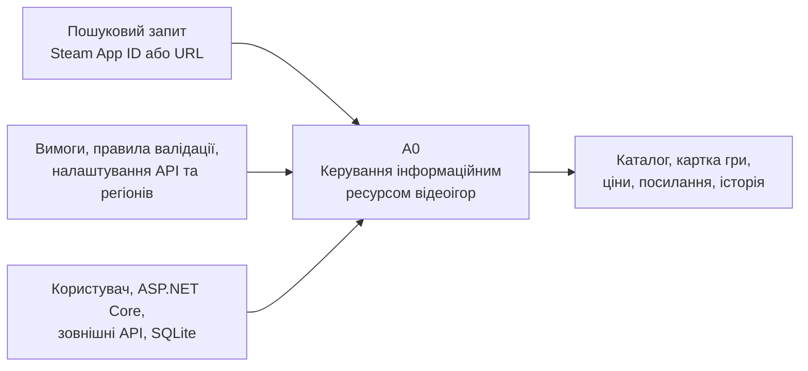
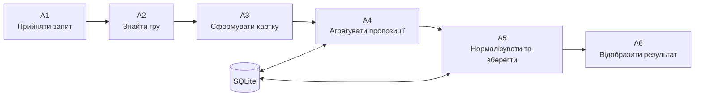
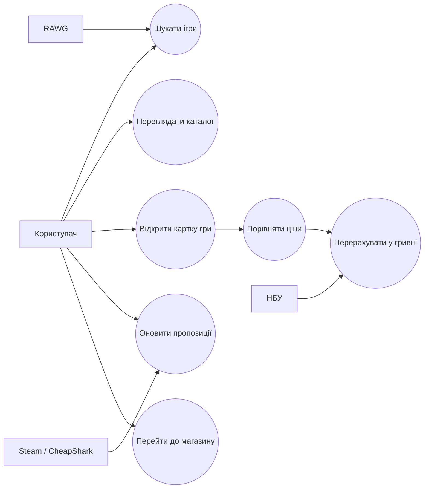
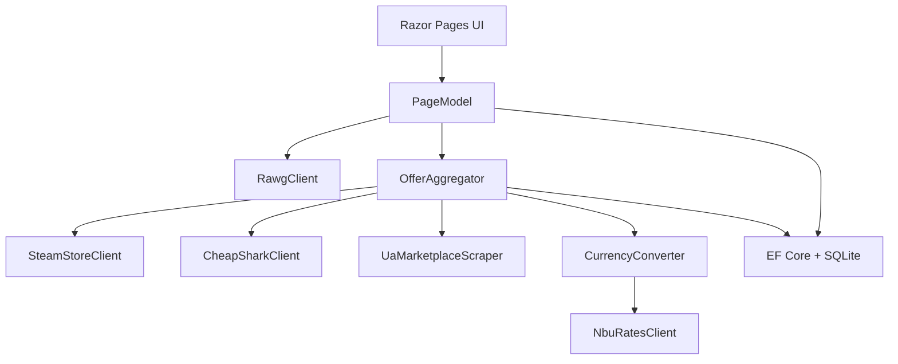
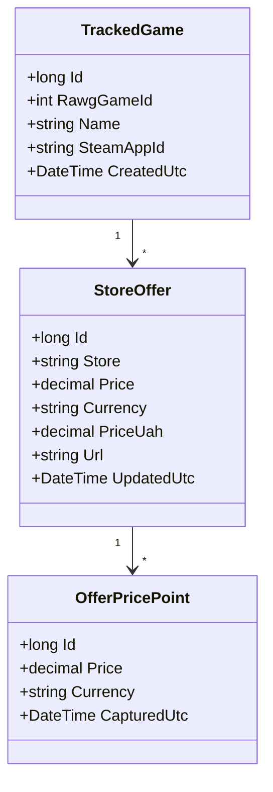
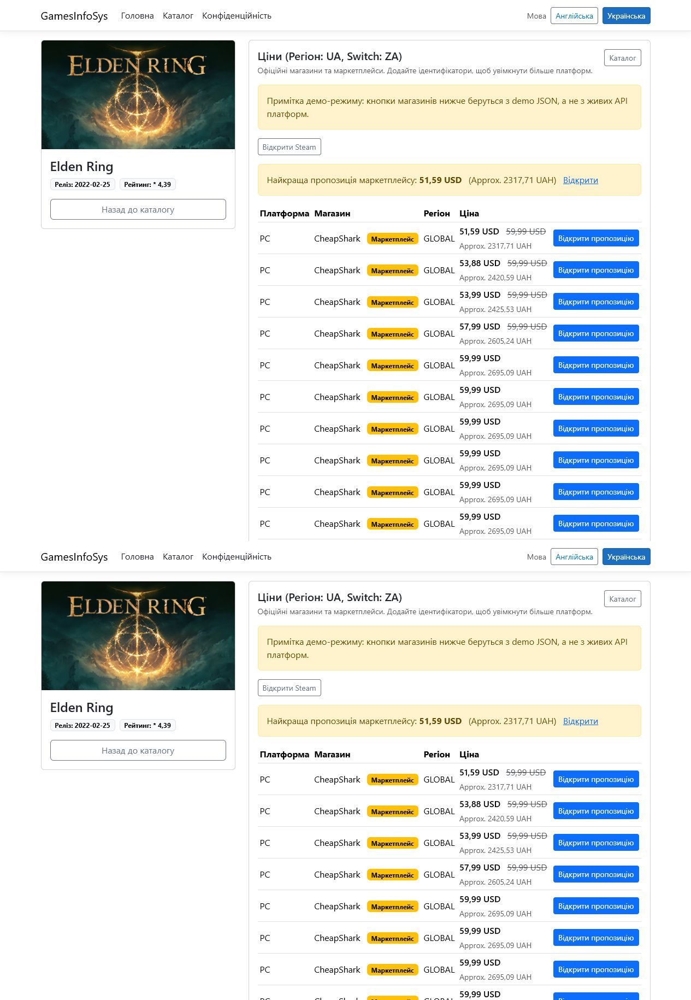

<!-- _class: title -->
<!-- _paginate: false -->

Кваліфікаційна робота бакалавра

# ПРОЄКТУВАННЯ ТА РОЗРОБКА ІНФОРМАЦІЙНОЇ СИСТЕМИ ДЛЯ ІНФОРМАЦІЙНОГО РЕСУРСУ ВІДЕОІГОР

**Виконав:** [ПІБ студента], [шифр групи]  
**Керівник:** [ПІБ керівника], [посада, науковий ступінь]

<!-- Доповідь: Представити тему роботи, автора та керівника. Наголосити, що результатом є працездатний вебзастосунок GamesInfoSys. -->

---

01 / GamesInfoSys

ЄДИНИЙ ПРОСТІР ДЛЯ ПОШУКУ ІГОР ТА ПОРІВНЯННЯ ПРОПОЗИЦІЙ

Система поєднує метадані відеоігор, ціни цифрових магазинів, регіональні посилання та перерахунок вартості у гривні.

<!-- Доповідь: Стисло сформулювати цінність системи для користувача: менше переходів між сервісами, одна картка гри, порівняння пропозицій. -->

---

## Мета, об'єкт і предмет

### Мета

Спроєктувати та реалізувати інформаційну систему, яка забезпечує пошук відеоігор, перегляд їх характеристик і порівняння актуальних магазинних пропозицій.

**Об'єкт дослідження** - процеси накопичення, пошуку, агрегування та подання інформації про відеоігри.

**Предмет дослідження** - методи й програмні засоби побудови вебсистеми, що інтегрує зовнішні API, локальне сховище і механізми нормалізації цін.

<!-- Доповідь: Не ототожнювати об'єкт із програмою. Об'єкт - інформаційні процеси, предмет - способи їх автоматизації. -->

---

## Завдання роботи

1. Проаналізувати предметну область та наявні сервіси відеоігор.
2. Сформувати функціональні й нефункціональні вимоги.
3. Побудувати моделі IDEF0, IDEF3, DFD та UML.
4. Спроєктувати архітектуру і модель даних.
5. Реалізувати пошук, картку гри та агрегування пропозицій.
6. Додати перерахунок цін у гривні за курсами НБУ.
7. Провести функціональне, інтеграційне й інтерфейсне тестування.

<!-- Доповідь: Показати логічний перехід від аналізу до моделювання, реалізації та перевірки. -->

---

## Актуальність

- інформація про одну гру розподілена між каталогами та магазинами;
- ціни залежать від платформи, регіону й валюти;
- ручне порівняння потребує багато переходів;
- зовнішні API можуть бути тимчасово недоступні;
- користувачеві потрібне зрозуміле подання українською мовою.

### Відповідь GamesInfoSys

Єдина картка гри, агреговані пропозиції, регіональні посилання, гривневий еквівалент, кешування в SQLite та демонстраційний режим.

<!-- Доповідь: Підкреслити практичну проблему фрагментованості даних і те, як її закриває розроблений застосунок. -->

---

## Основні бізнес-процеси

### Користувач

- відкриває каталог;
- вводить пошуковий запит;
- обирає відеогру;
- переглядає опис і платформи;
- порівнює ціни;
- переходить до зовнішнього магазину.

### Система

- отримує метадані з RAWG або demo-набору;
- зіставляє зовнішні ідентифікатори;
- запитує Steam та CheapShark;
- опрацьовує UA-маркетплейси;
- конвертує валюту;
- зберігає пропозиції та історію цін.

<!-- Доповідь: У поточній версії адміністративні функції реалізовано конфігурацією застосунку та керуванням ідентифікаторами гри. -->

---

## IDEF0: контекст системи

**ICOM:** Input - запити; Control - правила; Mechanism - програмні та зовнішні ресурси; Output - структурована інформація.

<!-- Доповідь: Пояснити призначення чотирьох типів стрілок IDEF0 і межі системи. -->

---

## IDEF0: декомпозиція A0

Декомпозиція відтворює фактичний маршрут даних у GamesInfoSys - від пошукового запиту до подання актуалізованої картки гри.

<!-- Доповідь: Звернути увагу, що зовнішні дані проходять перевірку, нормалізацію та збереження перед показом. -->

---

## Вимоги до програмного продукту

### Функціональні

- пошук і фільтрація каталогу;
- перегляд детальної інформації;
- оновлення магазинних пропозицій;
- підтримка Steam App ID;
- конвертація цін у UAH;
- зовнішні посилання на магазини.

### Нефункціональні

- адаптивний вебінтерфейс;
- локалізація UA/EN;
- стійкість до відмов API;
- демонстраційний режим;
- асинхронна взаємодія;
- розширюваність джерел даних.

<!-- Доповідь: Зазначити, що нефункціональні вимоги вплинули на вибір багатошарової архітектури та локального кешу. -->

---

## Варіанти використання

<!-- Доповідь: Центральний актор - користувач. Зовнішні системи виступають допоміжними акторами для пошуку, цін і валютних курсів. -->

---

## Архітектура застосунку

**Принцип:** інтерфейс не звертається до зовнішніх сервісів напряму - координацію виконують спеціалізовані клієнти та агрегатор.

<!-- Доповідь: Пояснити розподіл відповідальності та можливість додати нове джерело без перероблення сторінок. -->

---

## Модель даних

<!-- Доповідь: TrackedGame зберігає ідентифікатори гри, StoreOffer - поточну пропозицію, OfferPricePoint - історичні значення ціни. -->

---

## Технології

| Рівень | Засоби |
|---|---|
| Серверний застосунок | C#, .NET 10, ASP.NET Core Razor Pages |
| Доступ до даних | Entity Framework Core, SQLite |
| Інтеграції | HttpClient, RAWG API, Steam Store, CheapShark, НБУ |
| Інтерфейс | Razor, HTML5, CSS3, Bootstrap |
| Моделювання | IDEF0, IDEF3, DFD, UML, Mermaid |
| Режими роботи | зовнішні API та локальний demo-набір |

<!-- Доповідь: Вибір Razor Pages виправданий сторінковою структурою системи, а SQLite - компактністю та простим розгортанням. -->

---

## Головна сторінка

<!-- Доповідь: Показати швидкий пошук, навігацію та повідомлення про демонстраційний режим. -->

---

## Каталог відеоігор

<!-- Доповідь: Каталог містить картки з обкладинками, назвами, рейтингом, датою виходу і переходом до детальної сторінки. -->

---

## Картка гри та пропозиції

<!-- Доповідь: На одному екрані поєднано опис гри, платформи та таблицю пропозицій з гривневим еквівалентом. -->

---

## Повна детальна сторінка

<!-- Доповідь: Сторінка підтримує довгий опис, жанри, платформи, зовнішні ідентифікатори та оновлення цін. -->

---

## Функціональне тестування - 1

| ID | Сценарій | Очікуваний результат | Статус |
|---|---|---|---|
| FT-01 | Відкрити головну сторінку | Пошук і навігація доступні | Успішно |
| FT-02 | Ввести `Elden Ring` | Виведено релевантну картку | Успішно |
| FT-03 | Відкрити каталог без API | Завантажено demo-набір | Успішно |
| FT-04 | Відкрити картку гри | Відображено опис і платформи | Успішно |
| FT-05 | Вказати Steam App ID | Ідентифікатор збережено | Успішно |

<!-- Доповідь: Функціональні сценарії перевірялися на фактичному застосунку в локальному середовищі. -->

---

## Функціональне тестування - 2

| ID | Сценарій | Очікуваний результат | Статус |
|---|---|---|---|
| IT-01 | Оновити пропозиції | Дані джерел агреговано | Успішно |
| IT-02 | Недоступний RAWG | Система використовує demo-дані | Успішно |
| IT-03 | Отримати курс НБУ | Ціну перераховано в UAH | Успішно |
| UI-01 | Відкрити на вузькому екрані | Компоненти перебудовано | Успішно |
| DB-01 | Повторно оновити ціну | Запис оновлено, історію додано | Успішно |

<!-- Доповідь: Окремо перевірялися інтеграції, адаптивність і коректність повторного збереження пропозицій. -->

---

## Порівняння з аналогами

| Критерій | Каталог ігор | Магазин | Сервіс порівняння | GamesInfoSys |
|---|:---:|:---:|:---:|:---:|
| Детальні метадані | + | +/- | +/- | + |
| Кілька джерел цін | - | - | + | + |
| Перерахунок у UAH | - | +/- | +/- | + |
| Локальний demo-режим | - | - | - | + |
| Україномовний інтерфейс | +/- | +/- | +/- | + |
| Власна історія пропозицій | - | - | +/- | + |

<!-- Доповідь: Порівняння виконується за класами рішень, а не як рекламна оцінка конкретних продуктів. -->

---

## Результати

РЕАЛІЗОВАНО

- працездатний вебзастосунок GamesInfoSys;
- пошук і каталог відеоігор;
- детальна картка гри;
- агрегування магазинних пропозицій;
- конвертація валют;
- збереження даних та історії;
- локалізація і demo-режим;
- комплект проєктних діаграм.

<!-- Доповідь: Підсумувати відповідність результатів поставленим завданням. -->

---

## Висновки та розвиток

Розроблена система підтвердила доцільність об'єднання каталогу відеоігор і сервісу порівняння пропозицій у спільному інформаційному ресурсі.

**Подальший розвиток:**

- авторизація та персональні списки;
- сповіщення про зниження ціни;
- фонове планове оновлення;
- розширення переліку магазинів;
- графіки історії ціни;
- контейнеризація та хмарне розгортання.

<!-- Доповідь: Завершити коротким формулюванням практичної цінності та реалістичних напрямів удосконалення. -->

---

<!-- _class: title -->
<!-- _paginate: false -->

# ДЯКУЮ ЗА УВАГУ

## Готовий відповісти на запитання

