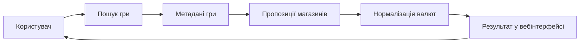
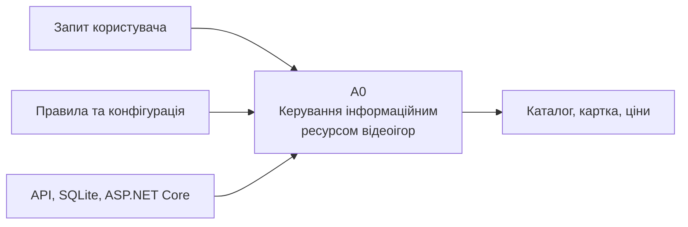
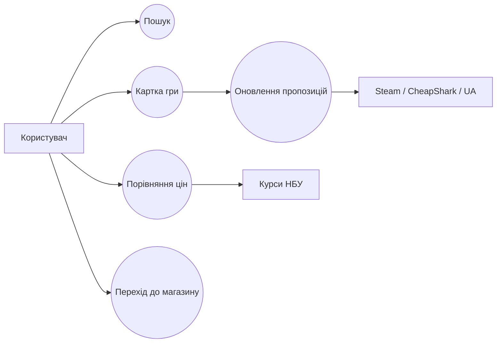
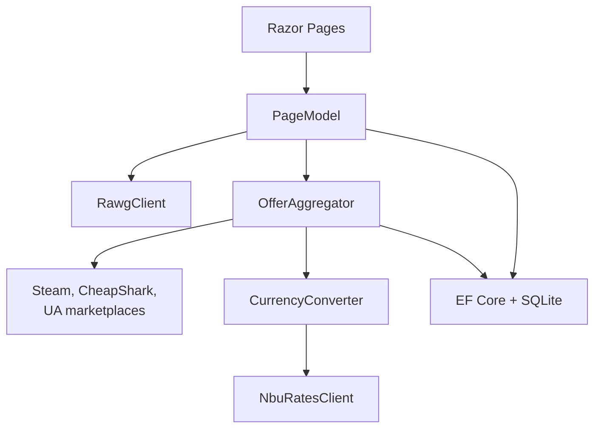

# ПРОЄКТУВАННЯ ТА РОЗРОБКА ІНФОРМАЦІЙНОЇ СИСТЕМИ ДЛЯ ІНФОРМАЦІЙНОГО РЕСУРСУ ВІДЕОІГОР

**Виконав:** [ПІБ студента], [шифр групи]  
**Керівник:** [ПІБ керівника]

<!-- Доповідь: Назвати тему та розроблений програмний продукт GamesInfoSys. -->

---

## GamesInfoSys

# Пошук. Дані. Ціни. Один ресурс.

Інформаційна система формує цілісну картку відеогри на основі каталогу, зовнішніх магазинів, валютних курсів і локального сховища.

<!-- Доповідь: Сформулювати головну ідею проєкту одним реченням. -->

---

## Мета і завдання

**Мета** - створити вебсистему для пошуку відеоігор і порівняння магазинних пропозицій.

**Об'єкт** - інформаційні процеси ресурсу відеоігор.

**Предмет** - методи інтеграції, збереження та подання даних.

1. Аналіз предметної області.
2. Формування вимог.
3. Моделювання IDEF0, IDEF3, DFD, UML.
4. Проєктування архітектури і БД.
5. Реалізація застосунку.
6. Тестування.

---

## Актуальність

- дані та ціни розміщено в різних джерелах;
- користувач витрачає час на ручне порівняння;
- вартість потрібно нормалізувати між валютами;
- зовнішні сервіси мають різні формати даних;
- потрібний стабільний режим роботи без API.

GamesInfoSys агрегує інформацію, показує гривневий еквівалент і переходить на demo-дані за відсутності зовнішнього доступу.

---

## Предметна область

Основні сутності: **відеогра**, **магазинна пропозиція**, **точка історії ціни**, **зовнішнє джерело**.

---

## IDEF0: контекст

Контекстна модель визначає межі GamesInfoSys та взаємодію із зовнішніми інформаційними ресурсами.

---

## IDEF0: декомпозиція

Результат кожного підпроцесу стає вхідними даними наступного етапу.

---

## Вимоги

### Користувач

- пошук і каталог;
- детальна картка;
- порівняння цін;
- перехід до магазину;
- українська та англійська мови.

### Система

- асинхронні інтеграції;
- SQLite-кеш;
- обробка помилок API;
- адаптивний інтерфейс;
- розширювані джерела.

---

## Варіанти використання

---

## Архітектура

Застосунок використовує розподіл на рівень подання, прикладні сервіси, інтеграції та дані.

---

## Технології

| Компонент | Технологія |
|---|---|
| Платформа | .NET 10 |
| Вебрівень | ASP.NET Core Razor Pages |
| Мова | C# |
| Дані | Entity Framework Core, SQLite |
| Інтеграції | HttpClient, JSON, HTML parsing |
| Інтерфейс | Razor, Bootstrap, CSS |
| Моделі | IDEF0, IDEF3, DFD, UML, Mermaid |

---

## Головна сторінка

Швидкий пошук, перехід до каталогу та явне повідомлення про режим джерела даних.

---

## Каталог

Карткове подання результатів з обкладинкою, рейтингом, датою виходу та переходом до деталей.

---

## Детальна сторінка

Метадані гри та агреговані пропозиції з ціною у вихідній валюті й орієнтовним значенням у гривнях.

---

## Перевірка роботи

| Перевірка | Результат |
|---|---|
| Пошук у demo-режимі | успішно |
| Відкриття картки гри | успішно |
| Збереження Steam App ID | успішно |
| Агрегування пропозицій | успішно |
| Перерахунок у UAH | успішно |
| Повторне оновлення даних | успішно |
| Адаптивне відображення | успішно |

---

## Висновки

- виконано аналіз предметної області;
- побудовано комплект функціональних та інформаційних моделей;
- реалізовано вебзастосунок GamesInfoSys;
- інтегровано зовнішні джерела даних і цін;
- забезпечено локальне збереження та demo-режим;
- підтверджено працездатність основних сценаріїв.

Наступний етап - персональні списки, сповіщення про зниження ціни та планове фонове оновлення.

---

# ДЯКУЮ ЗА УВАГУ

## Запитання?

