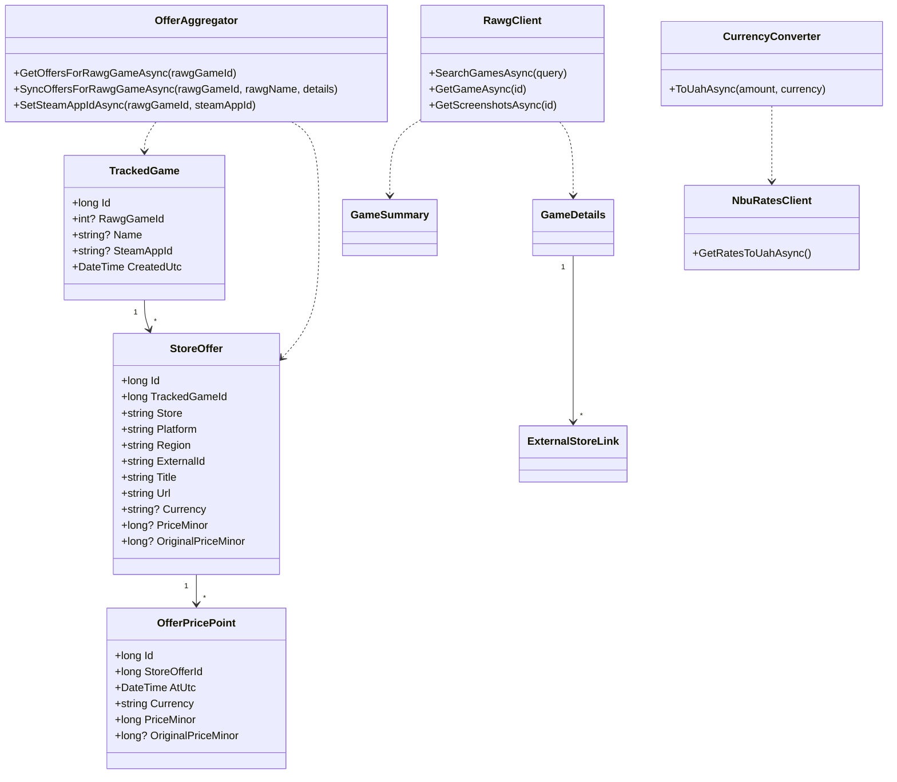

# UML Class Diagram GamesInfoSys

```mermaid
classDiagram
    class TrackedGame {
      +long Id
      +int? RawgGameId
      +string? Name
      +string? SteamAppId
      +DateTime CreatedUtc
    }
    class StoreOffer {
      +long Id
      +long TrackedGameId
      +string Store
      +string Platform
      +string Region
      +string ExternalId
      +string Title
      +string Url
      +string? Currency
      +long? PriceMinor
      +long? OriginalPriceMinor
    }
    class OfferPricePoint {
      +long Id
      +long StoreOfferId
      +DateTime AtUtc
      +string Currency
      +long PriceMinor
      +long? OriginalPriceMinor
    }
    class GameSummary
    class GameDetails
    class ExternalStoreLink
    class RawgClient {
      +SearchGamesAsync(query)
      +GetGameAsync(id)
      +GetScreenshotsAsync(id)
    }
    class OfferAggregator {
      +GetOffersForRawgGameAsync(rawgGameId)
      +SyncOffersForRawgGameAsync(rawgGameId, rawgName, details)
      +SetSteamAppIdAsync(rawgGameId, steamAppId)
    }
    class CurrencyConverter {
      +ToUahAsync(amount, currency)
    }
    class NbuRatesClient {
      +GetRatesToUahAsync()
    }
    TrackedGame "1" --> "*" StoreOffer
    StoreOffer "1" --> "*" OfferPricePoint
    GameDetails "1" --> "*" ExternalStoreLink
    RawgClient ..> GameSummary
    RawgClient ..> GameDetails
    OfferAggregator ..> TrackedGame
    OfferAggregator ..> StoreOffer
    CurrencyConverter ..> NbuRatesClient
```